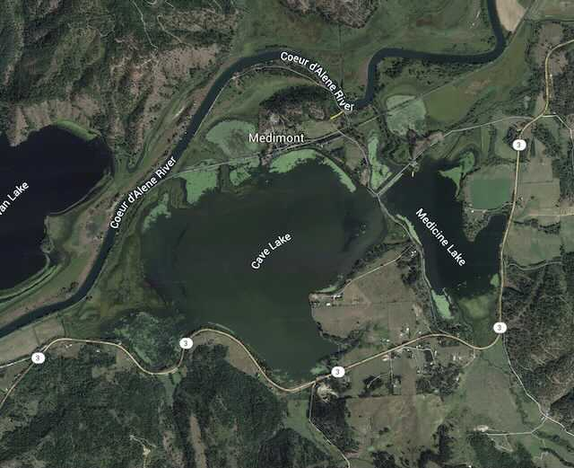

---
tags:
- Lakes
- Paddling
stats:
- label: Paddle Distance
  icon: map-marker-distance
  value: Varies
- label: Elevation
  icon: terrain
  value: 2133'
- label: Length and Acreage
  icon: vector-square
  value: Varies
- label: Maps
  icon: map
  value: IPNF, Medimont Topo
- label: Launch GPS
  icon: crosshairs-gps
  value: 47°28’40" N 116°35’43" W
- label: Shoshone County Sheriff
  icon: shield-account
  value: 208.556.1114
---

# Medimont Lake Launch

_Medimont Lake Launch_

## Description

The Medimont Launch services Cave Lake and Medicine Lake. To paddle to Cave Lake, paddle west to the bridge
to Cave Lake.

## Attractions

These side lakes are shallow and have very little power boat use.

## Directions

From Coeur d'Alene, drive east on I-90 over 4th of July Pass, and turn right at the Rose Lake & Harrison
exit. Highway 3 continues south down the Chain Lakes. Turn right (S) onto S. Medimont Road, to E. Rainy Hill
Road to the launch and campgrounds.

## Cool Things Close By

Coeur d'Alene River, Cave Lake, Medicine Lake, and Killarney Lake.

## R & P

Trail's End Brewery, Mexican Food Factory, Franklins, and Moon Time.

## Plan Your Trip

[Click for Current NOAA Weather Conditions](https://www.nws.noaa.gov/wtf/udaf/MapClick.php?lel=4000&uel=9000&polygon=49.016%2C-114.180%2C48.994%2C-114.381%2C48.890%2C-114.341%2C48.924%2C-114.151%2C&area=63)

## Photo Gallery

### Health Alert

_Health Alert._
