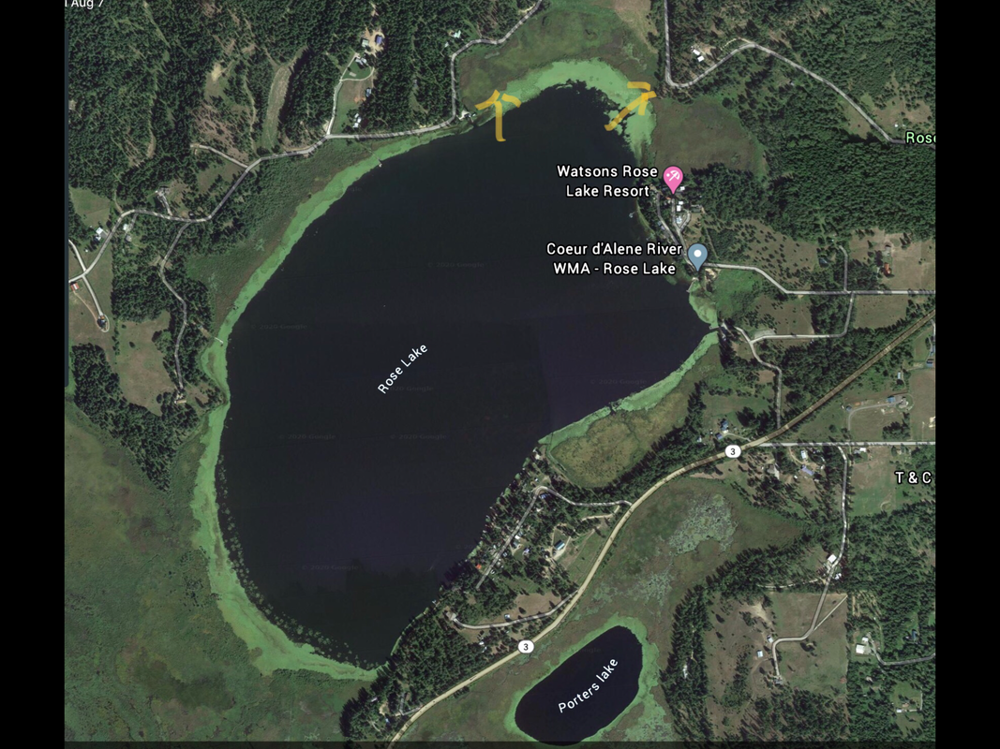

---
tags:
- Paddling & Rivers
stats:
- label: Paddle Distance
  icon: map-marker-distance
  value: varies
- label: Elevation
  icon: terrain
  value: 2133'
- label: Length and Acreage
  icon: vector-square
  value: varies
- label: Launch GPS
  icon: crosshairs-gps
  value: 47°28'33" N 116°35'18" W
- label: Kootenai County Sheriff
  icon: shield-account
  value: 208-446-1300
---

# Rainy Hill Launch

_Rainy Hill Launch_

## Plan Your Trip

[Click for Current NOAA Weather Conditions](https://www.nws.noaa.gov/wtf/udaf/MapClick.php?lel=4000&uel=9000&polygon=49.016%2C-114.180%2C48.994%2C-114.381%2C48.890%2C-114.341%2C48.924%2C-114.151%2C&area=63)

## Please Everyone... Heed This Health Alert

_Please everyone heed this health alert_

## Photo Gallery

_Image coming._
