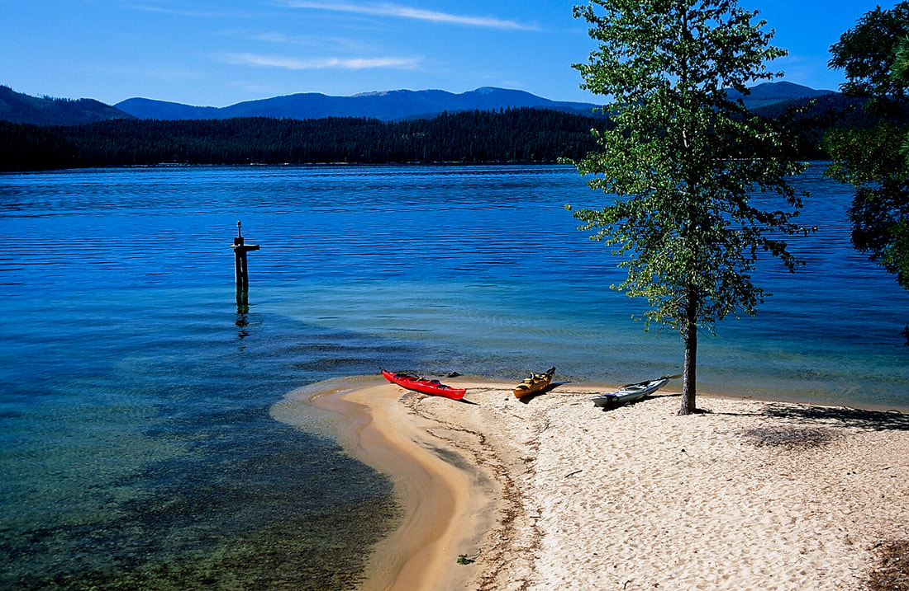

---
tags:
- Paddling & Rivers
stats:
- label: Paddle Distance
  icon: map-marker-distance
  value: varies
- label: Elevation
  icon: terrain
  value: 2439'
- label: Length and Acreage
  icon: vector-square
  value: 19 miles long and 26,000 acres
- label: Maps
  icon: map
  value: IPNF, Outlet Bay, Coolin, Priest Lake SW Topo
- label: Launch GPS
  icon: crosshairs-gps
  value: 48°44'32" N 116°50'00" W
---

# Kalispell Bay Launch

_Kalispell Bay Launch_

## Description

Priest Lake has been described as the "GEM" of Idaho. After your first visit, you will agree. The lower lake
is inhabited by thousands of people in the summer, and a virtual desert in the winter. The lower lake is 369'
deep. There are four islands on the lake, with one that is public, with 11 designated camp sites, and a few
pit toilets scattered among them. Please use the pit toilets when you need to do your business -- we all will
appreciate it.

Kalispell Island Trail #49 is 2.5 miles long, and circumnavigates the island. **Kalispell Island Group Site**
is located on the southeast side of Kalispell Island on Priest Lake. The rustic campsite is part of the Three
Pines camping area at site #29. The island, reached only by boat, faces the beautiful Selkirk Mountains.

**Other Camping:**

- **West Shores** - 7 camp units, west side of island (vault toilet).
- **Peninsula** - 2 camp units, southwest side of island (portable toilet required).
- **Schneider** - 5 camp units, southwest end of island (vault toilet).
- **Silver** - 8 camp units, south end of island (vault toilet).
- **Silver Cove** - 3 camp units, south end of island (vault toilet).
- **Selkirk** - 2 camp units, southeast side of island (portable toilet required).
- **Three Pines** - 7 camp units, southeast side of island (vault toilet).
- **Cottonwood** - 1 camp unit, east (middle) of island (portable toilet required).
- **Rocky Point** - 9 camp units, northeast end of island (vault toilet).
- **North Cove** - 5 camp units, northeast end of island (vault toilet).
- **Shady** - 1 camp unit, north end of island (portable toilet required).
- **Kalispell Vista** - 2 camp units, west side of island (portable toilet required).

A popular activity among visitors is to kayak, canoe, or power boat up a 3.5-mile thoroughfare, which leads
to the Upper Priest Lake Scenic Area. The upper lake, just like Kalispell Island, cannot be accessed by car,
so water is an excellent navigation option.

**Natural Features:** Kalispell Island is one of seven islands scattered throughout Priest Lake. Kalispell is
the largest of these islands, spanning 264 acres, and is shaped like a tooth. Priest Lake, at a 2,400 foot
elevation, is one of the top three largest lakes in Idaho. To the north, the lake connects to the Upper
Priest Lake, divided by a narrow channel, which can be passed through by boat.

## Attractions

Quiet island camping, great views of the Selkirks, pristine lake, isolated campsites.

## Directions

To access the Kalispell Bay Boat Launch, travel on Highway 57 for 31 miles to Kalispell Bay Road. Turn east
(right) until you reach West Lakeshore Road. Then head south 0.5 miles to the boat launch.

## Cool Things Close By

The American Selkirks, Hunt Creek Falls, Indian Creek Campgrounds, and the Priest Lake State Park.

## Restaurants & Pubs

Burger Express

## Plan Your Trip

[Click for Current NOAA Weather Conditions](https://www.nws.noaa.gov/wtf/udaf/MapClick.php?lel=4000&uel=9000&polygon=49.016%2C-114.180%2C48.994%2C-114.381%2C48.890%2C-114.341%2C48.924%2C-114.151%2C&area=63)

## Photo Gallery

_Images coming soon -- to contribute, contact Chic._
