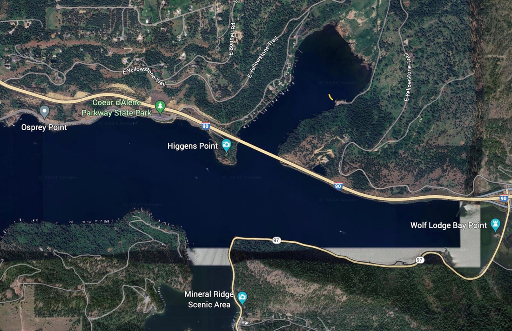

---
tags:
- Paddling & Rivers
stats:
- label: Paddle Distance
  icon: map-marker-distance
  value: varies
- label: Elevation
  icon: terrain
  value: 2128'
- label: Length and Acreage
  icon: vector-square
  value: varies
- label: Maps
  icon: map
  value: IPNF, Fernan lake, Mt. CDA topos
- label: Launch GPS
  icon: crosshairs-gps
  value: 47°37'51" N 116°40'51" W
- label: Kootenai County Sheriff
  icon: shield-account
  value: 208.446.1300
---

# Blue Bay Landing

_Blue Bay Landing_

## Description

We have added the area's sheriff's emergency phone numbers for each trip write-up under the ranger district
info. If an emergency occurs, evaluate your circumstances and call only if needed. The Blue Bay Landing is
along the east shore of the bay, due north of I-90. Although there isn't a launch at this site, canoeists and
kayakers can carry their boats down to the docks. Be aware... when the BLM built the docks, they are rather
high off the water. Getting into a kayak is difficult, so be careful.

## Attractions

Blue Bay is a back water bay off of Wolf Lodge Bay. Also attached to this site is the BLM's Wallace L.
Forest Conservation Area. This area offers hiking from the landing, up over the east ridge, with nice views
of Wolf Lodge and Beauty Bays.

## Directions

From CDA, drive east on I-90 to the Wolf Lodge, Harrison exit. At the stop sign, turn left (north) over the
freeway to the stop sign. Turn left (west) onto the old highway, which is now called E. Yellowstone Trail.
This road is very windy and caution should be taken while driving this road. Yellowstone summits the hill
next to a private residence, then drops down to the north end of Blue Bay. About half way down this road,
you will notice a parking area that is part of the trail system up from the landing. When you level out on
Yellowstone, the left turn is onto S. Landing Road, and is next to Blue Creek. Continue about .5 miles to
the landing.

## Cool Things Close By

Wolf Lodge Bay, Beauty Bay, Moscow Bay, and the back waters to the Wolf Lodge Creek, which in itself is a
nice paddle away from power boats.

## Restaurants & Pubs

Trail's End Brewery, Mexican Food Factory, Moon Time, and Franklins Hoagies.

## Plan Your Trip

[Click for Current NOAA Weather Conditions](https://forecast.weather.gov/MapClick.php?lat=47.6153&lon=-116.6789)

!!! warning "Please Everyone... Heed This Health Alert"

    
    _Please everyone heed this health alert_

## Photo Gallery

> _No images available yet. To contribute, contact Chic._
