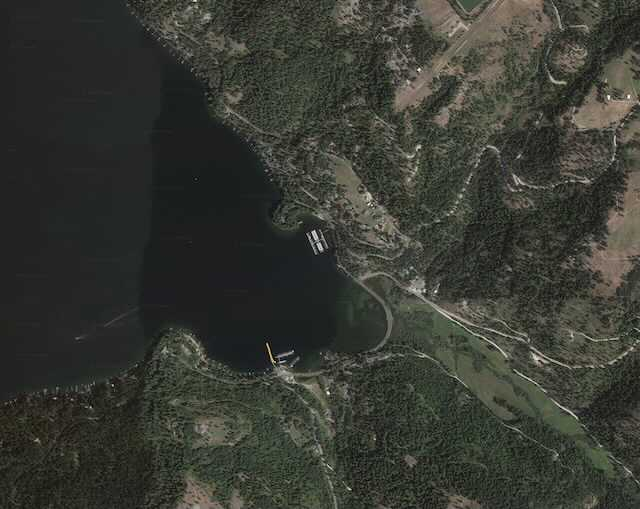

---
tags:
- Paddling & Rivers
stats:
- label: Paddle Distance
  icon: map-marker-distance
  value: varies
- label: Elevation
  icon: terrain
  value: 2128'
- label: Length and Acreage
  icon: vector-square
  value: varies
- label: Maps
  icon: map
  value: IPNF, Fernan Lake, Mount CDA topos
- label: Launch GPS
  icon: crosshairs-gps
  value: 47°38'16" N 116°42'48" W
---

# Booth Park Launch

_Booth Park Launch_

## Description

We have added the area's sheriff's emergency phone numbers for each trip write-up under the ranger district
info. If an emergency occurs, evaluate your circumstances and call only if needed. Booth Park is next to a
private marina. As you drive over Lake CDA Drive's road summit, look for an outhouse and road that drops
down steeply with twisting turns to the launch. There is very limited parking here, and your truck & trailer
should be short in able to turn around.

## Attractions

This boat launch faces SW and is open water to the entire north end of Lake CDA.

## Directions

From I-90 and The Sherman Street exit, continue straight thru the stoplight onto Lake Coeur d'Alene scenic
byway, past Yellowstone Road. The Boothe Park boat launch is about 6 miles on the right.

## Cool Things Close By

Blue Bay, Beauty Bay, Wolf Lodge Bay, Moscow Bay, Squaw Bay.

## Restaurants & Pubs

Moon Time, Mexican Food Factory, Franklins Hoagies, and Trails End Brewery.

## Plan Your Trip

[Click for Current NOAA Weather Conditions](https://www.nws.noaa.gov/wtf/udaf/MapClick.php?lel=4000&uel=9000&polygon=49.016%2C-114.180%2C48.994%2C-114.381%2C48.890%2C-114.341%2C48.924%2C-114.151%2C&area=63)

## Please Everyone... Heed This Health Alert

_Please everyone heed this health alert_

## Photo Gallery

### Picture (Image Missing)

Boat ramp and parking area. Image by David C.
