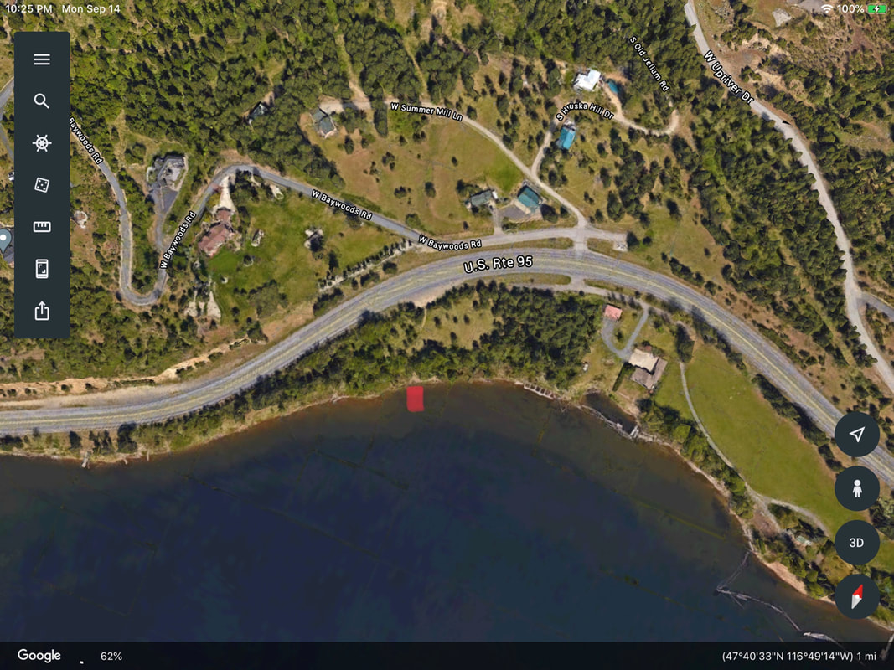

---
tags:
- Paddling & Rivers
stats:
- label: Paddle Distance
  icon: map-marker-distance
  value: varies
- label: Elevation
  icon: terrain
  value: 2128'
- label: Length and Acreage
  icon: vector-square
  value: varies
- label: Maps
  icon: map
  value: IPNF, Mica Bay topo
- label: Launch GPS
  icon: crosshairs-gps
  value: 47°40'31" N 116°49'15" W
---

# Cougar Bay Landing

_Cougar Bay Landing_

## Description

We have added the area's sheriff's emergency phone numbers for each trip write-up under the ranger district
info. If an emergency occurs, evaluate your circumstances and call only if needed. This "launch" is very
primitive, but gets you into Cougar Bay fast and usually away from other boaters. From Hwy 95, the trail is
about 300 feet down to the water. There are zero amenities, and it's okay to use for light kayaks and canoes.
Once in the water, Cougar Bay is mostly on your right and due south. The bay is shallow, and has many very
old pilings once used to hold log booms. One minus is the Hwy 95 that runs the entire north shore.

## Attractions

One real cool thing about Cougar Bay is there are few power boats that can float the shallow waters. Another
extra cool thing about Cougar Bay is the seasonal Osprey population. While paddling, you can see their raised
nests, and the birds as they dive to hunt for fish. Cougar Bay is also a great spot for small boaters to
fish. Along the southern shore is a trail built by the Cougar Bay Conservancy, that offers some places to
fish and swim.

## Directions

From Northwest Blvd, take a right (westish) over the CDA River bridge on Hwy 95. It's the same highway that
leads to Moscow and Heyburn S.P. A little over 1.5 miles from the Hwy 95 bridge, there is a nondescript pull
off on the south side of the highway. Please be very careful crossing over to the parking area. Look for a
simple gate to get you to the water. If you drive the W. Cougar Bay Road, you have gone too far. However, if
you continue about 1.3 miles on 95, the Cougar Bay Conservancy entrance is on your left (south). The
shoreline trailhead is located at the end of this turn off.

## Cool Things Close By

CDA, Spokane River, NIC Beach, CDA City Beach, and Sanders Beach.

## Restaurants & Pubs

The Mexican Food Factory, Trails End Brewery, Franklins Hoagies, and the Moon Time.

## Plan Your Trip

[Click for Current NOAA Weather Conditions](https://www.nws.noaa.gov/wtf/udaf/MapClick.php?lel=4000&uel=9000&polygon=49.016%2C-114.180%2C48.994%2C-114.381%2C48.890%2C-114.341%2C48.924%2C-114.151%2C&area=63)

## Please Everyone... Heed This Health Alert

_Please everyone heed this health alert_

## Photo Gallery

_There is more to do in Cougar Bay than paddling around._

_Exploring Cougar Bay_

_Exploring Cougar Bay_

_Exploring Cougar Bay_

_Exploring Cougar Bay_

_Exploring Cougar Bay_
