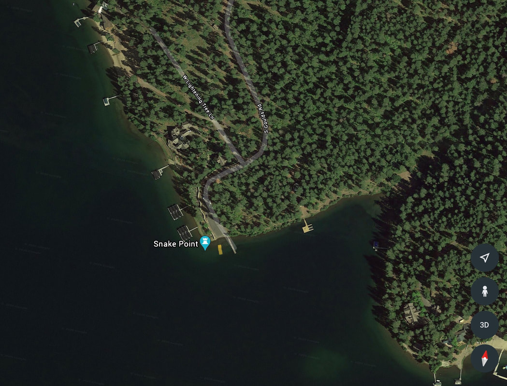

---
tags:
- Paddling & Rivers
stats:
- label: Paddle Distance
  icon: map-marker-distance
  value: varies
- label: Elevation
  icon: terrain
  value: 2128'
- label: Length and Acreage
  icon: vector-square
  value: varies
- label: Maps
  icon: map
  value: IPNF, Mica Bay
- label: Launch GPS
  icon: crosshairs-gps
  value: 47°36'18" N 116°50'02" W
---

# Goulds Launch

_Goulds Launch_

## Description

We have added the area's sheriff's emergency phone numbers for each trip write-up under the ranger district
info. If an emergency occurs, evaluate your circumstances and call only if needed. The Gould's Landing is
located on the north side of Mica Bay. There are no fees to launch here. Once on the water, Mica Bay
stretches SW to the base of the bay. If you go straight across Mica Bay, you will find Camp Sweyolakan Girl
Scout Camp. On the main body of the lake near Camp Sweyolakan is Toad Rock, which is slightly off shore. The
main body of the lake is due SE.

A note to power boaters: this launch can only handle small boats, due to lack of space to turn around. The
road is steep and windy -- do not go down.

## Attractions

Toad Rock, Mica Bay, and the county's Mica Bay Boat Launch. Mica Bay's launch is for larger boats.

## Directions

From the SW end of the Spokane River bridge, drive 6.3 miles to the Mica turn off. Turn left (East) onto the
W. Kidd Island Bay Road. Drive 7.3 miles to W. Valhalla Road, and bear right. In 0.75 miles turn right,
staying on W. Valhalla Road for 0.25 mile and turn right onto S. Gould Road all the way to the launch. This
launch has very limited parking. Do not let your car block any access.

## Cool Things Close By

Mica Bay, Camp Sweyolakan Girl Scout Camp, and Toad Rock.

## R & P

Mexican Food Factory, Trails End Brewery, Franklins Hoagies, and Moon Time.

## Plan Your Trip

[Click for Current NOAA Weather Conditions](https://www.nws.noaa.gov/wtf/udaf/MapClick.php?lel=4000&uel=9000&polygon=49.016%2C-114.180%2C48.994%2C-114.381%2C48.890%2C-114.341%2C48.924%2C-114.151%2C&area=63)

## Please Everyone... Heed This Health Alert

_Please everyone heed this health alert_

## Photo Gallery

_Image coming._
