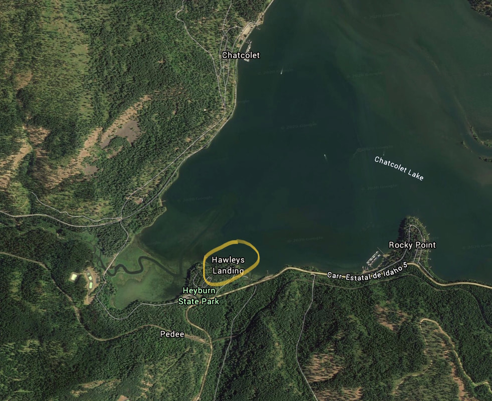

---
tags:
- Trails & Scrambles
stats:
- label: Paddle Distance
  icon: map-marker-distance
  value: varies
- label: Elevation
  icon: terrain
  value: 2128'
- label: Length and Acreage
  icon: vector-square
  value: varies
- label: Maps
  icon: map
  value: IPNF., Plummer & Chatcolet
- label: Launch GPS
  icon: crosshairs-gps
  value: 47°21'13" N 116°46'22" W
- label: Benewah County Sheriff
  icon: shield-account
  value: 208-245-2555
---

# Hawleys Landing

_Hawleys Landing_

## Description

We have added the area's sheriff's emergency phone numbers for each trip write-up under the ranger district
info. If an emergency occurs, evaluate your circumstances and call only if needed. Hawley's Landing is
located in Heyburn S.P. off of Hwy 5 at the Hawley's Landing Visitors Center.

## Attractions

Heyburn S.P., Trail of the CDA's, Lake Chatcolet, St. Maries River -- the highest navigable river in the
world -- and Indian Cliffs hiking area.

## Directions

From CDA drive south on 95 to Plummer. At Plummer, turn left (East), onto Hwy 5 to Heyburn S.P.

## Cool Things Close By

Heyburn S.P., Trail of the CDA's, Lake Chatcolet, St. Maries River -- the highest navigable river in the
world -- and Indian Cliffs hiking area.

## R & P

Trails End Brewery, Mexican Food Factory, the Moon Time.

## Plan Your Trip

[Click for Current NOAA Weather Conditions](https://www.nws.noaa.gov/wtf/udaf/MapClick.php?lel=4000&uel=9000&polygon=49.016%2C-114.180%2C48.994%2C-114.381%2C48.890%2C-114.341%2C48.924%2C-114.151%2C&area=63)

## Please Everyone... Heed This Health Alert

_Please everyone heed this health alert_

## Photo Gallery

_No images available -- to contribute, contact Chic._
