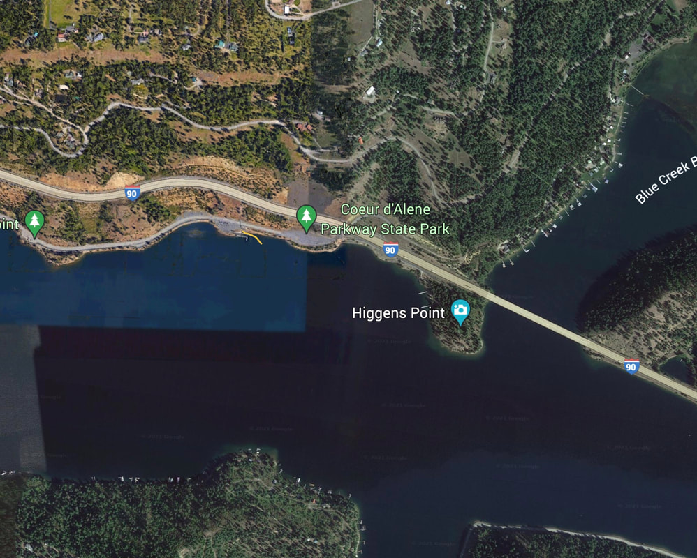

---
tags:
- Trails & Scrambles
stats:
- label: Paddle Distance
  icon: map-marker-distance
  value: varies
- label: Elevation
  icon: terrain
  value: 2128'
- label: Length and Acreage
  icon: vector-square
  value: varies
- label: Maps
  icon: map
  value: IPNF, Fernan topo
- label: Launch GPS
  icon: crosshairs-gps
  value: 47°37'47" N 116°41'28" W
- label: Kootenai County Sheriff
  icon: shield-account
  value: 208-446-1300
---

# Higgins Point Launch

_Higgins Point Launch_

## Description

We have added the area's sheriff's emergency phone numbers for each trip write-up under the ranger district
info. If an emergency occurs, evaluate your circumstances and call only if needed. Higgins Point Launch is
located at the end of Lake CDA Drive. It has two launch lanes and is very busy during the summer, especially
on the weekends and holidays. From the parking area next to the launch, there's a paved trail to Higgins
Point. The point has swimming, docks, fishing, and is a great spot to view the eagles.

## Attractions

December 15th through January are incredible times to view the eagles. Boat launch, hiking trail around
Higgins Point. Great rollerblading, bicycling, and boating.

## Directions

From the east end of Sherman Avenue, turn right (south) onto Lake CDA Drive. Continue to Higgins Point.

## Cool Things Close By

Wolf Lodge Bay, Beauty Bay, and Booth Park Launch.

## R & P

Trails End Brewery, Franklins Hoagies, Mexican Food Factory, and Moon Time.

## Plan Your Trip

[Click for Current NOAA Weather Conditions](https://www.nws.noaa.gov/wtf/udaf/MapClick.php?lel=4000&uel=9000&polygon=49.016%2C-114.180%2C48.994%2C-114.381%2C48.890%2C-114.341%2C48.924%2C-114.151%2C&area=63)

## Please Everyone... Heed This Health Alert

_Please everyone heed this health alert_

## Photo Gallery

_No images available yet -- contact Chic to contribute._
