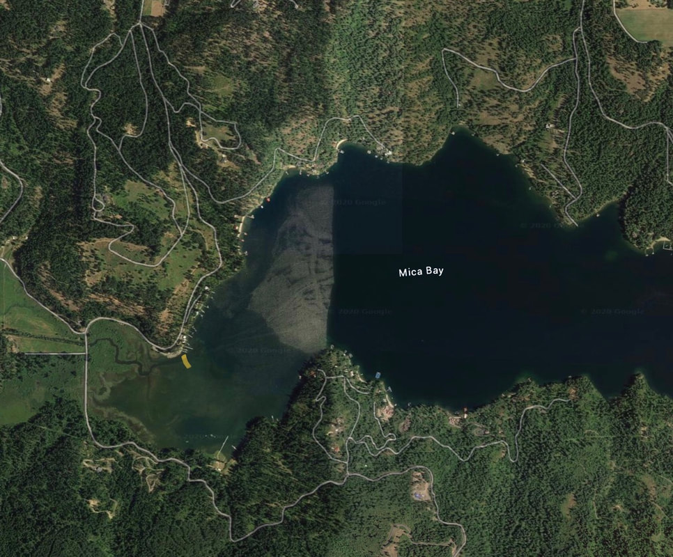
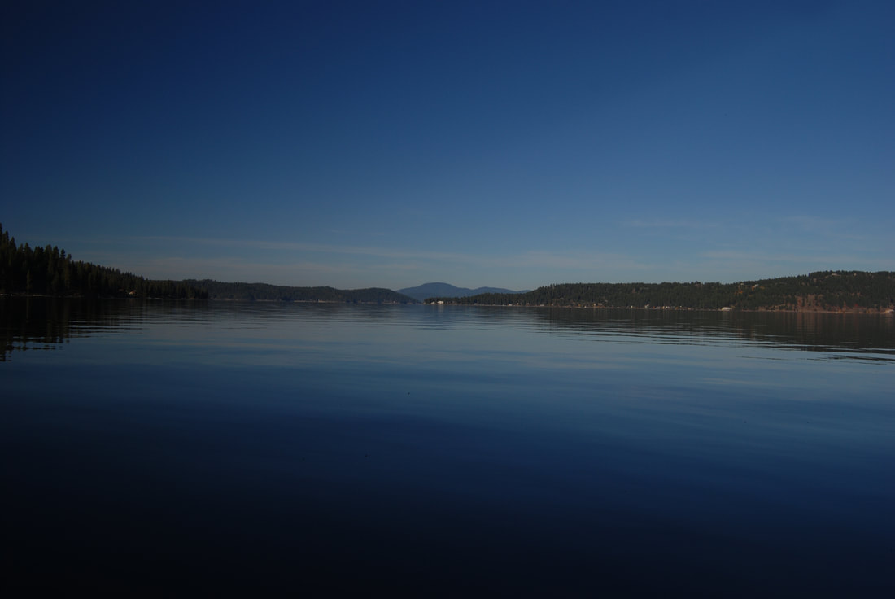

---
tags:
- Lakes
- Paddling
stats:
- label: Paddle Distance
  icon: map-marker-distance
  value: Varies
- label: Elevation
  icon: terrain
  value: 2128'
- label: Length and Acreage
  icon: vector-square
  value: Varies
- label: Launch GPS
  icon: crosshairs-gps
  value: 47°35’58" N 116°51’33" W
- label: Kootenai County Sheriff
  icon: shield-account
  value: 208.446.1300
---

# Mica Bay Launch

_Mica Bay Launch_

## Description

We have added the area's sheriff emergency phone numbers for each trip write-up under the ranger district
info. If an emergency occurs, evaluate your circumstances and call only if needed.

Mica Bay is a long bay on Lake Coeur d'Alene that offers great paddling out to the main lake. As you put in,
paddle along the right shoreline to reach Mica Bay Boaters Park. This park is a good option to stay at if
you want to do a shakedown paddle/camp. From the park, paddle east to the main body of Lake Coeur d'Alene.
Camp Sweyolakan is on the south shore as you reach the main body of Lake Coeur d'Alene.

## Attractions

A large launch with ample parking and easy access to Mica Bay and Lake Coeur d'Alene.

## Directions

From the SW end of the Spokane River bridge in Coeur d'Alene, drive south past Mica, Idaho, to Old U.S.
Highway 95 Road. Turn left (east) to the launch, which is located near the base of Mica Bay.

## Cool Things Close By

Mica Bay Boaters Camp, Camp Sweyolakan, and Toad Rock.

## R & P

Trail's End Brewery, Mexican Food Factory, Franklins Hoagies, and Moon Time.

## Plan Your Trip

[Click for Current NOAA Weather Conditions](https://www.nws.noaa.gov/wtf/udaf/MapClick.php?lel=4000&uel=9000&polygon=49.016%2C-114.180%2C48.994%2C-114.381%2C48.890%2C-114.341%2C48.924%2C-114.151%2C&area=63)

## Photo Gallery

### Health Alert

_Health Alert._

### Mica Bay Shoreline

_Mica Bay Shoreline._

The shoreline in fall colors.
