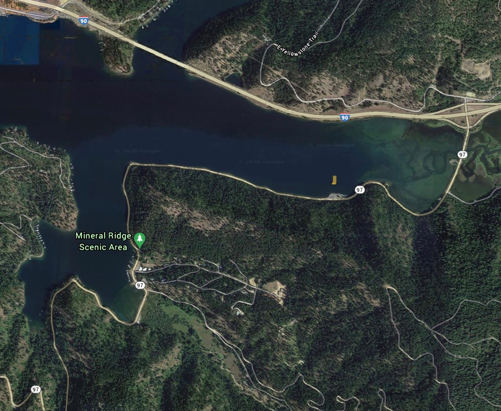

---
tags:
- Peaks & Mountains
stats:
- label: Paddle Distance
  icon: map-marker-distance
  value: varies
- label: Elevation
  icon: terrain
  value: 2128'
- label: Length and Acreage
  icon: vector-square
  value: varies
- label: Maps
  icon: map
  value: IPNF, Mt. CDA topo
- label: Launch GPS
  icon: crosshairs-gps
  value: 47°37'07" N 116°39'37" W
- label: Kootenai County Sheriff
  icon: shield-account
  value: 208-446-1300
---

# Mineral Ridge Launch

_Mineral Ridge Launch_

## Description

We have added the area's sheriff's emergency phone numbers for each trip write-up under the ranger district
info. If an emergency occurs, evaluate your circumstances and call only if needed. The Mineral Ridge launch
is a BLM launch that may require a launch fee. Please be very careful re-entering Hwy 97A when leaving. In
the months of December and January, this site is a great place to view the annual migration of Bald Eagles.

## Attractions

From this launch you can access the Wolf Lodge Creek, Beauty Bay, Moscow Bay and the main body of the north
end of Lake CDA.

## Directions

From CDA, drive east on I-90 to the Harrison, Idaho exit, onto Hwy 97A. Drive about 0.9 of a mile to the
launch on the right.

## Cool Things Close By

Wolf Lodge Creek & Bay, Beauty Bay, Blue Bay, and Moscow Bay.

## Restaurants & Pubs

Trails End Brewery, Mexican Food Factory, Moon Time.

## Plan Your Trip

[Click for Current NOAA Weather Conditions](https://www.nws.noaa.gov/wtf/udaf/MapClick.php?lel=4000&uel=9000&polygon=49.016%2C-114.180%2C48.994%2C-114.381%2C48.890%2C-114.341%2C48.924%2C-114.151%2C&area=63)

## Please Everyone... Heed This Health Alert

_Please everyone heed this health alert_

## Photo Gallery

_Image coming._
