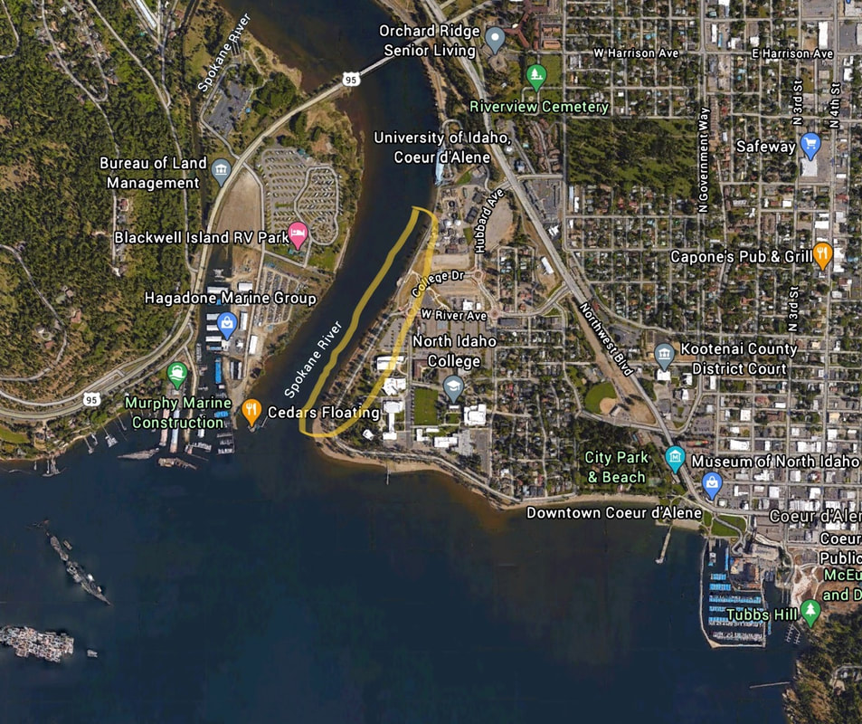

---
tags:
- Trails & Scrambles
stats:
- label: Paddle Distance
  icon: map-marker-distance
  value: varies
- label: Elevation
  icon: terrain
  value: 2128'
- label: Length and Acreage
  icon: vector-square
  value: varies
- label: Maps
  icon: map
  value: IPNF., Mica Bay topo
- label: Launch GPS
  icon: crosshairs-gps
  value: 47°40'30" N 116°48'07" W
- label: Kootenai County Sheriff
  icon: shield-account
  value: 208-446-1300
---

# N.I.C. Dike Road Landing

_N.I.C. Dike Road Landing_

## Description

Although there is not an actual launch here, the N.I.C. Beach is long and has several paths down to the
water's edge. Be aware of lots of goose poop on the beach.

## Attractions

Access to the Spokane River, the main body of the lake, City Beach, Tubbs Hill, Casco Bay, and Cougar Bay.

## Directions

Drive east on I-90 to Exit 11 or Northwest Blvd, in CDA. Continue SE on Northwest Blvd to just past the Hwy
95 bridge, and turn right at the signs to NIC. From downtown CDA, drive NW on Northwest Blvd. Turn left onto
W. Fort Grounds Dr., which turns into Park Road, to W. River Ave. Turn left and drive through the roundabout,
staying on W. River Ave to the next roundabout, to the NIC Dike Road. Finding a parking spot is the most
difficult part of the launch. You can remove your kayak or canoe here and find a parking space down off the
Dike Road.

## Cool Things Close By

Cougar Bay, Casco Bay, the Spokane River, City Beach, Tubbs Hill, and Sanders Beach.

## R & P

Trails End Brewery, Moon Time, Franklins, Mexican Food Factory.

## Plan Your Trip

[Click for Current NOAA Weather Conditions](https://www.nws.noaa.gov/wtf/udaf/MapClick.php?lel=4000&uel=9000&polygon=49.016%2C-114.180%2C48.994%2C-114.381%2C48.890%2C-114.341%2C48.924%2C-114.151%2C&area=63)

## Please Everyone... Heed This Health Alert

_Please everyone heed this health alert_

## Photo Gallery

_Image coming._
