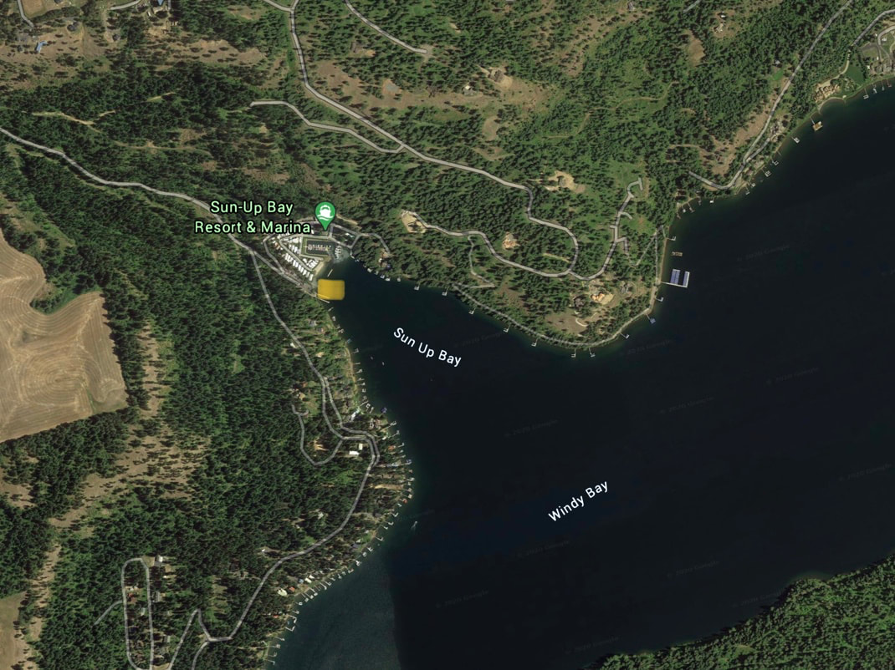

---
tags:
- Paddling & Rivers
stats:
- label: Paddle Distance
  icon: map-marker-distance
  value: varies
- label: Elevation
  icon: terrain
  value: 2128'
- label: Length and Acreage
  icon: vector-square
  value: varies
- label: Maps
  icon: map
  value: IPNF, Worley topo
- label: Launch GPS
  icon: crosshairs-gps
  value: 47°29'13" N 116°54'52" W
---

# Sun Up Bay Launch

_Sun Up Bay Launch_

## Description

This launch is out of the way and away from the Rockford Bay crowds. You can paddle north up the west side
of CDA to Rockford Bay and beyond. Or you can turn right down CDA to the large Windy Bay.

## Attractions

Less car and boat traffic, Rockford Bay, and the main body of the Lake CDA.

## Directions

From CDA, drive over the Spokane River on Hwy 95. Take a mileage reading as you cross the bridge. In about 16
miles you will come to W. Sun Up Bay Road. Turn left and follow W. Sun Up Bay Road all the way to the launch.

## Cool Things Close By

Rockford Bay, Windy Bay, and Rockford Point.

## R & P

Trails End Brewery, Franklins, Mexican Food Factory, and Moon Time.

## Plan Your Trip

[Click for Current NOAA Weather Conditions](https://www.nws.noaa.gov/wtf/udaf/MapClick.php?lel=4000&uel=9000&polygon=49.016%2C-114.180%2C48.994%2C-114.381%2C48.890%2C-114.341%2C48.924%2C-114.151%2C&area=63)

## Please Everyone... Heed This Health Alert

_Please everyone heed this health alert_

## Photo Gallery

_Image coming._
