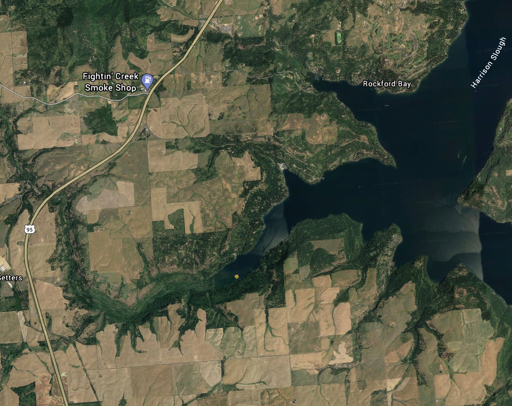

---
tags:
- Paddling & Rivers
stats:
- label: Paddle Distance
  icon: map-marker-distance
  value: varies
- label: Elevation
  icon: terrain
  value: 2128'
- label: Length and Acreage
  icon: vector-square
  value: varies
- label: Maps
  icon: map
  value: IPNF, Worley topo
- label: Launch GPS
  icon: crosshairs-gps
  value: 47°46'36" N 116°93'08" W
---

# Windy Bay Launch

_Windy Bay Launch_

## Description

Windy Bay is one of the larger bays on Lake CDA, and as the name implies, it can be very windy. Up the SE end
of the lake is Lake Creek to paddle up if it's windy on Windy Bay.

## Attractions

Huge bay with a nice creek to paddle up.

## Directions

Drive south on Hwy 95 from CDA to the W. Settlers Road, and turn right. Drive a short distance to W. Bitter
Road, and turn left, and drive back under the Hwy, staying on W. Bitter Road, to S. Lakewood Cove Road, and
turn left almost to the lake, but turn left onto W. Ice Storm Road, to the 4th dock from the end.

## Cool Things Close By

Sun Up Bay, Rockford Bay, Rockford Point, and the main body of Lake CDA.

## Restaurants & Pubs

Trails End Brewery, Franklins, Moon Time, and Mexican Food Factory.

## Plan Your Trip

[Click for Current NOAA Weather Conditions](https://www.nws.noaa.gov/wtf/udaf/MapClick.php?lel=4000&uel=9000&polygon=49.016%2C-114.180%2C48.994%2C-114.381%2C48.890%2C-114.341%2C48.924%2C-114.151%2C&area=63)

## Please Everyone... Heed This Health Alert

_Please everyone heed this health alert_

## Photo Gallery

_Image coming._
