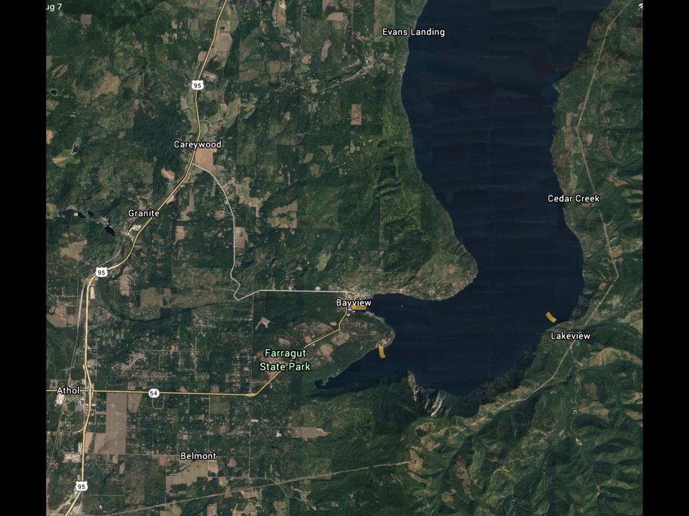

---
tags:
- Paddling & Rivers
stats:
- label: Paddle Distance
  icon: map-marker-distance
  value: varies
- label: Elevation
  icon: terrain
  value: 2067'
- label: Length and Acreage
  icon: vector-square
  value: 65 miles long, & 148 square miles and 1150' deep.
- label: Maps
  icon: map
  value: Bayview Topo
- label: Launch GPS
  icon: crosshairs-gps
  value: 47°58'50" N 116°33'30" W
- label: Kootenai County Sheriff
  icon: shield-account
  value: 208-446-1300
---

# Bayview City Launch

_Bayview City Launch_

## Description

The Bayview Launch is located downtown across from the Bayview Mercantile, and next to the Boileau's
Buttonhook Inn. From the launch, the main body of the lake is about 2 miles due east. Along the south
shoreline as the bay meets the lake is Blackwell Point. From Blackwell Point, paddle SSE across Idlewilde Bay
to Steamboat Rock.

A word of precaution about paddling Lake Pend Oreille: if the winds are up, do not go far from the shore. If
you get caught in the winds, go to the nearest shoreline without bucking the winds. Steamboat Rock is just
less than a mile across. As you approach Steamboat Rock, watch the hillside for Mountain Goats -- they
usually don't climb around the cliffs above the lake in the heat of the day, so look for any very bright
white specks on the cliffs. As you skirt Steamboat Rock, massive cliffs dominate the shoreline all the way to
Echo Bay and beyond.

At 1.5 miles from Steamboat Rock is Echo Bay, which has the first "beaches" along the shore -- I put beach in
parentheses because the beaches are made up of polished flat rocks. Because of Echo Bay's orientation, it
doesn't get full sun until late afternoon. Find a spot in the sun and have lunch and swim.

A word on sanitation: you can't get 200' from the water to do your business, so take a pee bottle, and blue
bags for each person's poop. Please do not pee in the lake.

There is something special you will find at Echo Bay: as stated above, the rocks are flat and polished, and
they are excellent rocks for skipping. But beware -- I've skipped so many rocks, my shoulders hurt too much
to paddle. After skipping too many rocks, you can follow your route back to Bayview. But you can also paddle
north up to Lakeview, about 3 miles up lake. Be aware: if the winds are up, do not attempt to paddle across
the lake to Bayview or the west shoreline. Instead, follow your route back to Steamboat Rock, staying close
to the shore. Once you are at Steamboat Rock, pause before crossing Idlewilde Bay -- find a small spot along
the shore, out of the winds, and wait out the winds. Do not attempt the crossing in any winds you are not
comfortable with.

## Option #1

From Blackwell Point, turn south (right) into Idlewilde Bay, along the shore and Farragut State Park. First
you will come to Farragut's boat launch. There are toilets here if needed. Continuing south, the shoreline is
spectacular. Near the south end of Pend Oreille Lake is Beaver Bay Beach and Swimming Area. Stop for a swim,
but do not take your kayaks into the swimming area. A bit further south is Buttonhook Bay and the end of the
lake. You can paddle the east shoreline up to Steamboat Rock, and then across to Bayview.

## Option #2

Once out in Bayview's bay, you can paddle up the west shoreline around Cape Horn and beyond. Just don't allow
the winds to be in your face as you paddle back to Bayview.

## Option #3

Now the fun starts. This option is a four or five day paddle around the northern half of Lake Pend Oreille.
Whether you launch from Bayview or Farragut, paddle across Idlewilde Bay to Steamboat Rock as noted above,
but continue up Cedar Creek. The next leg takes you from Cedar Creek to Granite Creek Landing. Because only
about 14% of the shoreline is privately owned, you can find a secluded beach to camp in private.

The third leg takes you across the lake to the west shoreline, and Maiden Rock Boat Camp. Maiden Rock has an
outhouse, picnic tables, and more of those wonderful skipping rocks -- not to mention rocks to climb and dive
off of. Also at Maiden Rock is a trail up to the Blacktail Trailhead and Mountain; it's a steep 2 miles, but
maybe a shorter walk up to the cedar trees is enough.

To make the last leg shorter, it would be wise to paddle about 2 miles past Evans Landing and boat camp. From
2 miles past Evans Landing, it's over 8 miles to the Farragut Launch. This total paddle loop is over 30
miles. Because of the distance, and the possibility of winds, you may want to let loved ones know you may be
late getting home -- possibly a day late.

| Leg | Distance |
| :--- | :--- |
| One | 8.4 miles |
| Two | 6.4 miles |
| Three | 8 miles |
| Four | 7 miles |

## Attractions

So many to list. Mountain Goats at two or more places, untouched shoreline camping, cliffs, wildlife, big
water paddling, beautiful shorelines, solitude, and best of all, incredible rock skipping.

## Directions

Drive about 17.7 miles to the Athol exit, and turn right (East) onto Hwy 54. After stopping to pay for entry
and overnight fees, get back onto Hwy 54 and drive about 1/4 mile to the South Road. Turn right (SE then NE)
for about 3.2 miles to the launch.

## Cool Things Close By

Silverwood Theme Park -- I only list this because the more people at Silverwood, the less on the lake. Other
cool things are Lake Cocolalla, Packsaddle Mountain, Lakeview, and N. & S. Chilco Peaks.

## R & P

Trails End Brewery, Mexican Food Factory, Franklins Hoagies, and the Moon Time.

## Plan Your Trip

[Click for Current NOAA Weather Conditions](https://www.nws.noaa.gov/wtf/udaf/MapClick.php?lel=4000&uel=9000&polygon=49.016%2C-114.180%2C48.994%2C-114.381%2C48.890%2C-114.341%2C48.924%2C-114.151%2C&area=63)

## Photo Gallery

_The north shore of Bayview, with Cape Horn above_
