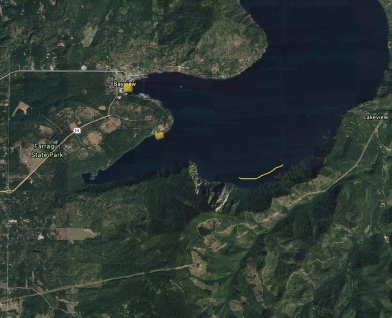
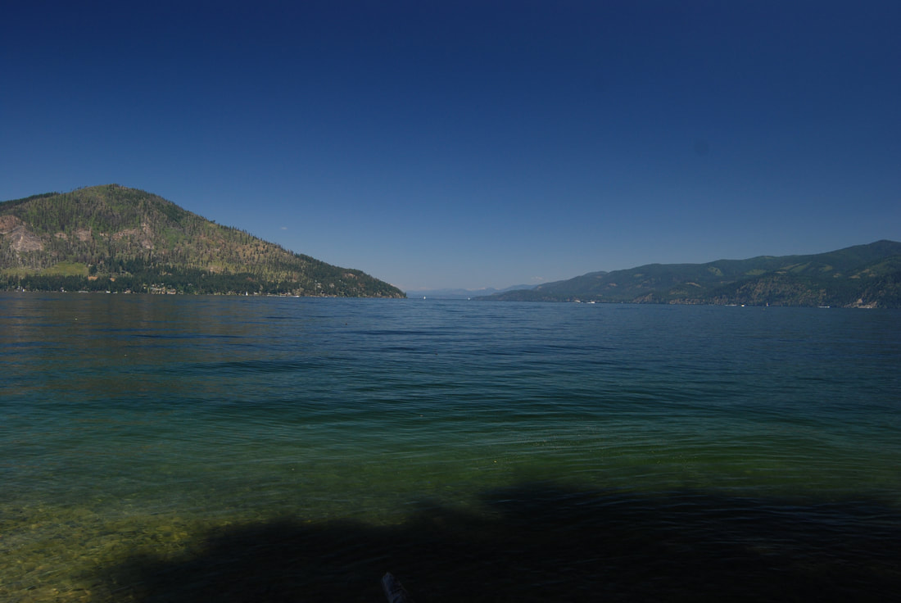
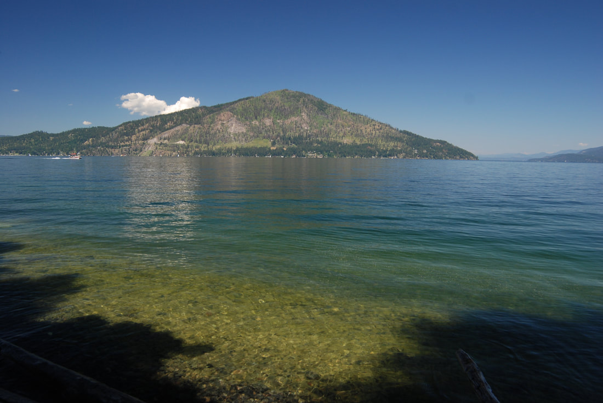

---
tags:
- Lakes
- Easy
- Paddling
stats:
- label: Event Type
  icon: hiking
  value: Flat Water Paddling
- label: Distance
  icon: map-marker-distance
  value: 5+ miles RT
- label: Elevation
  icon: terrain
  value: 2,057'
- label: Acres
  icon: vector-square
  value: 94,720
- label: Difficulty
  icon: speedometer
  value: Easy (consult hazards for wind/waves)
- label: Maps
  icon: map
  value: Farragut S. P., Idlewilde Bay, Bernard Peak topo
- label: GPS
  icon: crosshairs-gps
  value: 47°56’56″N 116°30’14″W
- label: Kootenai County Sheriff
  icon: shield-account
  value: 208.446.1300
---

# Echo Bay & Lake Pend Oreille (2,057')

_Echo Bay & Lake Pend Oreille (2,057')_

## Description & Paddling Instructions

The paddle to Echo Bay starts at the Bayview public launch or the Farragut State Park Eagle Boat Launch.
From either site, paddle due east across Idlewilde Bay to Bernard Point (2.5 miles from Bayview or 1.3 miles
from Eagle Boat Launch).

Paddle along the shoreline below Bernard Peak beneath massive, near-vertical granite cliffs. As you paddle
northeast along the shoreline toward Echo Bay, keep an eye out for mountain goats high above on the cliffs.

A major attraction in one-mile-long Echo Bay is its shaded shoreline beach, which features several sunny
spots to catch rays and an endless supply of near-perfect skipping rocks.

---

## Route Options & Extensions

You may choose to paddle further around the shoreline toward Lakeview. From Lakeview, you can retrace your
strokes back along the shore, or if Lake Pend Oreille is calm, paddle 2.25 miles straight across Idlewilde
Bay to Cape Horn, and south back to Bayview.

---

## Directions

From Coeur d'Alene, drive north on Hwy 95 toward Sandpoint. At Athol, exit right (east) onto State
Highway 54. Drive 4 miles to the roundabout pay station. Continue 1/4 mile along SH-54 to South Road, turn right,
and continue to the Eagle Boat Launch inside Farragut State Park.

---

## Hazards & Safety

!!! caution "High Wind & Open Water Hazards"
    Lake Pend Oreille is a massive, deep body of water subject to sudden, severe winds and large waves.

    - **Wind Response:** If winds pick up, pull your boat onto the nearest shore immediately. Do not attempt
      to paddle across open water in high winds.
    - **Boat Handling:** Secure your cockpit cover and place all loose items below deck. Paddle carefully
      toward the closest shoreline. Never allow wind or waves to hit your boat broadside, as it can capsize
      your craft.

---

## Restaurants & Pubs

- **Hayden:** Rustler’s Roost (on Hwy 95)
- **Coeur d'Alene:** Mexican Food Factory, Franklin’s Hoagies, Moon Time

---

## Weather & Planning

- [Current NOAA Weather Conditions](https://www.nws.noaa.gov/wtf/udaf/MapClick.php?lel=4000&uel=9000&polygon=49.016%2C-114.180%2C48.994%2C-114.381%2C48.890%2C-114.341%2C48.924%2C-114.151%2C&area=63)

---

## Photo Gallery

_Cape Horn on the north side of Bayview._

_Looking north from Echo Bay, with Lakeview._

_The view from Echo Bay._
