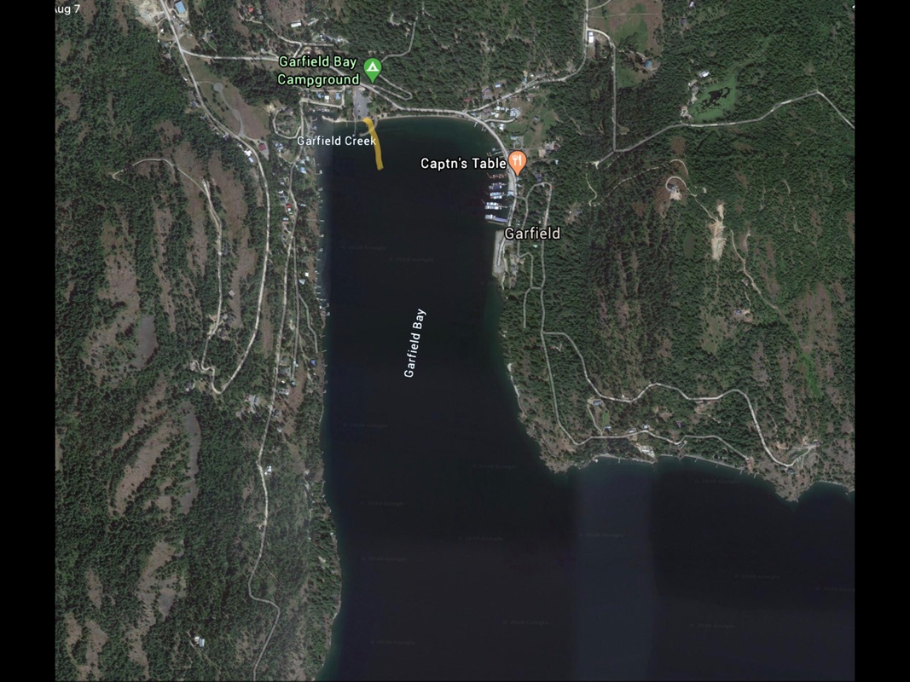

---
tags:
- Paddling & Rivers
stats:
- label: Paddle Distance
  icon: map-marker-distance
  value: varies
- label: Elevation
  icon: terrain
  value: 2067'
- label: Length and Acreage
  icon: vector-square
  value: varies
- label: Maps
  icon: map
  value: IPNF, Packsaddle Mountain topo
- label: Launch GPS
  icon: crosshairs-gps
  value: 48°11'14" N 116°26'15" W
- label: Bonner County Sheriff
  icon: shield-account
  value: 208-263-8417
---

# Garfield Bay Launch

_Garfield Bay Launch_

## Description

The Garfield Bay Launch is located near the Garfield Bay Campground. Once out of Garfield Bay, to the left is
Mineral Point (Trail). To the right is Talache Landing.

## Attractions

Big water paddling, Mineral Point Hiking Trail, and Green Bay Boat Camp.

## Directions

Drive north on 95 to Sagle and turn right (East) onto the Sagle Road, and drive about 7.5 miles, staying on
Garfield Bay Road, to the launch.

## Cool Things Close By

Talache Landing, Shepherd Lake, and Mirror Lake. If the winds are up on P.O. Lake, these two small lakes are
an option.

## Restaurants & Pubs

Mr. Sub, Eichardt's, Jalapeños, and Burger Express in Sandpoint.

## Plan Your Trip

[Click for Current NOAA Weather Conditions](https://www.nws.noaa.gov/wtf/udaf/MapClick.php?lel=4000&uel=9000&polygon=49.016%2C-114.180%2C48.994%2C-114.381%2C48.890%2C-114.341%2C48.924%2C-114.151%2C&area=63)

## Photo Gallery

_To contribute, contact Chic._
