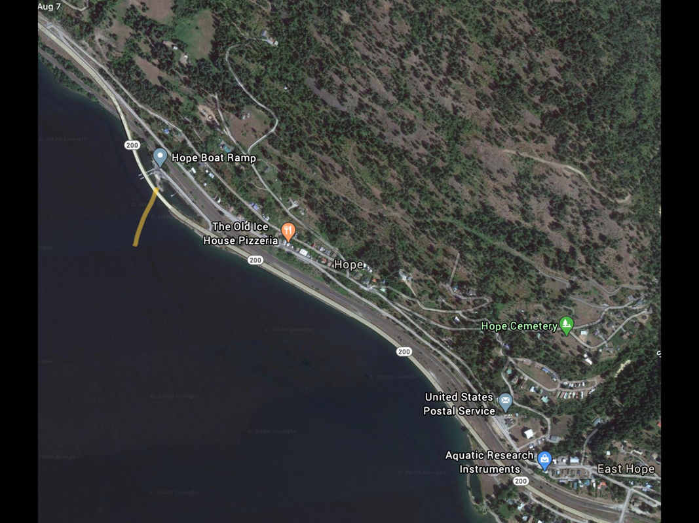

---
tags:
- Paddling & Rivers
stats:
- label: Paddle Distance
  icon: map-marker-distance
  value: varies
- label: Elevation
  icon: terrain
  value: 2067'
- label: Length and Acreage
  icon: vector-square
  value: varies
- label: Launch GPS
  icon: crosshairs-gps
  value: 48°15'02" N 116°18'55" W
- label: Bonner County Sheriff
  icon: shield-account
  value: 208-263-8417
---

# Hope Launch

_Hope Launch_

## Description

The Hope Boat Launch is located just west of Hope on Hwy 200, on the north shore. From the Hope Launch, most
of the north shore is accessible.

## Attractions

Easy off Hwy 200 access. North shore paddling on big water.

## Directions

From Sandpoint, turn right (East) onto Hwy 200, and drive towards Hope. As Hwy 200 swings out over the lake,
the launch is off to the left (north).

## Cool Things Close By

Sam Owen Campground, Warren Island, Pearl Island, Ellisport Bay, Memaloose Island, and David Thompson State
Wildlife Preserve.

## Restaurants & Pubs

Old Ice House Pizzeria

## Plan Your Trip

[Click for Current NOAA Weather Conditions](https://www.nws.noaa.gov/wtf/udaf/MapClick.php?lel=4000&uel=9000&polygon=49.016%2C-114.180%2C48.994%2C-114.381%2C48.890%2C-114.341%2C48.924%2C-114.151%2C&area=63)

## Photo Gallery

_Images coming soon._
