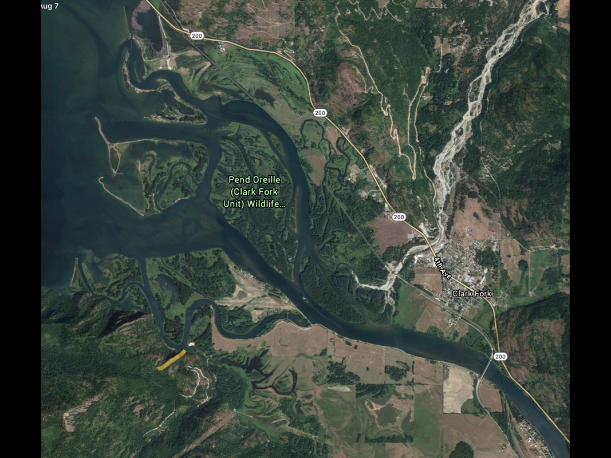

---
tags:
- Paddling & Rivers
stats:
- label: Paddle Distance
  icon: map-marker-distance
  value: varies
- label: Elevation
  icon: terrain
  value: 2067'
- label: Length and Acreage
  icon: vector-square
  value: varies
- label: Maps
  icon: map
  value: IPNF, Clark Fork Topo
- label: Launch GPS
  icon: crosshairs-gps
  value: 48°08'20" N 116°13'43" W
- label: Bonner County Sheriff
  icon: shield-account
  value: 208-263-8417
---

# Johnson Creek Launch

_Johnson Creek Launch_

## Description

Johnson Creek is a premier paddling location, where the Clark Fork River enters Pend Oreille Lake. Once in
the water, there are many routes to paddle to get out onto Pend Oreille Lake. If you hug the south shore
through channels, you come to the landing on the lake facing west. There is a dock on the east side of the
peninsula to tie your boats up. Or you can paddle around the peninsula to a long beach with a small pond in
it. A cool thing about this beach is, of course, the wonderful skipping rocks. If you want to extend your
paddle, or are looking for a place to boat camp, just head south down the east shoreline -- the boat camps
are exceptional and private.

## Attractions

Pend Oreille Wildlife Area Clark Fork Unit, Denton Slough, the Clark Fork River, Clark Fork, Sam Owen
Campground, and the Green Monarchs.

## Directions

From Sandpoint, turn right onto Hwy 200 and drive to Clark Fork. About halfway through Clark Fork is the
Clark Fork Pantry. Stop here for incredible sandwiches on homemade bread and peanut butter cookies. A bit
further on 200, you will see a Forest Service sign on the right to Johnson Creek Launch.

## Cool Things Close By

Johnson Creek Falls is just a bit further on F.R. 278, Pend Oreille Wildlife Area, the Clark Fork River,
Clark Fork, the Green Monarchs, Sam Owen Campground, 4 islands to paddle around, and the Denton Slough.

## R & P

The Clark Fork Pantry, and Squeeze Inn Restaurant. Mr. Sub, Eichardt's, and Jalapeños in Sandpoint.

## Plan Your Trip

[Click for Current NOAA Weather Conditions](https://www.nws.noaa.gov/wtf/udaf/MapClick.php?lel=4000&uel=9000&polygon=49.016%2C-114.180%2C48.994%2C-114.381%2C48.890%2C-114.341%2C48.924%2C-114.151%2C&area=63)

## Photo Gallery

_Images coming soon._
