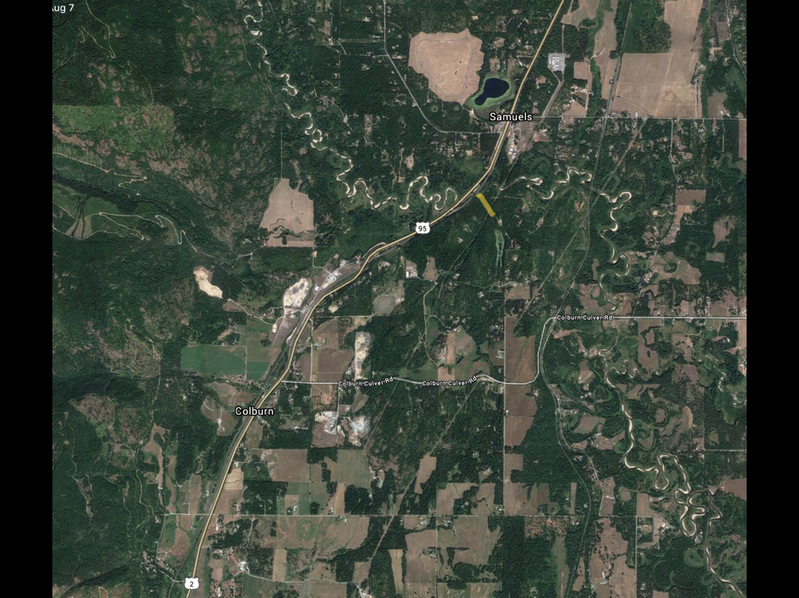

---
tags:
- Paddling & Rivers
stats:
- label: Paddle Distance
  icon: map-marker-distance
  value: 22.5 miles of very windy river
- label: Elevation
  icon: terrain
  value: Hwy 95 put in 2106'. P.O. Lake take out 2062'
- label: Length and Acreage
  icon: vector-square
  value: 22.5 miles and takes 8 to 12 hours.
- label: Maps
  icon: map
  value: Elmira Topo
- label: Launch GPS
  icon: crosshairs-gps
  value: Put in 48°25'16" N 116°29'57" W. Take out 48°19'26" N 116°23'04" W
- label: Bonner County Sheriff
  icon: shield-account
  value: 208-263-8417
---

# Pack River And Hwy 95 Launch

_Pack River And Hwy 95 Launch_

## Description

From the Hwy 95 put in, the river winds and twists for over 22 miles. Most of this paddle is on flat water
from April on. However, there are a few class 1 rapids. The biggest hazards are downed trees, log jams,
tight turns, and what are called "strainers." When a tree falls into the river, it acts like a strainer --
water flows through it, and they collect debris. Avoid strainers, down trees, and be aware on tight turns.
Past those hazards, the paddle is more of a float, with some heavy paddling around turns. A few more hazards
are moose, elk, beavers, and other small wildlife -- do not leave your lunch unattended.

At the take out, you can paddle out into the Pend Oreille Wildlife Management Area, and the Pack River Flats.
This is an amazing paddle that should not be missed, but I would advise against taking a reckless newbie. At
Lightning Creek, there is the Pack River Store, for supplies.

## Attractions

A gorgeous, windy river that will amaze you for hours.

## Directions

Drive through Sandpoint for about 12 miles where 95 crosses over the Pack River. The north launch is on the
right near where the river crosses under the RR tracks. There are three other put-ins to make your paddle
shorter: Colburn-Culver Road, Rapid Lightning Creek, and Hwy 200.

## Cool Things Close By

Pend Oreille Lake, Hawkins Point, Pend Oreille Wildlife Management Area, and Sandpoint.

## R & P

Mr. Sub, Eichardt's, Jalapeños, and Burger Express.

## Plan Your Trip

[Click for Current NOAA Weather Conditions](https://www.nws.noaa.gov/wtf/udaf/MapClick.php?lel=4000&uel=9000&polygon=49.016%2C-114.180%2C48.994%2C-114.381%2C48.890%2C-114.341%2C48.924%2C-114.151%2C&area=63)

## Photo Gallery

_Images coming soon._
