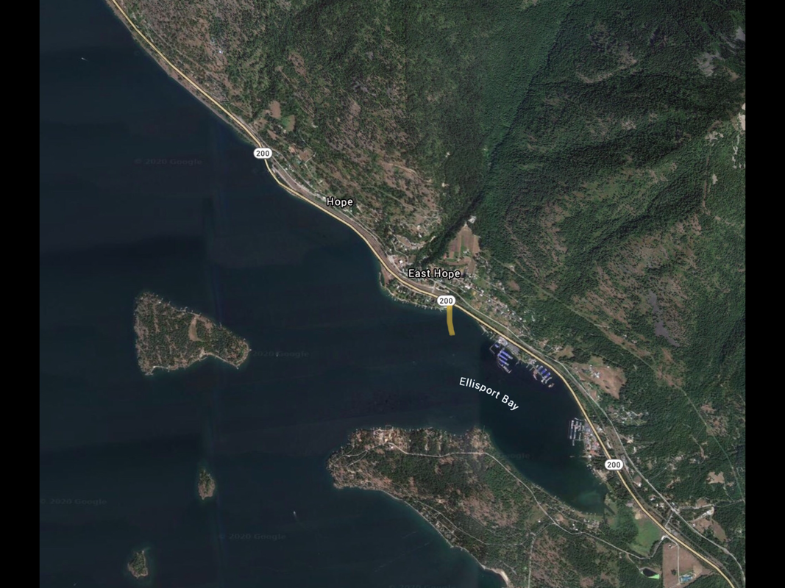

---
tags:
- Paddling & Rivers
stats:
- label: Paddle Distance
  icon: map-marker-distance
  value: varies
- label: Elevation
  icon: terrain
  value: 2067'
- label: Length and Acreage
  icon: vector-square
  value: varies
- label: Maps
  icon: map
  value: IPNF, Packsaddle Mountain topo
- label: Launch GPS
  icon: crosshairs-gps
  value: 48°14'20" N 116°17'36" W
---

# Pringle Park Launch

_Pringle Park Launch_

## Description

The Pringle Park Launch and Campgrounds are located at the mouth of Ellisport Bay, east of Hope, Idaho. This
launch gives you access to the north shore of Pend Oreille Lake, Warren Island, Pearl Island, Cottage Island,
David Thompson State Game Reserve, and the Sam Owen Campground.

## Attractions

Pringle Park has magnificent views of the main body of the P.O. Lake toward Sandpoint and SE towards the
Green Monarchs.

## Directions

From Sandpoint, take Hwy 200 towards Clark Fork. When you come next to the Hope Launch, the Pringle Park
Launch is 1.1 miles East. If you reach the Pend Oreille Shores resort, you have gone too far.

## Cool Things Close By

The north shore of Pend Oreille Lake, Cottage Island, Pearl Island, Warren Island, Memaloose Island, and Sam
Owen Campground.

## Restaurants & Pubs

Mr. Sub! Eichardt's, Jalapeños, and Burger Express, in Sandpoint.

## Plan Your Trip

[Click for Current NOAA Weather Conditions](https://www.nws.noaa.gov/wtf/udaf/MapClick.php?lel=4000&uel=9000&polygon=49.016%2C-114.180%2C48.994%2C-114.381%2C48.890%2C-114.341%2C48.924%2C-114.151%2C&area=63)

## Photo Gallery

_No images -- to contribute, contact Chic._
