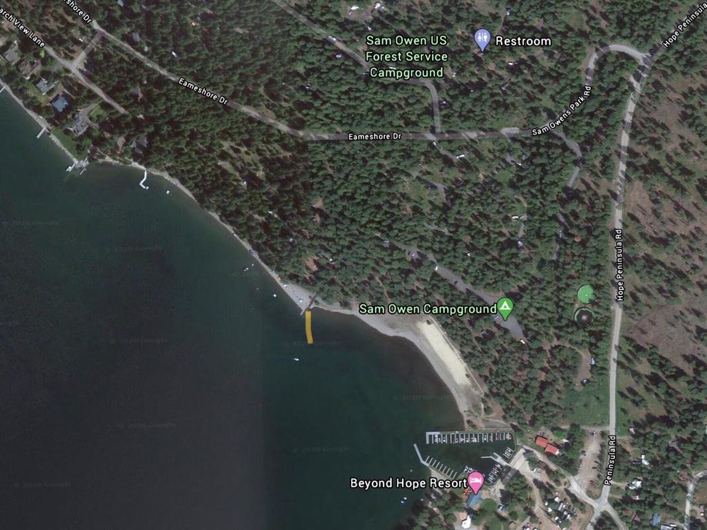

---
tags:
- Paddling & Rivers
stats:
- label: Paddle Distance
  icon: map-marker-distance
  value: varies
- label: Elevation
  icon: terrain
  value: 2067'
- label: Length and Acreage
  icon: vector-square
  value: 65 miles and 148 square miles.
- label: Maps
  icon: map
  value: IPNF, Packsaddle Mountain topo
- label: Launch GPS
  icon: crosshairs-gps
  value: 48°13'03" N 116°17'19" W
---

# Sam Owen Camp Ground Launch

_Sam Owen Camp Ground Launch_

## Description

There are actually two Sam Owen Campgrounds: the Sam Owen Campground on the water and around the beach, and
the Sam Owen USFS Campground above the other. This launch gives you access to the north shore and its three
islands; however, the islands are private property. All of this sits on the David Thompson State Game
Preserve's peninsula. If you are lucky, and quick, you can reserve a waterfront campsite -- there are 80
campsites in 4 loops.

## Attractions

Lakefront campsites, sandy beach, restrooms, potable water system, boat launch, and an amphitheater.

## Directions

From the Hope Boat Launch, drive east on Hwy 200 for 3 miles to the Hope Peninsula Road. Opposite from the
Sam Owen Fire Station #1, turn right and bear left, staying on Hope Peninsula Road N.F. #1002. Then right
onto Sam Owen Park Road.

## Cool Things Close By

The north shore of P.O. Lake, 4 islands to paddle around, and the David Thompson Game Preserve.

## Restaurants & Pubs

Hope's Ice House Pizzeria.

## Plan Your Trip

[Click for Current NOAA Weather Conditions](https://www.nws.noaa.gov/wtf/udaf/MapClick.php?lel=4000&uel=9000&polygon=49.016%2C-114.180%2C48.994%2C-114.381%2C48.890%2C-114.341%2C48.924%2C-114.151%2C&area=63)

## Photo Gallery

_Images coming soon -- to contribute, contact Chic._
