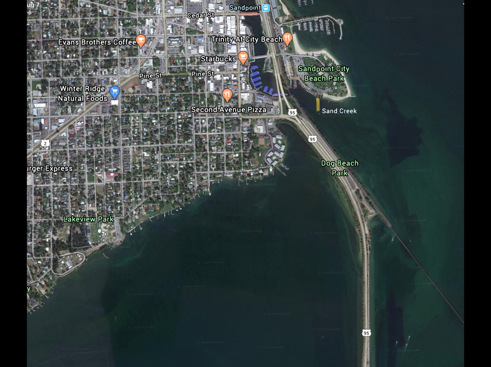

---
tags:
- Paddling & Rivers
stats:
- label: Paddle Distance
  icon: map-marker-distance
  value: varies
- label: Elevation
  icon: terrain
  value: 2067'
- label: Length and Acreage
  icon: vector-square
  value: 65 miles long & 14 square miles or 88,008 acres, and 125 miles of shoreline.
- label: Launch GPS
  icon: crosshairs-gps
  value: 48°6'22" N 126°32'29" W
---

# Sandpoint City Beach Launch

_Sandpoint City Beach Launch_

## Description

The Sandpoint City Beach is a gathering site for people to swim, play volleyball, tennis, sunbathing, and
boating.

## Attractions

A sandy beach circles the peninsula for all water sports. Boat launch with restrooms.

## Directions

As you cross the Pend Oreille River's Long Bridge, take the Sandpoint exit through downtown. As you turn onto
E. Superior Street, turn right onto S. 1st Ave. In less than a quarter of a mile, turn right onto Bridge
Street, across the bridge, under the RR tracks, and the park is straight ahead. The launch is on your first
right at the end. There's a turnaround just past the launch. Parking is always a problem, so be patient.

## Cool Things Close By

Sand Creek, P.O. Lake, the Long Bridge 1 mile walk. As you cross under the RR tracks heading towards the
park, take a sharp left turn onto Railroad Depot Road to the end. There you will find the lakeside P.O. Bay
Trail. It goes all the way to the town of Ponderay.

## R & P

Mr. Sub, Eichardt's, Jalapeños in Sandpoint. And the Burger Express near Dover to the west.

## Plan Your Trip

[Click for Current NOAA Weather Conditions](https://www.nws.noaa.gov/wtf/udaf/MapClick.php?lel=4000&uel=9000&polygon=49.016%2C-114.180%2C48.994%2C-114.381%2C48.890%2C-114.341%2C48.924%2C-114.151%2C&area=63)

## Photo Gallery

_Images coming soon -- to contribute, contact Chic._
