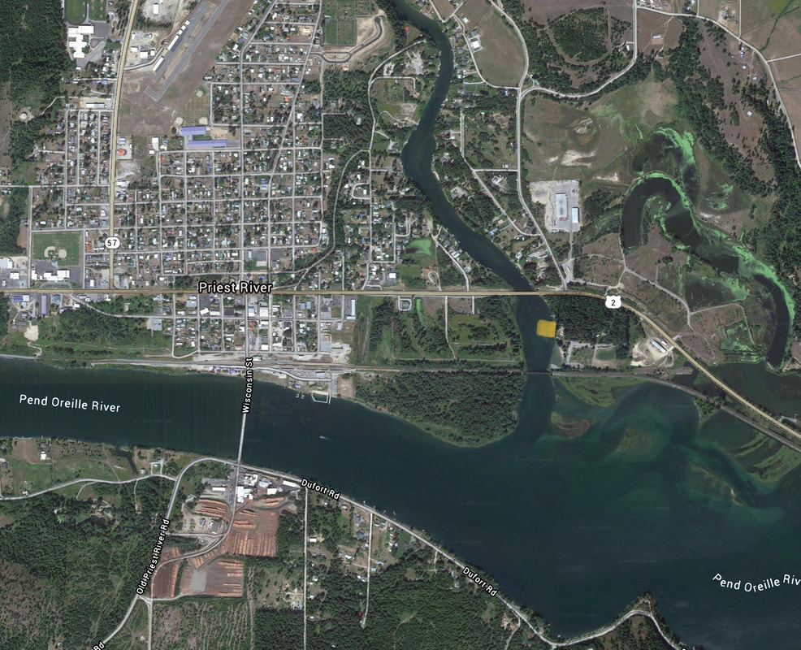

---
tags:
- Paddling & Rivers
stats:
- label: Paddle Distance
  icon: map-marker-distance
  value: varies
- label: Elevation
  icon: terrain
  value: 2066'
- label: Length and Acreage
  icon: vector-square
  value: varies
- label: Maps
  icon: map
  value: IPNF, Priest River Topo
- label: Launch GPS
  icon: crosshairs-gps
  value: 48°10'50" N 116°53'33" W
- label: Bonner County Sheriff
  icon: shield-account
  value: 208.263.8417
---

# Priest River Recreation Area Launch

_Priest River Recreation Area Launch_

## Description

This off the P.O. River launch is at the confluence of the Priest River and the P.O. Rivers. Within the
Priest River Recreation Area is the Priest River Park, with plenty of parking, restrooms, and a swimming
area.

## Attractions

Off the P.O. River at the confluence of the Priest River.

## Directions

From the stop light in Priest River, drive east on Hwy 2 for 1.3 miles to the entrance, next to the saw
mill.

## Cool Things Close By

The American Selkirks, Upper & Lower Priest Lakes, Round Lake State Park, and the Pend Orielle River.

## Restaurants & Pubs

Burger Express.

## Plan Your Trip

[Click for Current NOAA Weather Conditions](https://www.nws.noaa.gov/wtf/udaf/MapClick.php?lel=4000&uel=9000&polygon=49.016%2C-114.180%2C48.994%2C-114.381%2C48.890%2C-114.341%2C48.924%2C-114.151%2C&area=63)

## Photo Gallery

No images. To contribute, contact Chic.
