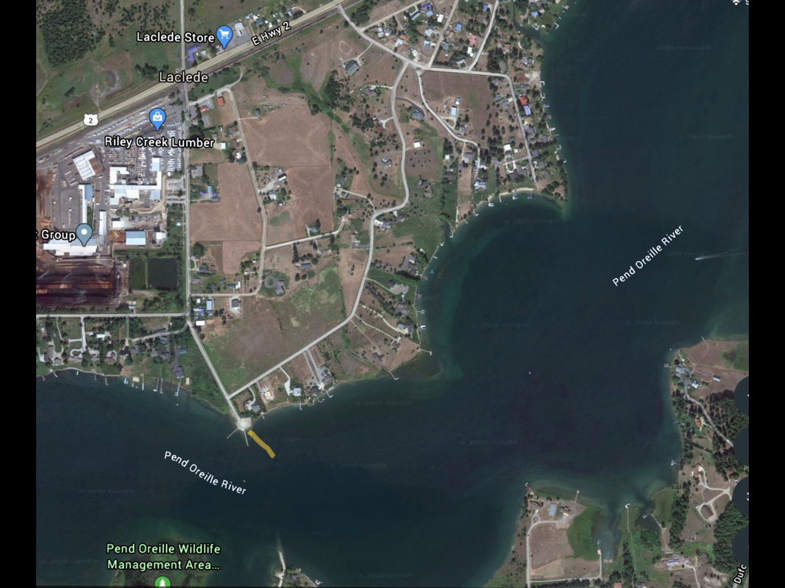

---
tags:
- Paddling & Rivers
stats:
- label: Paddle Distance
  icon: map-marker-distance
  value: varies
- label: Elevation
  icon: terrain
  value: 2066'
- label: Length and Acreage
  icon: vector-square
  value: varies
- label: Maps
  icon: map
  value: IPNF, Priest River Topo
- label: Launch GPS
  icon: crosshairs-gps
  value: 48°09'32" N 116°46'19" W
---

# Rieley Creek Launch

_Rieley Creek Launch_

## Riley Creek Recreation Area

## Description

This recreation area and launch are located on a peninsula, SW of Laclede, and the Riley Creek Lumber Mill.
The camp ground and launch, occupies most of the SW end of the peninsula. The Park has all the amenities,
including a great swimming area.

## Attractions

Access to the Pend Orielle River and Lake, Morton Slough, and Round Lake.

## Directions

In Laclede, turn off Hwy 2 at the S. Riley Creek Park Drive. In .4 miles the drive turns right (west). Stay
on the Riley Creek Park Drive to the park.

## Cool Things Close By

Morton Slough, Round Lake State Park, Priest River, and Sandpoint.

## R & P

Burger Express in Priest River.

## Plan Your Trip

[Click for Current NOAA Weather Conditions](https://www.nws.noaa.gov/wtf/udaf/MapClick.php?lel=4000&uel=9000&polygon=49.016%2C-114.180%2C48.994%2C-114.381%2C48.890%2C-114.341%2C48.924%2C-114.151%2C&area=63)

## Photo Gallery

No image. To contribute, contact Chic.
