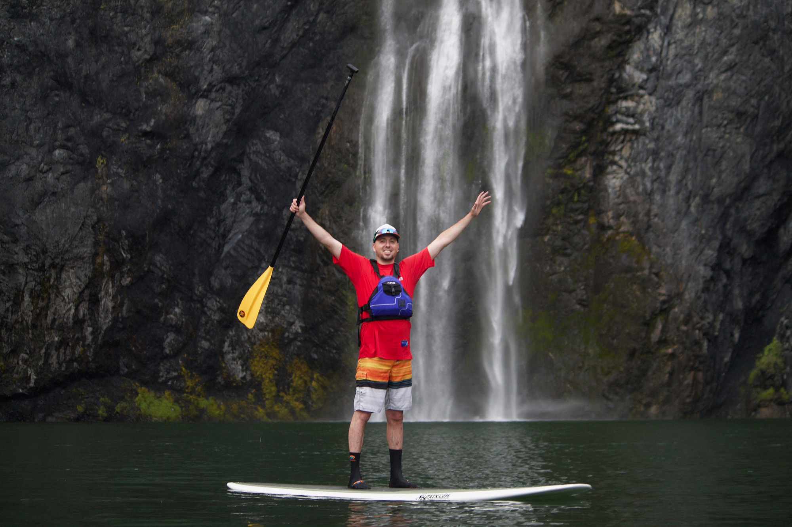

---
tags:
  - Paddling
  - Paddling & Rivers
  - Easy
  - Flat Water Paddling
stats:
  - label: Event Type
    icon: kayaking
    value: Flat Water Paddling
  - label: Distance
    icon: map-marker-distance
    value: 5 miles RT
  - label: Elevation
    icon: terrain
    value: "2,067'"
  - label: Difficulty
    icon: speedometer
    value: Easy
  - label: GPS
    icon: crosshairs-gps
---

# Paddling Safety & Kayaking Guide

## Useful Information All Paddlers Need to Know

Like in all outdoor sports, there are inherent hazards in paddling. Your primary responsibility is to
identify hazards before they become dangerous.

!!! warning "Wind & Cold Water Hazards"

    - **Wind:** Wind is by far the most hazardous weather concern on open water. When winds pick up, head for shore
    immediately. Do not attempt tight turns in heavy chop; land on shore and wait out the wind until it is
    safe to resume paddling.
    - **Currents:** Always paddle *upstream* or *into the wind* at the start of your trip. A 2-hour paddle downwind can
    require double the time and energy to fight back.
    - **Cockpit Balance:** Never allow your nose to extend past the inside rim of your cockpit. Practice turning in
    your seat without leaning outward.
    - **Water Temperature:** Check water and air temperatures before launching. In cold water, a wetsuit or drysuit is
    essential to prevent rapid hypothermia.

### Essential Safety Guidelines

- **Sun Protection:** Apply broad-spectrum sunscreen before leaving home and reapply after swimming. Don't
  forget the backs of your hands. Wear a wide-brim sun hat.
- **Landing in Surf:** Approach shore with the bow perpendicular to the waves. Never let your boat turn
  broadside in surf, or it will swamp. Exit quickly once near shore while holding your boat and paddle
  securely.
- **Assisting Swimmers:** Never let swimmers approach the side of your kayak. Offer them the bow so you can
  keep an eye on them without risk of capsize.
- **Logjams & Eddies:** During high spring flows, scan far ahead for strainers, logjams, and debris. Use
  extreme caution around eddies where tributary streams enter rivers or where channels make abrupt turns.
- **Float Plans:** Always leave a detailed float plan with a reliable person on land detailing your launch
  point, destination, expected return time, and emergency contact numbers.
- **Group Responsibility:** Keep a close eye on fellow paddlers. If anyone begins acting abnormally or
  showing signs of hypothermia, stop immediately to assess their condition.

---

## Uncle Chuck's 25 Kayaking Rules

1. **Boat Selection:** Always buy as long and narrow of a kayak as you can afford, equipped with a rudder.
2. **PFD Required:** Never go on the water without wearing your PFD.
3. **Keep Center of Gravity:** If your nose extends outside your cockpit rim, over you go.
4. **13 Essentials:** Always carry your 13 essentials on every outing.
5. **Render Assistance:** Always render aid to other paddlers in need.
6. **Stay Upright:** Stay upright at all times.
7. **High Winds Rule:** Never paddle in high winds—head to shore and sit it out.
8. **Upstream First:** Always start paddling upstream or into the wind so the return leg is downstream or
   downwind.
9. **File a Float Plan:** Always leave your paddle location, destination, return time, and emergency contact
   details with a reliable contact.
10. **Gear Check:** If you do not have all your essential safety gear, do not launch.
11. **Maintenance:** Repair or replace worn gear immediately before your next trip.
12. **Common Sense:** Use common sense before and during your paddle.
13. **Efficient Strokes:** Use relaxed paddle strokes to conserve energy.
14. **Obey Regulations:** Obey all watercraft laws, regulations, and law enforcement directives.
15. **Respect Authorities:** Never back-talk or argue with marine authorities.
16. **Provisions:** Bring extra food, energy snacks, water, or a water purifier on every trip.
17. **Stability:** Stay upright.
18. **Sobriety:** Never paddle under the influence of alcohol or drugs.
19. **Sun Gear:** Wear proper clothing, sunscreen, paddling gloves, and a wide-brim sun hat.
20. **Weather Tracking:** Check weather forecasts and NOAA marine alerts before launching.
21. **Community:** Lead a trip for local paddling clubs like the Spokane Mountaineers, Spokane Canoe & Kayak
    Club, or Coeur d'Alene Kayak Club.
22. **Route Guides:** Use InlandNWRoutes.com for launch locations, driving directions, and trip reports.
23. **Vehicle Transport:** Secure boats properly to your vehicle rack using cam straps and locking cables.
24. **Passing Protocol:** Pass oncoming boats on your left (port to port), just like motor vehicles.
25. **Education & Fun:** Take a paddling safety course before your first trip, and have too much fun!

---

## Emergency Equipment & Packing Checklist

In a medium-to-large dry bag, pack the following essential items for every paddle:

!!! info "Essential Dry Bag Packing List"

    - **Emergency Dry Clothes:** Walmart rain suit (top & bottom), heavy fleece jacket and pants, synthetic
    polypropylene thermal underwear, wool gloves, wool stocking cap, and wool socks.
    - **Towel:** A large plush bath towel stored right at the top of your dry bag to dry off and re-dress quickly
    after an accidental capsizing.
    - **Safety Hardware:** Signal whistle attached to your PFD, bilge pump, large cockpit sponge, emergency LED
    headlamp with red/green navigation lights for dusk, and a knife.
    - **Boat Care:** McQuire's Ultimate Quick Wax or 303 Marine Protectant to keep hull surfaces smooth and prevent
    pollen/scum buildup.

---

## International Scale of River Difficulty

| Grade | Difficulty | Description |
| :--- | :--- | :--- |
| **Grade I** | **Easy** | Moving water with small, regular waves and clear passages. Low river speeds; easy navigation around minor gravel bars or snags. |
| **Grade II** | **Medium** | Unobstructed rapids with regular waves, easy eddies, and clear channels. River speed occasionally exceeds back-paddling speed. |
| **Grade III** | **Difficult** | Rapids requiring precise maneuvering. High waves, small drops, and fast currents near overhanging branches. Requires scouting during high spring runoff (April–July). |
| **Grade IV** | **Very Difficult** | Long, turbulent rapids with powerful hydraulics requiring precise boat control. Shore scouting is mandatory. Not suitable for open canoes or recreational kayaks. |

---

## Regional Navigation Links

| Region | Route Guide Link | Description |
| :--- | :--- | :--- |
| **Canada** | [Canada Routes](../hike/canada/index.md) | Kootenay, Columbia, and British Columbia waterway access. |
| **Washington** | [Washington Routes](../hike/washington/index.md) | Eastern WA rivers, Spokane River, and lake launches. |
| **Idaho** | [Idaho Routes](../hike/idaho/index.md) | Priest Lake, Lake Pend Oreille, St. Joe, and CDA water routes. |
| **Montana** | [Montana Routes](../hike/montana/index.md) | Clark Fork, Kootenai River, and MT river access. |
| **Oregon** | [Oregon Routes](../hike/oregon/index.md) | Columbia River and Oregon regional paddling destinations. |
