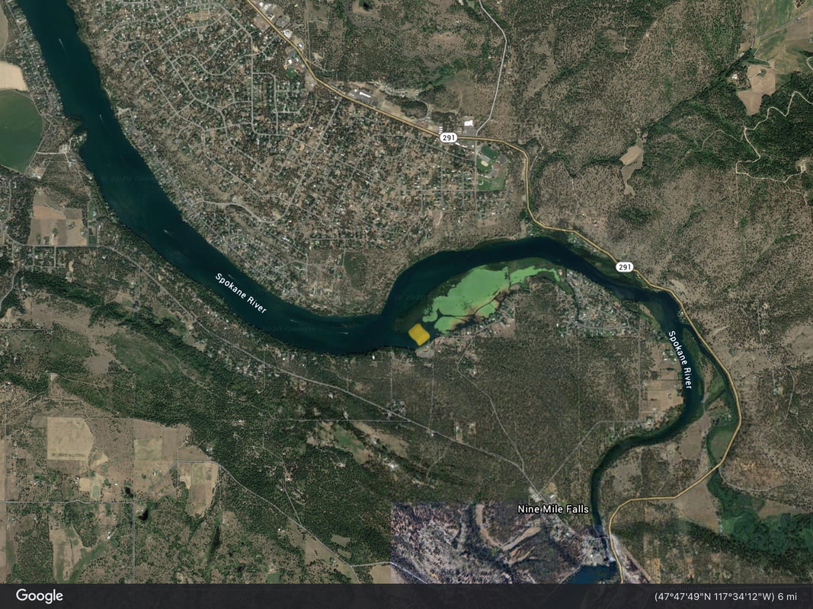

Nine Mile Recreation Area is a popular water access site situated on Lake Spokane (the 21-mile reservoir formed along the Spokane River between Nine Mile Falls Dam and Long Lake Dam). Located within Riverside State Park, this site features paved boat ramps, docks, parking, picnicking, and swimming areas ideal for kayaks, canoes, paddleboards, and motorboats.

!!! info "Trip Planning & Regulations"

    - **Discover Pass:** A Washington State Discover Pass is required for vehicle parking at Riverside State Park sites.
    - **Current Conditions:** Check [NOAA Weather Conditions for Nine Mile Falls](https://forecast.weather.gov/MapClick.php?lat=47.7816&lon=-117.5456) before paddling.

---

## Paddle Route & Highlights

- **21-Mile Reservoir:** The Spokane River reservoir stretches 21 miles downstream to Long Lake Dam, providing calm, open-water paddling throughout summer with minimal linear current.
- **Scenic Granite Bluffs:** Paddle past granite rock formations, ponderosa pine forests, and quiet coves near Suncrest and Tumtum.
- **Wildlife Viewing:** Osprey, bald eagles, great blue herons, and waterfowl frequent the shoreline habitats along the river corridor.

---

## Access & Driving Directions

- From Spokane, follow WA-291 (Nine Mile Road) north past Nine Mile Falls Dam.
- Turn off WA-291 into the Nine Mile Recreation Area entrance within Riverside State Park to reach the boat launch and parking loop.

---

## Nearby Attractions

- Nine Mile Falls Dam & Powerhouse
- McLellan Conservation Area
- Fisk State Park
- Lake Spokane Campground
- Riverside State Park Trail System

---

## Photo Gallery

_Nine Mile Recreation Area Launch on Lake Spokane._
