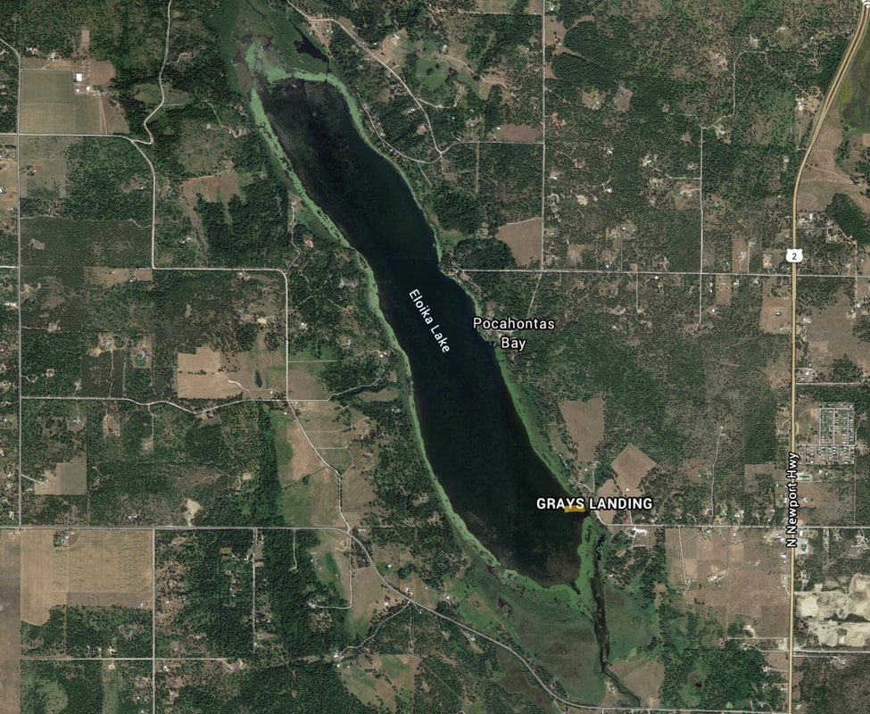

---
tags:
  - Lakes
stats:
  - label: Paddle Distance
    icon: map-marker-distance
    value: 5.6 mile loop
  - label: Elevation
    icon: terrain
    value: 1905’
  - label: Length and Acreage
    icon: vector-square
    value: 2.25 miles long and 659 acres.
  - label: Maps
    icon: map
    value: W.D.F. & G., Pend Orielle County
  - label: Launch GPS
    icon: crosshairs-gps
    value: 48°01’06"n 117°23’01" w
  - label: Spokane County Sheriff
    icon: shield-account
    value: 509.477.2240
---

# Eloika Lake Launch

_Eloika Lake Launch_

## Description

We have added the areas sheriff’s emergency phone numbers for each trip write up under the ranger district
info. if an emergency ocurrs, evaluate your circumstances and call only if needed. Eloika Lake is a long
narrow lake that is lined with algae blooms all around it.

## Attractions

NA

## Directions

Drive Hwy 2 past the Milan crossroad for 3.2 miles and turn left (W) onto E. Bridge Road to Grays Landing.

## Cool things close by

Loon Lake, Deer Lake, Horseshoe Lake, Sacheen Lake, and Diamond Lake.

## Restaurants & Pubs

NA

## Plan your trip

[Click for Current NOAA Weather Conditions](https://www.nws.noaa.gov/wtf/udaf/MapClick.php?lel=4000&uel=9000&polygon=49.016%2C-114.180%2C48.994%2C-114.381%2C48.890%2C-114.341%2C48.924%2C-114.151%2C&area=63)

## Photo gallery

Dark sky and shooting star
