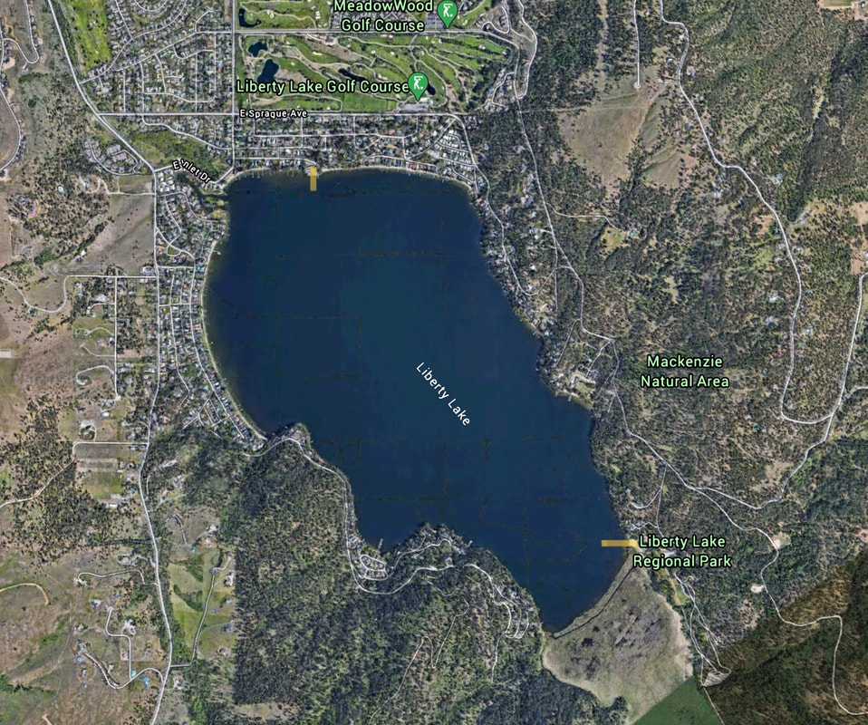

Liberty Lake Regional Park encompasses 3,591 acres on the southern shore of Liberty Lake. Featuring a sandy swimming beach, hand-launch watercraft access, designated picnic areas, campsites, and an extensive hiking trail system through ancient cedar groves and along Liberty Creek, it serves as the primary outdoor recreation destination on the lake.

!!! info "Trip Planning & Park Rules"

    - **Day-Use Fees:** Spokane County Parks charges a seasonal day-use entry fee during summer months.
    - **Weather & Conditions:** Check [NOAA Weather Conditions for Liberty Lake](https://forecast.weather.gov/MapClick.php?lat=47.6375&lon=-117.0633) before paddling.
    - **Trail System:** The 8.3-mile Liberty Lake Loop Trail leads past Split Creek and the Cedar Grove into the hills above the park.

---

## Paddle Route & Highlights

- **South Shore Paddling:** Launch from the park's sandy shore to explore quiet marshlands and reed beds along the inlet of Liberty Creek.
- **Lake Circuit:** Paddle 4.7 miles around the perimeter of Liberty Lake, taking in views of Mica Peak and the forested hillsides.
- **Water Recreation:** Ideal for kayaks, canoes, stand-up paddleboards, swimming, and warm-water fishing for bass and trout.

---

## Access & Driving Directions

1. From Interstate 90, take **Exit 296** (Liberty Lake / Otis Orchards).
2. Drive south on **N. Liberty Lake Road** for 1.7 miles.
3. Turn left (east) onto **E. Sprague Avenue** for 0.7 miles.
4. Turn right (south) onto **S. Molter Road** for 0.8 miles.
5. Turn left (east) onto **E. Valleyway Avenue**, which curves into **S. Zephyr Road** and **S. Idaho Road** heading south to the park entrance.

---

## Nearby Destinations

- Liberty Lake 3rd Street Launch (North Shore)
- Liberty Lake Loop Trail & Ancient Cedar Grove
- Mica Peak Conservation Area
- Saltese Flats Conservation Area
