The paddle trip along the northernmost stretch of the Pend Oreille River to Pewee Falls and Z Canyon is widely regarded as one of the most spectacular water routes in the Inland Northwest. Paddling south from the launch near Boundary Dam, watercraft navigate beneath 300-foot sheer limestone canyon cliffs, explore sea-like shoreline caves, view 200-foot waterfalls cascading directly into the river, and experience unique daily river level shifts created by dam operations.

!!! warning "Critical Water Level Fluctuation & Navigation Warnings"

    - **5 to 16 Foot Daily Water Level Fluctuations:** Boundary Dam and Box Canyon Dam generate hydroelectric power for Seattle throughout the day. Water levels rise and fall by 5 to 16 feet every 24 hours.
    - **Overnight Boat Safety:** If camping along the river, sleep and stow all kayaks, canoes, and gear at least **16 feet above the evening waterline**. Unsecured boats left near the water edge WILL be floated away during early morning power generation cycles.
    - **Metaline Falls River Obstruction Hazard:** Do **NOT** paddle downstream through the town of Metaline past the Metaline Falls bridge. Decades ago, blasting during old powerhouse demolition dropped a massive section of rock into the river, creating a hazardous whirlpool on the east bank.

---

## Paddle Route & Highlights

- **Boundary Dam Campground Launch:** Launching from the campground at Boundary Dam provides immediate access to the lower canyon.
- **Ratt Island:** Located just off the launch site. During morning high water, much of the island and shoreline wildflowers are submerged; as water levels drop in the afternoon, exposed beaches and rock outcrops emerge.
- **Pewee Falls (200-Foot Plunge):** Located 0.6 miles southwest of the launch in a sheltered side bay. At low water, a large circular mound of boulders dropped from the towering cliffs above emerges at the base of the 200-foot waterfall.
- **Z Canyon Sheer Cliffs:** South of Pewee Falls, the river enters Z Canyon, where sheer limestone walls rise 300+ feet directly out of the water. Two paddle-accessible caves appear on the eastern shoreline as water levels drop in the afternoon.
- **Stereophonic Waterfalls:** Approximately 7.7 miles upstream from the launch, two waterfalls pour into the river from opposite banks. Floating in the middle of the river between the falls creates a stereophonic acoustic effect.
- **Backcountry Lakeshore Camping:** Primitive campsites are situated along the riverbank at mile 9.3 for overnight trips.

---

## Boundary Dam & Local History

- **Boundary Dam Engineering:** Completed in 1967 by Seattle City Light, Boundary Dam stands 340 feet tall as a thin-arch concrete double-curvature dam. Its underground powerhouse—carved 15 stories into limestone rock—houses six generators producing over 1,100 megawatts (up to 35% of Seattle's electricity).
- **Indigenous & Mining History:** Ancestors of the Kalispel Tribe of Indians have inhabited the Pend Oreille River valley for over 8,000 years. In the mid-1800s, the Metaline Mining District became a major producer of zinc and lead.
- **Film Location:** In 1997, Director Kevin Costner filmed portions of the post-apocalyptic movie *The Postman* at Boundary Dam, constructing the fictional facade of "Bridge City" across the face of the dam.
- **Gardner Cave (Crawford State Park):** Located nearby, Crawford State Park protects Gardner Cave, a 500-foot limestone cave featuring stalactites, stalagmites, and flowstone formations.

---

## Access & Driving Directions

1. From Spokane, drive north on **US-2 N** through Chattaroy.
2. Turn northwest onto **WA-211 N** near Usk toward Metaline Falls.
3. Join **WA-20 N** at Tiger and continue north along the Pend Oreille River.
4. At Tiger, continue north on **WA-31 N** through Ione to Metaline and Metaline Falls.
5. Just north of Metaline, turn west onto **Boundary Road** and follow signs to Boundary Dam Campground and Crawford State Park.
6. A Washington State **Discover Pass** is required for parking at Crawford State Park sites.

---

## Nearby Attractions

- Crawford State Park & Gardner Cave Tours
- Boundary Dam Vista House & Spillway Overlook
- Sullivan Lake State Park & Hiking Trails
- American Selkirk Mountain Range

---

## Photo Gallery

- 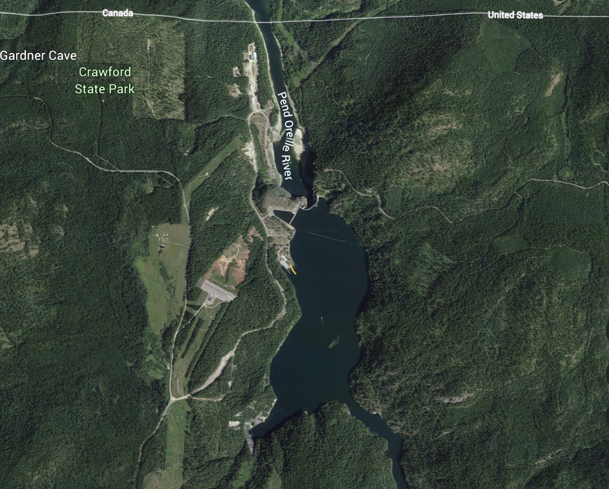
- 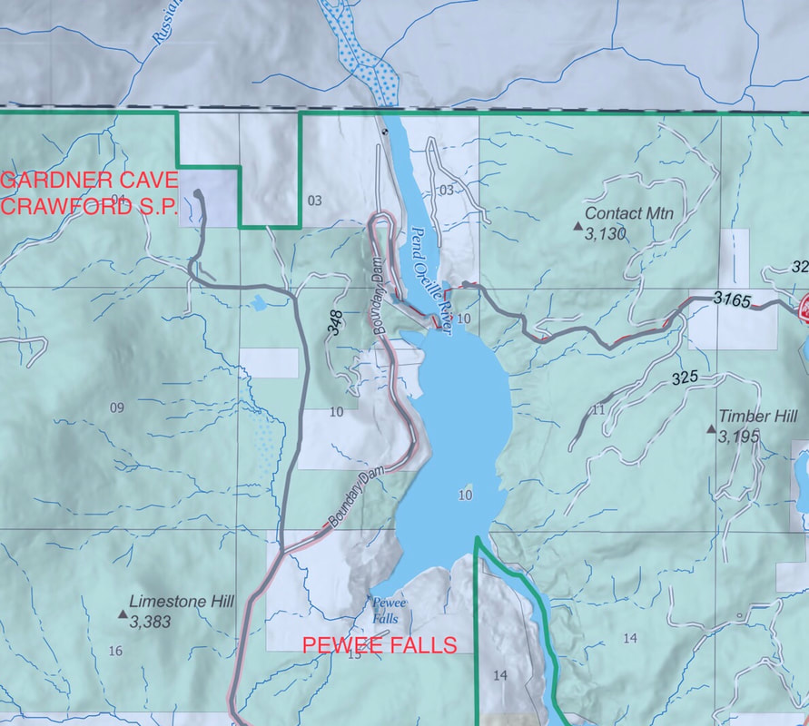
- 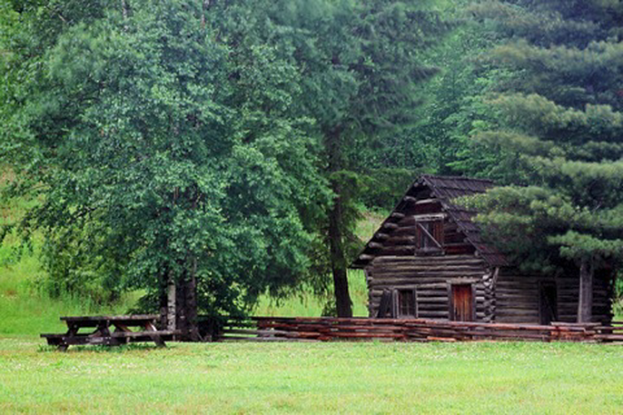
- 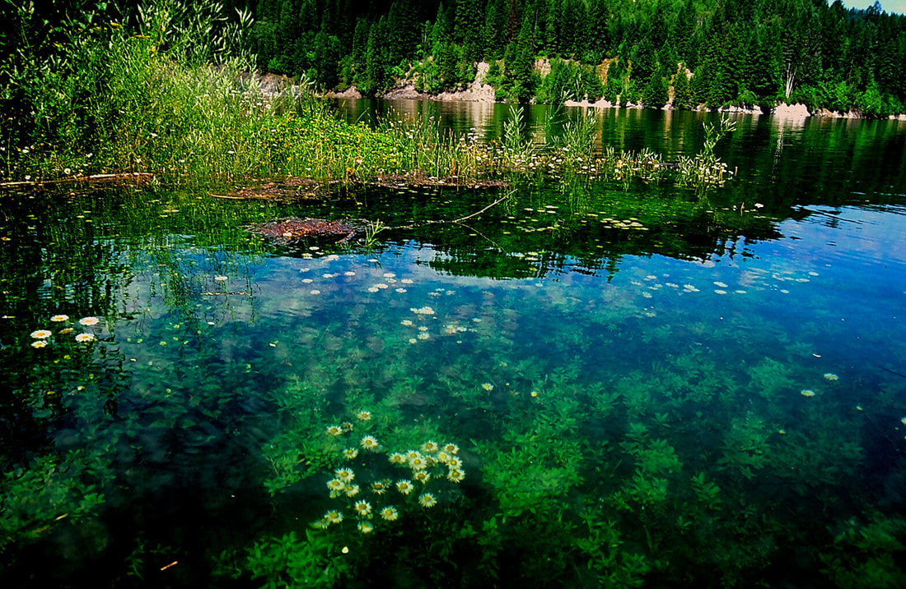
- 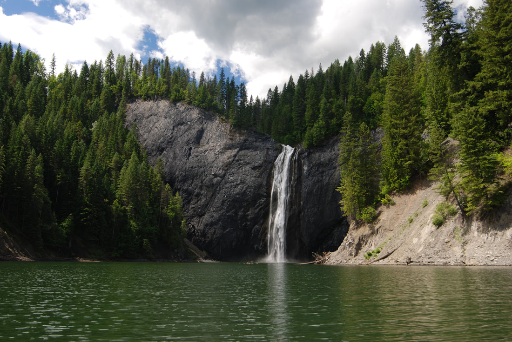
- 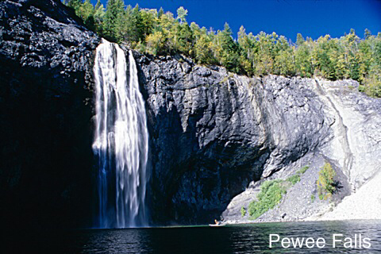
- 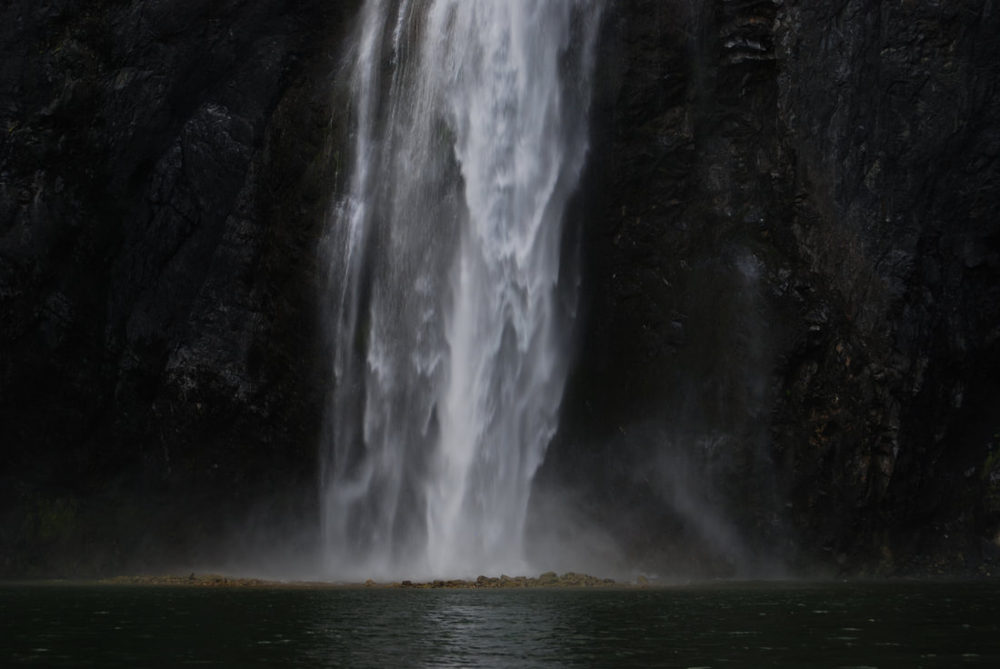
- 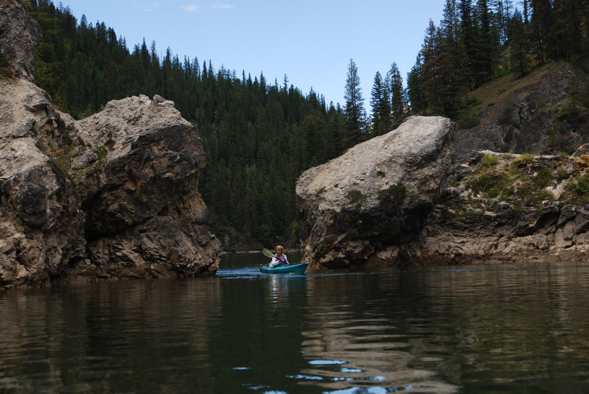
- 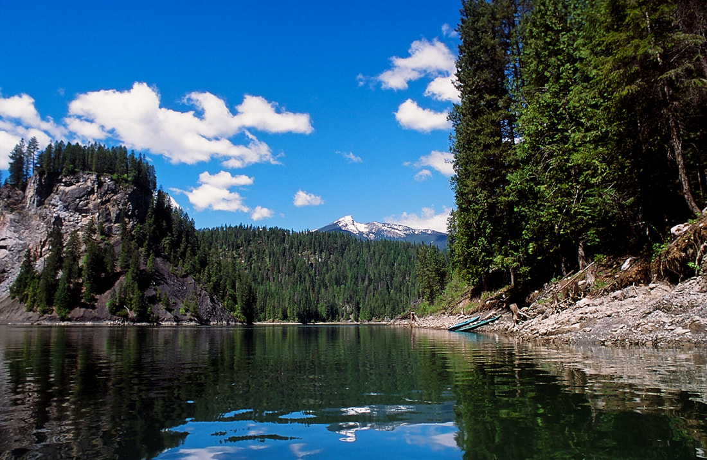
- 
- 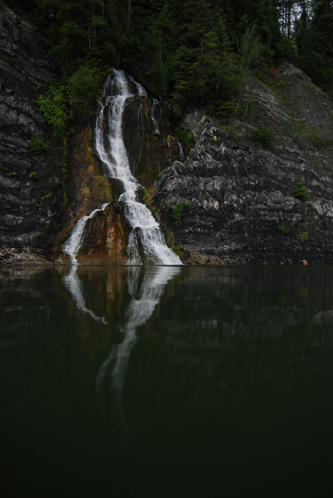
- 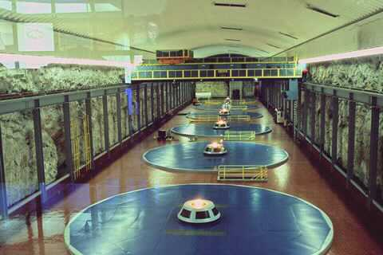
- 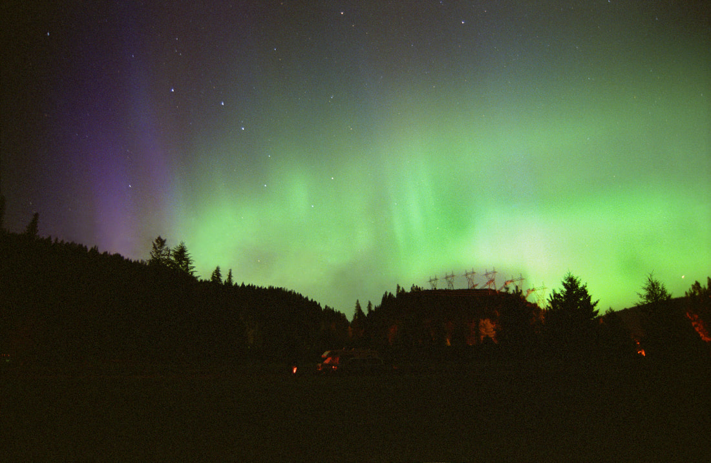
