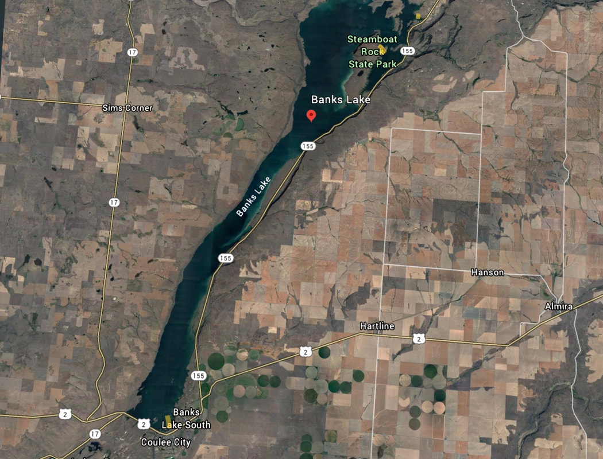

---
tags:
- Paddling
- Lakes
stats:
- label: Paddle Distance
  icon: map-marker-distance
  value: Varies (2.5+ miles one-way)
- label: Elevation
  icon: terrain
  value: 1,571'
- label: Length & Acreage
  icon: vector-square
  value: 26.7 miles long & 26,890 acres
- label: Maps
  icon: map
  value: Steamboat Rock SW
- label: GPS
  icon: crosshairs-gps
  value: 47°52′02″ N 119°05′54″ W
- label: Grant County Sheriff
  icon: shield-account
  value: CALL 911 FIRST or 509.754.2011
---

# Banks Lake Kayak & Hike

_Banks Lake Kayak & Hike_

## Description

Banks Lake is an expansive 26.7-mile long, 26,890-acre reservoir filling the Upper Grand Coulee in Eastern
Washington. Framed by towering basalt cliffs and dramatic granite monoliths, the lake offers world-class
paddlecraft exploration and hiking.

Paddlers can launch from either Northrop Point or Steamboat Rock State Park and head north approximately 2.5
miles to a shaded, sandy beach. An obvious trail leads from the shoreline to the summit of a prominent
granitic rock knob, providing commanding 360-degree views of the entire coulee basin. After hiking, paddlers
can explore the maze of granitic islands, rock towers, and quiet alcoves along the eastern shore.

Camping is available at Steamboat Rock State Park and Jones Bay Campground.

## Route Options

### Option 1: East Shore Granite Knobs

Paddle the eastern shoreline to explore numerous granite islets and climb one of several dramatic rock knobs
rising directly out of the water.

### Option 2: Steamboat Rock Summit

Combine your paddle with the classic hike up Steamboat Rock—a massive, 600-foot flat-topped basalt mesa
offering miles of rim trails and panoramic views over Banks Lake.

### Option 3: Northrop Canyon

Land near the mouth of Northrop Canyon on the east side of the lake to hike through rare old-growth
ponderosa pine forest. The canyon is also famous for rock climbing at Highway Rock, featuring over 70 routes
on its 300-foot granite face.

## Access & Directions

- **Primary Route (via Grand Coulee)**: Drive US-2 West through Wilbur. Just past town, turn right onto
  WA-21 N / WA-174. Stay left on WA-174 for 20 miles to Grand Coulee, then turn left onto WA-155 South for
  10 miles. Pass Jones Bay Campground and Northrop Point launch, then turn right into Steamboat Rock State
  Park. Drive 2 miles to the boat launch on the park's east end. *(Discover Pass required)*
- **Alternate Route (via Coulee City)**: Drive US-2 West to Coulee City, then turn right (north) onto WA-155
  North for 15 miles directly to Steamboat Rock State Park.

## Safety & Hazards

!!! warning "Rattlesnake Country & Summer Heat"

    Banks Lake lies in dry desert sagebrush country where Western rattlesnakes are common around rocky
    outcrops and trails. Wear sturdy boots and snake gaiters when hiking, stay alert, and keep dogs on a
    leash. Summer temperatures frequently exceed 90°F—bring extra water and sun protection.

## Nearby Points of Interest

- **Grand Coulee Dam & Evening Laser Light Show**
- **Steamboat Rock State Park & Jones Bay Campground**
- **Northrop Canyon & Highway Rock Climbing (70+ routes)**
- **Deep Lake, Sun Lakes-Dry Falls State Park, & Summer Falls**

## Photo Gallery

_Steamboat Rock rising above Banks Lake._

_Hikers on the trail at Banks Lake._

_Two hikers on the summit of Steamboat Rock._

_Hikers taking in panoramic views from Steamboat Rock summit._

## Plan Your Trip

- [Current NOAA Weather Conditions](https://www.nws.noaa.gov/wtf/udaf/MapClick.php?lel=4000&uel=9000&polygon=49.016%2C-114.180%2C48.994%2C-114.381%2C48.890%2C-114.341%2C48.924%2C-114.151%2C&area=63)
