# Panorama

---

## Panorama

---

## Tap on the image to enlarge

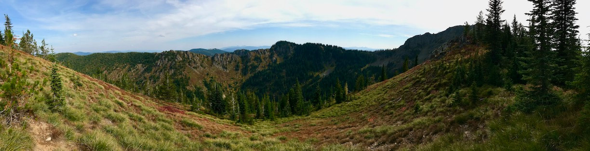{: data-src=" data-title="WILLOW PEAK 6324' FROM THE IDAHO CENTENNIAL TRAIL RIDGE STEVENS LAKE AREA" }

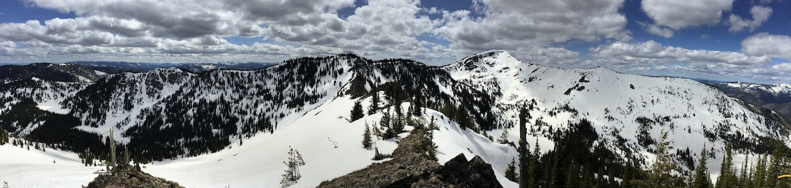"

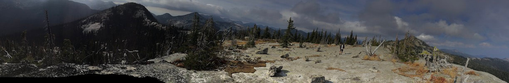{: data-src=" data-title="CHRIS NAMED THESE LUNAR LANDSCAPE THIS IS ALONG THE IDAHO CENTENNIAL TRAIL ABOVE UPPER BALL LAKE, A.S." }

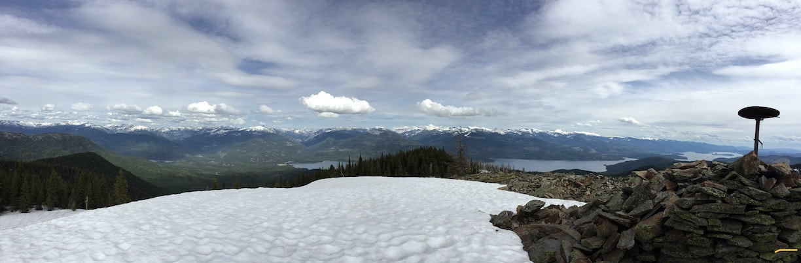"

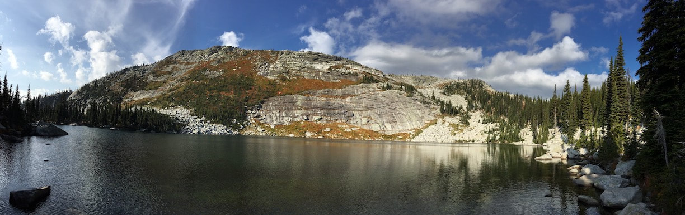{: data-src=" data-title="WEST SHORE OF UPPER BALL LAKE, A.S." }

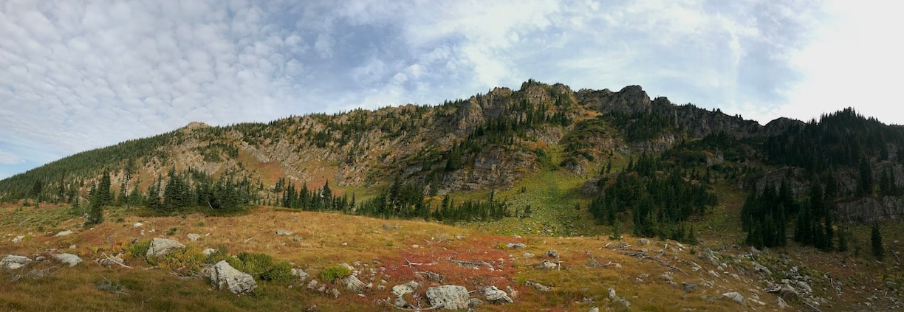"

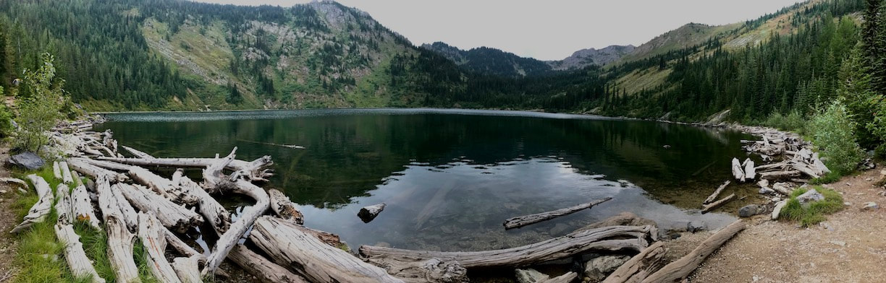{: data-src="assets/images/122222021115p_orig.jpeg" data-title="LOWER STEVENS LAKE & STEVENS PEAK WAY BACK ON THE RIGHT OF CENTER" }

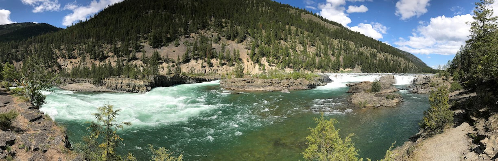"

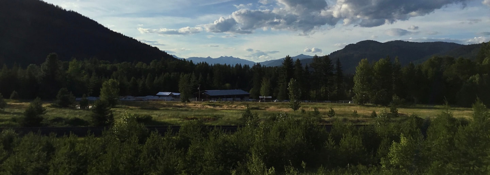{: data-src=" data-title="6 OF THE SEVEN SISTERS FROM HWY 200 EAST OF SANDPOINT, A.S." }

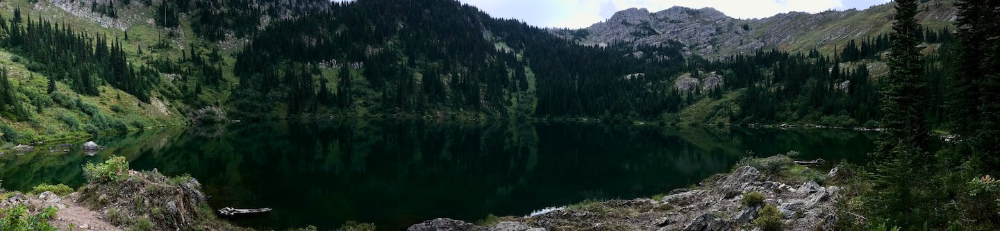"

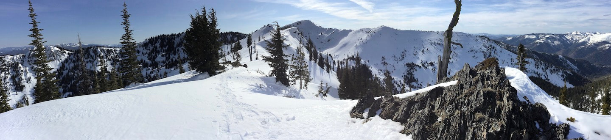{: data-src=" data-title="RIDGE EAST OF L. & U. STEVENS LAKES CALLED STATE LINE RIDGE, WITH STEVENS PEAK" }

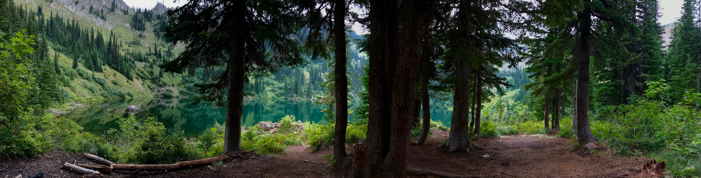"

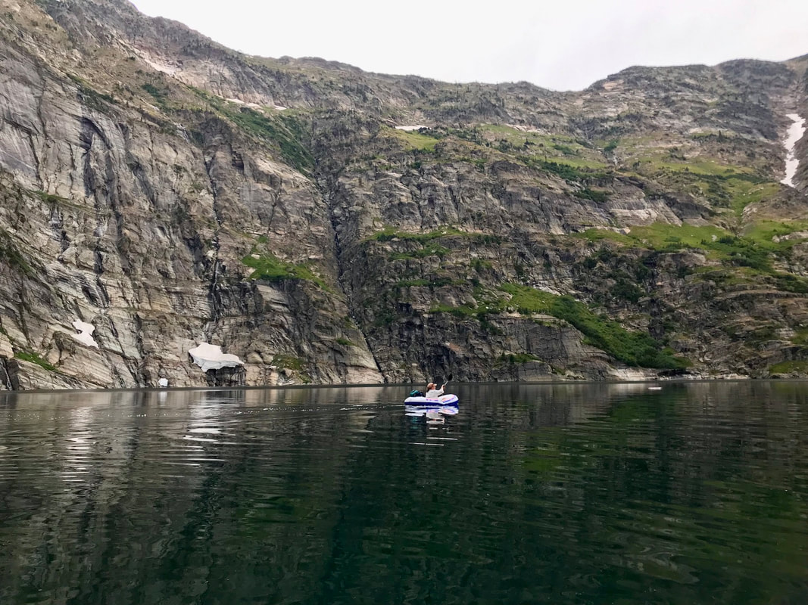{: data-src="assets/images/8152022329p_orig.jpeg" data-title="PADDLING LEIGH LAKE
IN SUMMER OF 2022." }

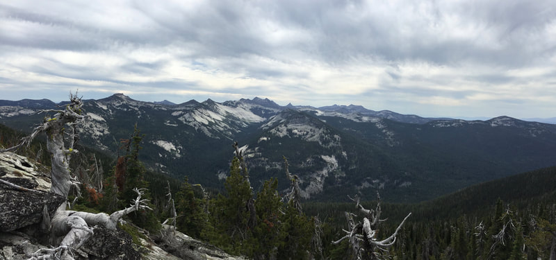"

*Picture (Image missing)*

Leigh lake. the amphitheater, snowshoe peak 8638’
