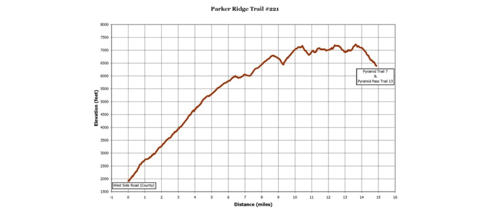
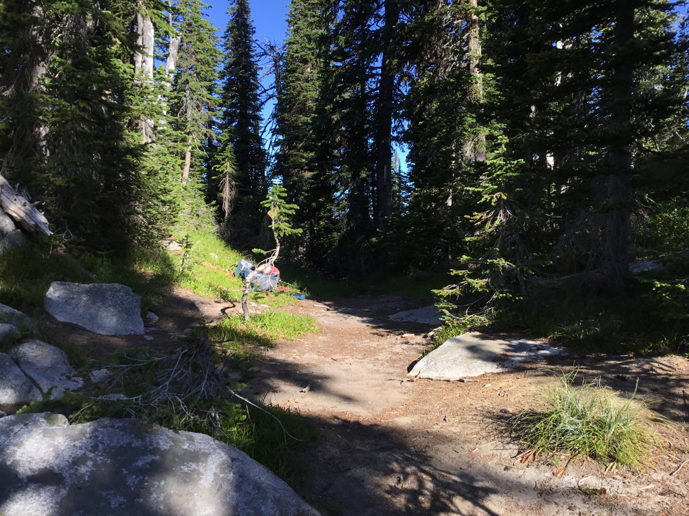
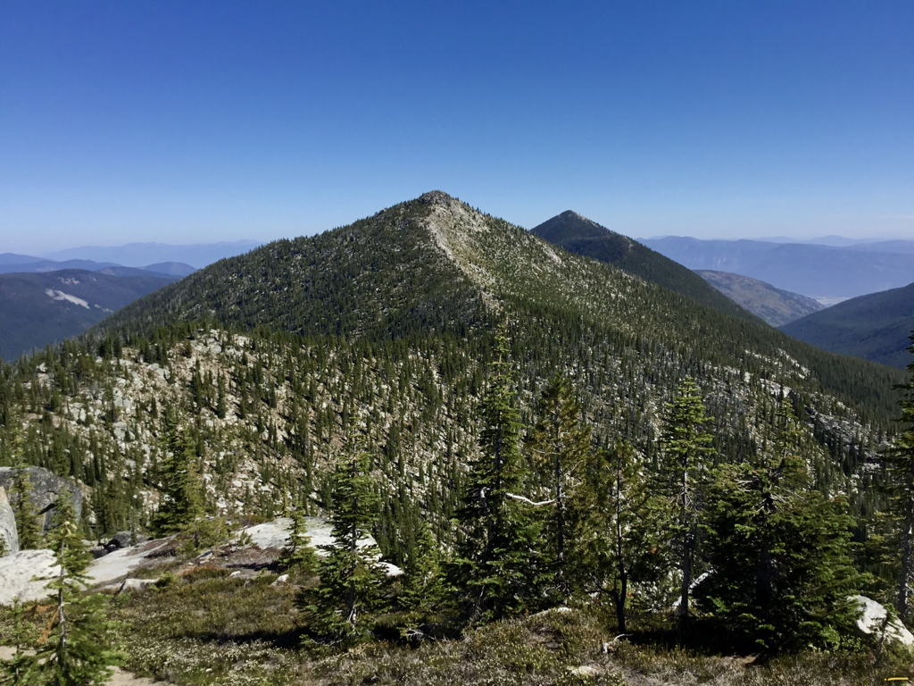
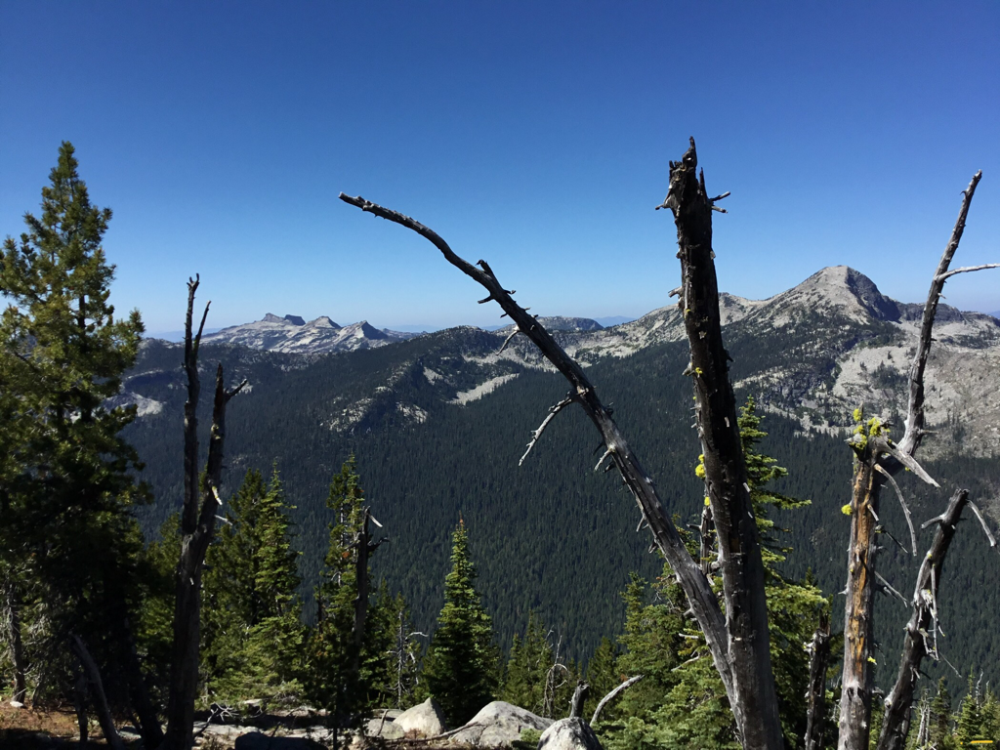
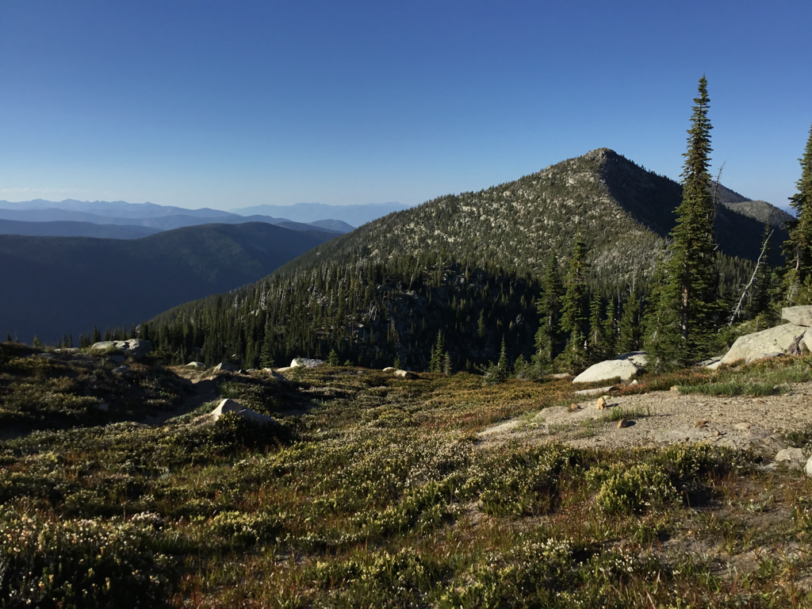
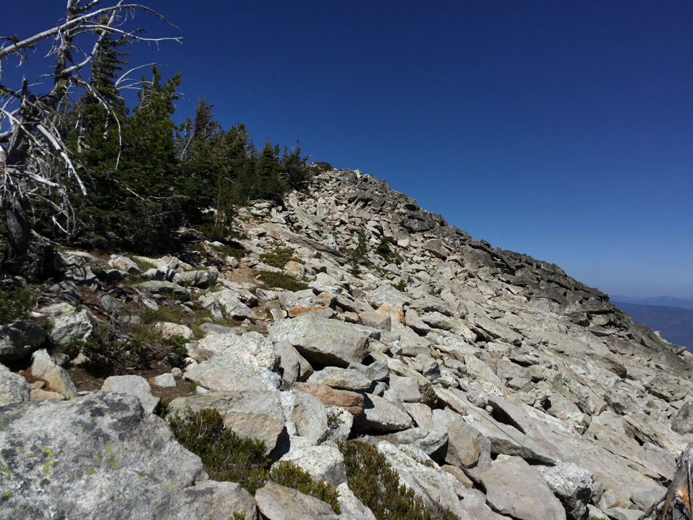
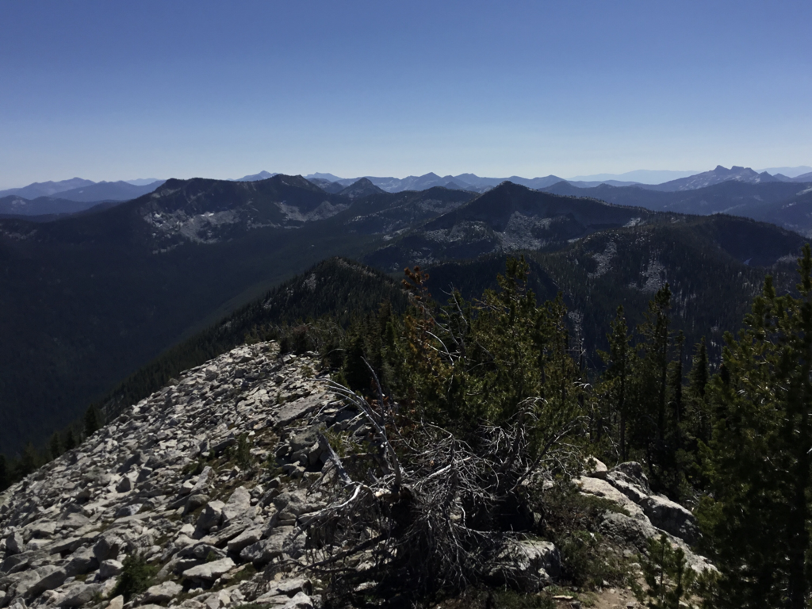
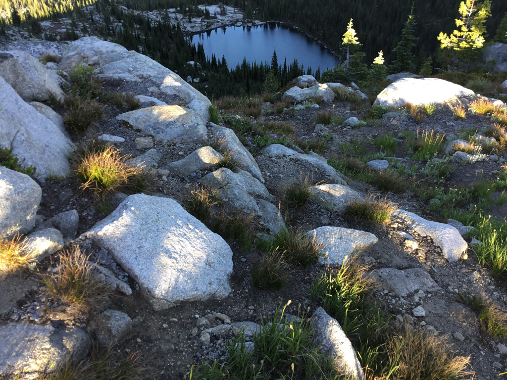
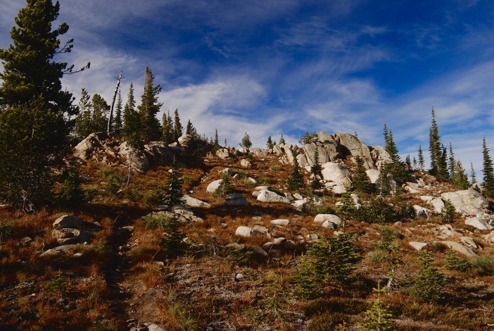

---
tags:

- Peaks & Mountains

- Difficult

- Hiking

- Backpacking

stats:

- label: Event Type
  icon: hiking
  value: Hiking & Backpacking

- label: Distance
  icon: map-marker-distance
  value: 35 Miles RT, (Pyramid Pass 2.7 & 1300 verts)

- label: Elevation Gain
  icon: elevation-rise
  value: From the Canyon Creek TH 5280’ from Parker Creek TH 4570’

- label: Difficulty
  icon: speedometer
  value: Difficult

- label: Maps
  icon: map
  value: IPNF, Kaniksu N.F., Smith Peak, Pyramid Peak, Shorty Peak

- label: GPS
  icon: crosshairs-gps
  value: 48°52’25" n 116°35’16" w

- label: Ranger District
  icon: pine-tree
  value: Bonners Ferry R.D. 208.267.5561

- label: Boundary County Sheriff
  icon: shield-account
  value: CALL 911 FIRST or 208.267.3151
notes:

- Idaho panhandle national forest/alerts

- '[https://www.fs.usda.gov/alerts/ipnf/alerts-notices](https://www.fs.usda.gov/alerts/ipnf/alerts-notices)'
---

# Parker Peak 7670

*Parker peak 7670' trail #’s 16, 7 & 221*

## Description

We have added the areas sheriff’s emergency phone numbers for each trip write up under the ranger district info. if an emergency ocurrs, evaluate your circumstances and call only if needed.
The Long Canyon Trail #16 starts the hike along the West Side Road #417 south of Copeland. This trail leads you thru some of the most beautiful and remote areas in North Idaho. Long Canyon is the largest drainage in Idaho that has never been logged or mined.

From the trailhead on the West Side Road to the summit of Parker Peak, is more than 5820' in elevation gain. Within Long Canyon, there are several campsites and water is available all the way to just below Pyramid Pass, except the first 4 miles. At a little over 7 miles, the trail crosses Canyon Creek. This crossing can be difficult in the spring during runoff. At Trail #16 the trail crosses Long Canyon Creek once again, and the USFS doesn't maintain the trail above to enhance the protection of grizzly bears. When you come to the Trail #7 junction just below Pyramid Pass, hike about 4 miles to connect with Trail #221. Turn left (SE) up a steep section to a saddle with very scenic views of the Selkirks, and the Parker Creek drainage. For about 5 miles the trail is a ridge walk with incredible views. In this section is Long Mountain Lake & Mountain, a worthy stop in a scenic lake basin. There are camp sites near the lake. From Long Mountain Lake, and Parker Lake, there is no water to the end. Near the summit of Parker Peak there is a short very faint trail leading you to the Parker Peak summit. In 1939 there used to be a fire lookout on top of Parker Peak, the second highest peak in North Idaho. From Parker Peak there are numerous switchbacks that drop you 5820' in about 9 miles to the Parker Creek trailhead, also along the West Side Road about 3 miles from the Long Canyon trailhead.

## Directions

From the Kootenai National Wildlife Refuge, drive north 10 miles to the Trout Creek Road #634. Turn left (west) and drive 9 miles to the trailhead.

## Cool things close by

Fisher Peak, Shorty & Lone Tree Peaks, Cutoff Peak, Red Top Mt, West Fork Lake & Peak, the Purcell Trench, Bonners Ferry, and across the Purcell Trench, is the Northwest Peaks Scenic Area. It’s located in Montana right next to Idaho and Canada.

## R & p

Jalapeños, Mr. Sub, Burger Express, Eicharts in Sandpoint

## Photo gallery

## Pyramid pass

*Picture (Image missing)*

## A bumblebee stuck on an aster at pyramid pass, due to cold temps

---

## Parker peak 7670’ in back, along parker ridge this is a beautiful hike to parker peak

---

## The lions head (l), and smith peak 7653’ on right

---

*Picture (Image missing)*

## Three women, two dogs from ohio,  hiking the long canyon/parker peak loop

---

## Approaching parker peak along parker ridge

---

## The final ascent along parker ridge, to parker peak

*Picture (Image missing)*

## A 300° pano from the summit of parker peak

## The trail down the south face of parker peak towards pyramid pass. pyramid peak is top center

## Long mountain lake from the parker ridge trail

## The trail past long mountain lake

## A walk along a trail, in and out of the sun, warms more than our bodies.   chic   2012
