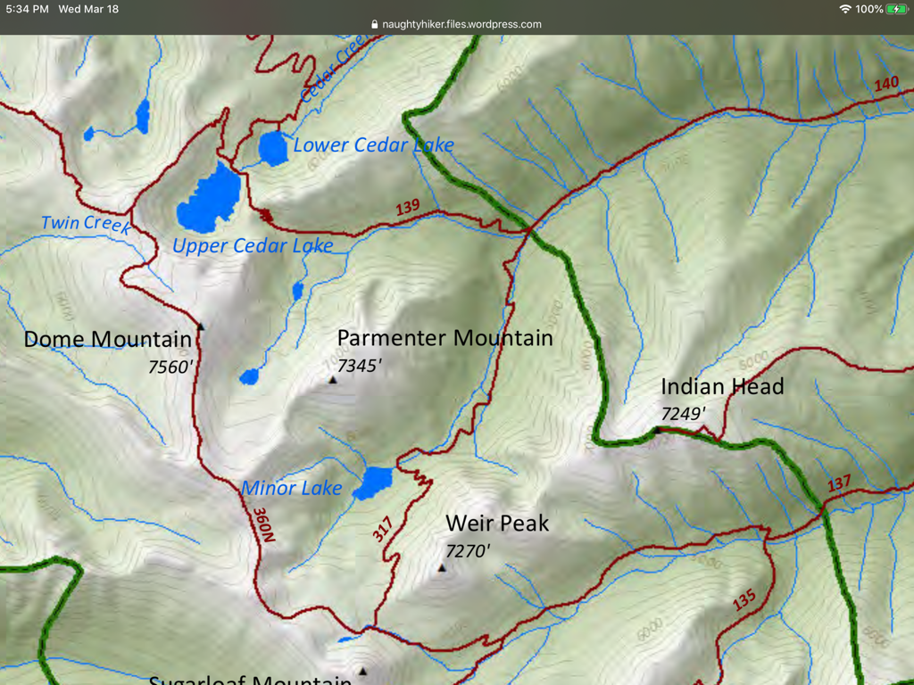

---
tags:
- Lakes
- Strenuous
- Day Hiking
- Backpacking
- Loop
stats:
- label: Event Type
  icon: hiking
  value: Day hiking, backpacking, loop
- label: Distance
  icon: map-marker-distance
  value: 17 miles RT
- label: Elevation
  icon: terrain
  value: 3700 verts
- label: Difficulty
  icon: speedometer
  value: Strenuous
- label: Maps
  icon: map
  value: K.N.F., Treasure Mt. Topo.
- label: GPS
  icon: crosshairs-gps
  value: 48°22’44" n 115°37’44" w
- label: Ranger District
  icon: pine-tree
  value: Libby Ranger District 406.293.7773
- label: Lincoln County Sheriff
  icon: shield-account
  value: CALL 911 FIRST or 406.293.4112
notes:
- Kootenai national forest/alerts<https://www.fs.usda.gov/alerts/kootenai/alerts-notices>
---

# Parmenter Lake

*Parmenter lake. trails 140 & 360*

## Description

If anyone does this trip, please supply Chic with info on the hike in.

## Directions

In Libby, at the intersection of Hwy 2 & 37, turn west and go one block. Turn left on a Main Street and go 6 blocks to Balsam Street. Turn right, cross the Flower Creek Bridge , then take the first left and go .4 to the road that bears right up Parmenter Hill. At the top of the hill, take the first right and go just over a mile to the "Y." Take the unsaved left fork to the trailhead, about 220 yards.

## Hazards: na

## Cool things close by

Ross Creek Cedars, Cedar Lakes, Dome Mountain, Kootenai Falls, the Proposed Scotchman Peaks Wilderness, Granite Lake, and Leigh Lake.

## R & p

Henry’s in Libby, Pizza Hut, Rosaeurs, Clark Fork Pantry & Squeeze Inn in Clark Fork. Eicharts, Mr Sub, Burger Express, & Jalapeños in Sandpoint

---

## Plan your trip

Click for Current NOAA Weather Conditions

## Photo gallery

## No images. if you would like to contribute, contact chic

---

##

---

---

---

---

---

---
