---
tags:

- Waterfalls

stats:

- label: Waterfall
  icon: waterfall
  value: Pewee Falls on the Pend Orielle River

- label: Drop
  icon: arrow-collapse-down
  value: 200'

- label: Waterfall Type
  icon: waterfall
  value: Plunge

- label: Maps
  icon: map
  value: Colville N. F., Sullivan Lake topo 509.447.7300

- label: GPS
  icon: crosshairs-gps
  value: Boundary Dam Boat Launch. 48°??589’58" N 117°21’02" W
notes:

- 'DISTANCE CAR, BOAT TO FALLS: Less then 1 mile'
---

# Pewee Falls

## Description

There isn't a good way to walk to Pewee Falls.

Pewee Falls is located on the Pend Orielle River south of Boundary Dam, and 1/2 of a mile from Canada.

I might say something about the river. There is very little sensation of the river moving down stream. But if you set out in the morning the pool is full. By the time you visit the the two waterfalls up stream, you will notice the pool level is lower. That's because there are two dam about 18 miles apart, the water levels fluctuate up and down. The dam  makes power for Seattle.

After putting in at the free campground and Launch, head towards Ratt Island. When you round the island, notice that the water level is high. By the time you get back in the afternoon, the island will show a lower waterline.
Once you've rounded the islands you will see Pewee Falls about .3 of a mile in its own cove. As you approach the falls the sounds and sights are spectacular. There is a very small area on the north side of the falls to get out on. But be very careful.
Then the padding starts. Paddle upstream from the falls. The cliffs here are about 100' tall on both sides.
Upstream about 3 miles is another island. On the west  of the island are picnic tables to snack or have lunch at. In low pool, you may not be able to paddle around the island, so go back out into the main channel, and continue upstream. Here the cliffs on both sides are 200-300 feet tall right out of the water.
Continue paddling upstream for a total 7.5 mile to twin waterfalls. There is one on both sides of the river. A cool thing to do here is, position yourself between the two falls and listen to stereophonic waterfalls, and meditate your existence..
At about 8.5 miles from the dam is the Grandview Campground. A bit further upstream is an undeveloped camping area on a sharp left turn.
This is my opinion. I don't like the the river above water line that crosses the river overhead. Likewise, coming down from city of Metaline not Metaline Falls, there is a whirl pool I don't like.
So basically, if I'm doing a day paddle, I turn around at the twin falls.

## Option #1

As long as you are in the area, take the Boundary Dam tour.

## Option #2

If you have the time, head down to Sullivan Lake and do the drive up to the Vista on the opposite side of the river, to view the north side of the dam.

## Option #3

Another very cool place to visit while you are up there, is the Gardner Cave, Crawford State Park. Its a short distance to the NW from the dam.
There are guided tours that take you down about 125' underground. The cave is lighted and has a metal walkway.
Don't miss it.

## Option #4

From just north of city of  Metaline Falls, there is the Sullivan Lake Road that takes you to the north end of Sullivan Lake. Near the Old Mill Site is a short walk to Elk Creek Falls. Pick up a brochure from the Ranger Station.
You can paddle the river south, lock up you boats, then walk the 4.5 miles back to the north end. Fall colors along this hike are spectacular.

## Directions

From Newport, WA., head north on Hwy 20 to Tiger, WA. At Tiger, turn right (N) up Hwy 31. When you pass the Selkirk High School, in less then 1/2 a mile stop act the Sweet Creek Rest Area. From the rest area is the Sweetwater Falls Trail. Its a very cool set of falls

---

## Cool things close by

City of Metaline Falls, Sullivan Lake, Gardner Cave, and I can tell you, the drive to Boundary Dam is a beautiful Fall Colors drive.

## Hazards

All waterfalls are a hazard, due to their slippery nature. always be extra careful near any waterfall.

## R & P

NA

---

## Plan your trip

Click for Current NOAA Weather Conditions

## Photo gallery

---

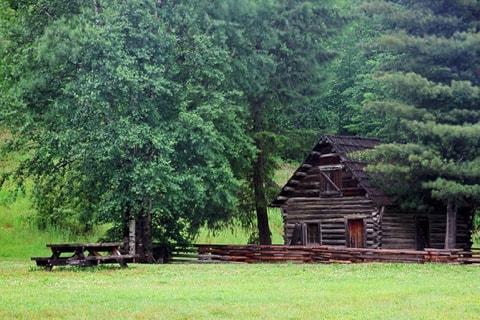

## The old homestead near the boat launce

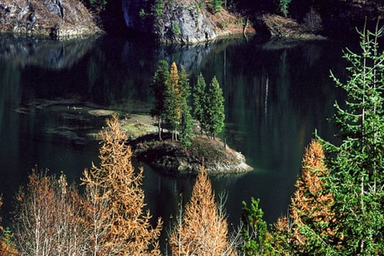

## Ratt island from the road to boundary  dam

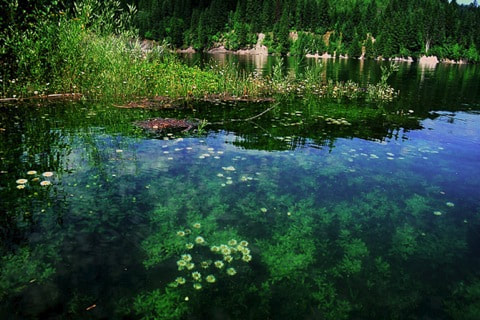

## Ratt island during "high tide." notice the wildflowers are underwater

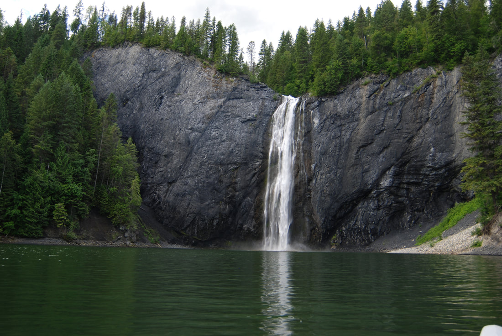

## Pewee falls 200' drop during "high tide"

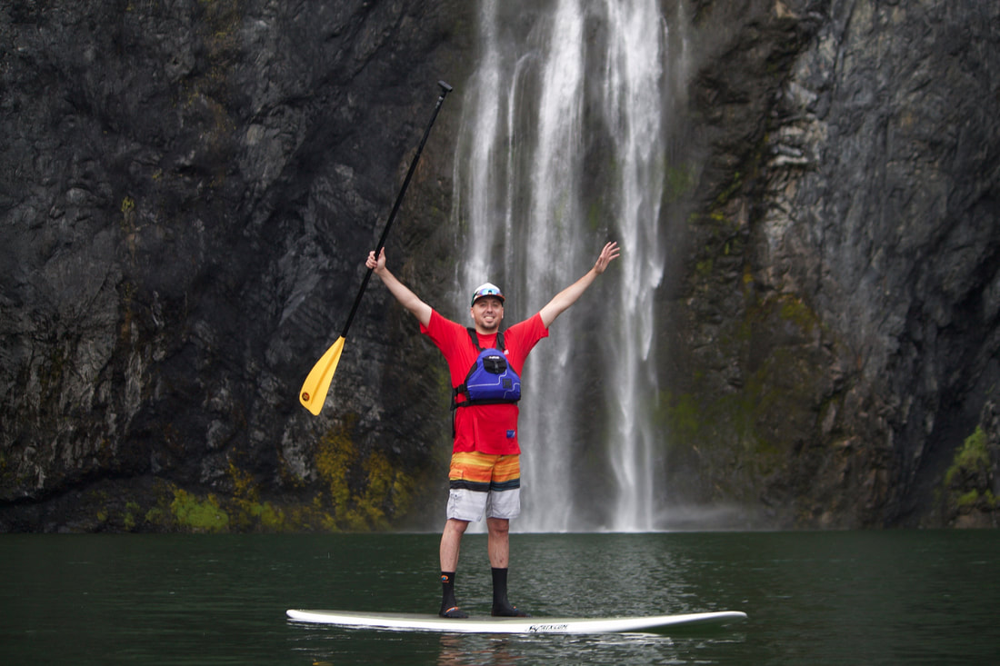

## Our friend bart posing in front of pewee falls

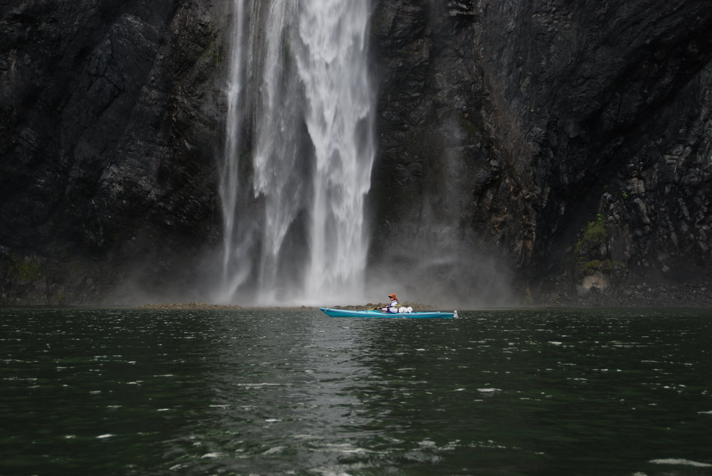

## Michelle & pewee falls. notice the massive rock pile below the falls

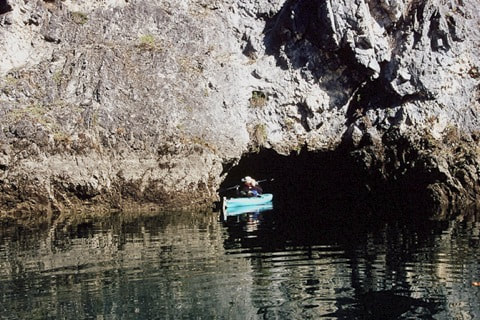

## Kayaker entering a cave upstream from pewee falls

## Michelle paddling past the natural arch that tour jetboats toppled

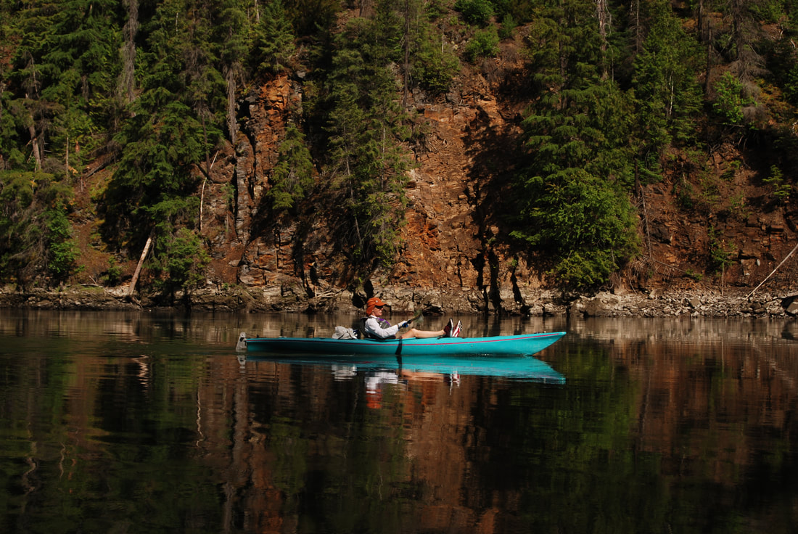

## Enjoying the beautiful views heading upstream

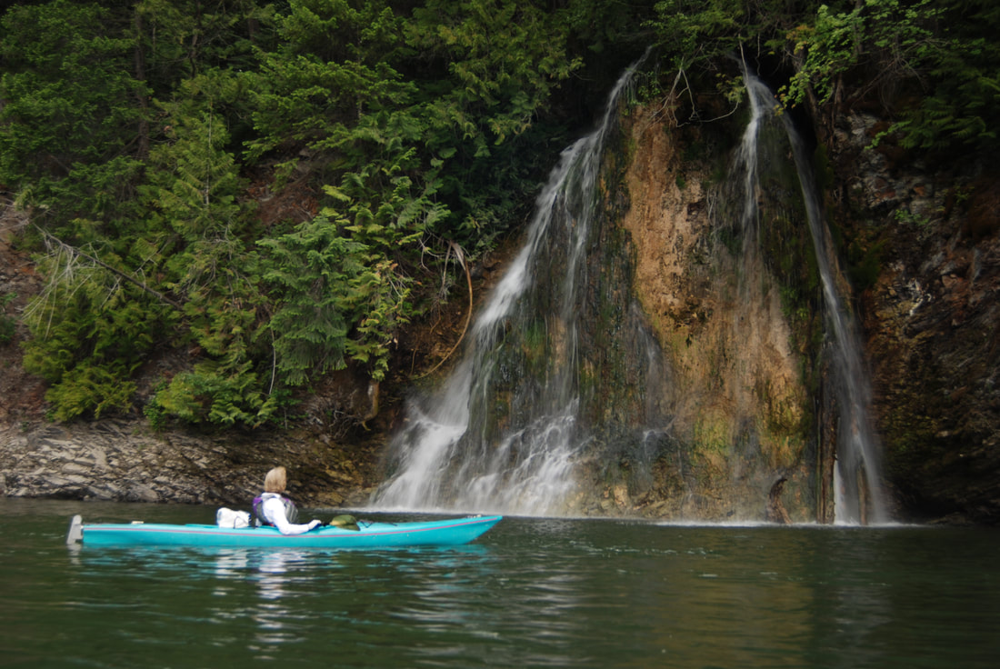

## The twin falls on the east side of the pend orielle river

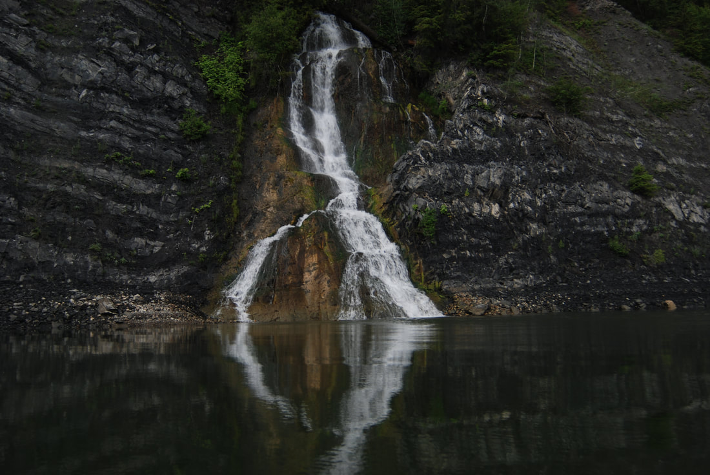

## Opposite the above falls on the west side of the river

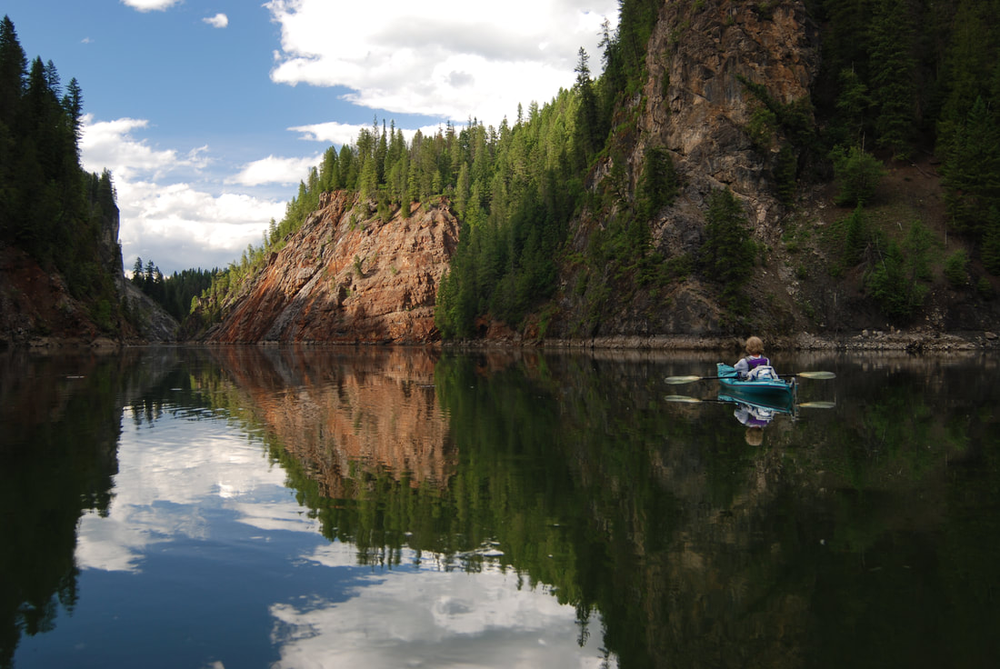

## Talk about serene. paddling back to boundary dam

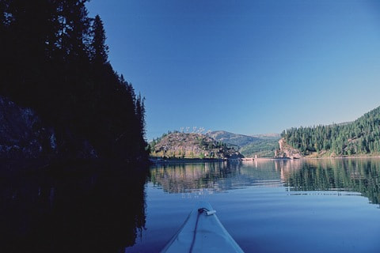

## As you round a bend, the boundary dam commands the view

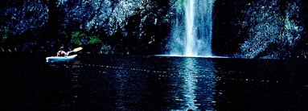

## An early image of pewee falls

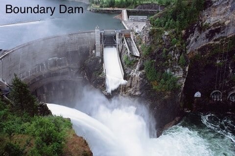

## A view of boundary dam from the vista. ask the dam personnel when the chutes open

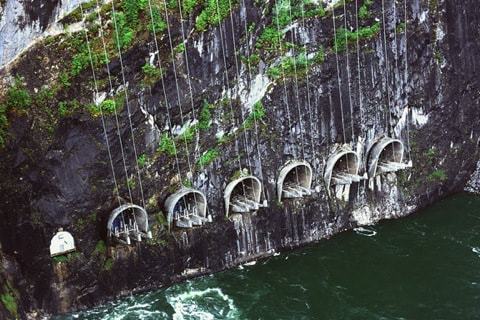

## The power portals from the vista

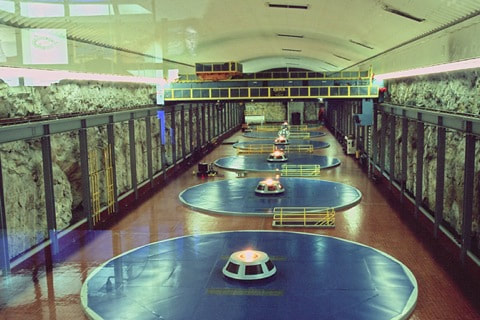

## Five generators deep within the dam

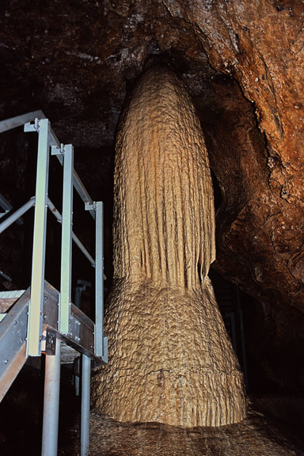

## The christmas tree in the gardner cave, crawford state park

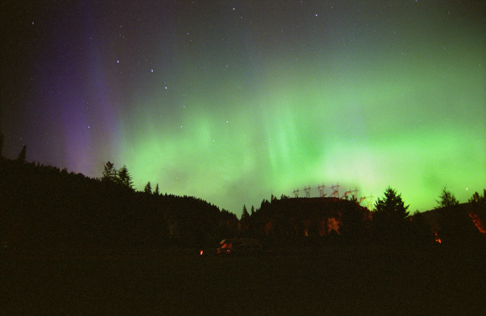

After a kayak & hiking trip to canada, i slept at boundary dam. when i turned around after cooking dinner, the auroras were incredible Can you spot the big dipper?
