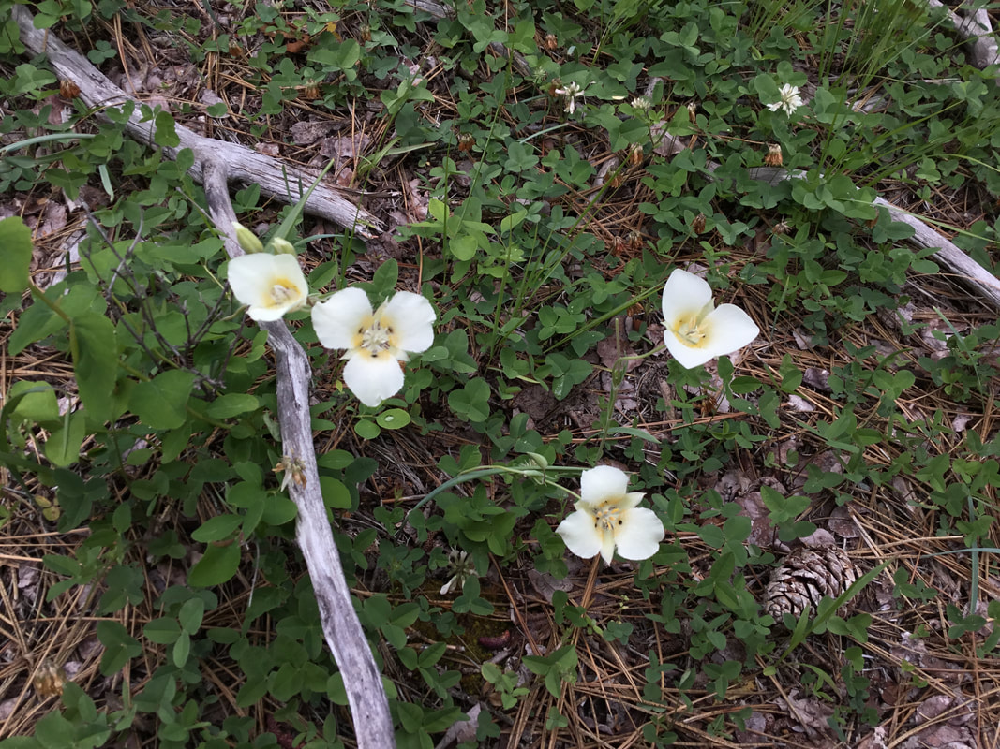
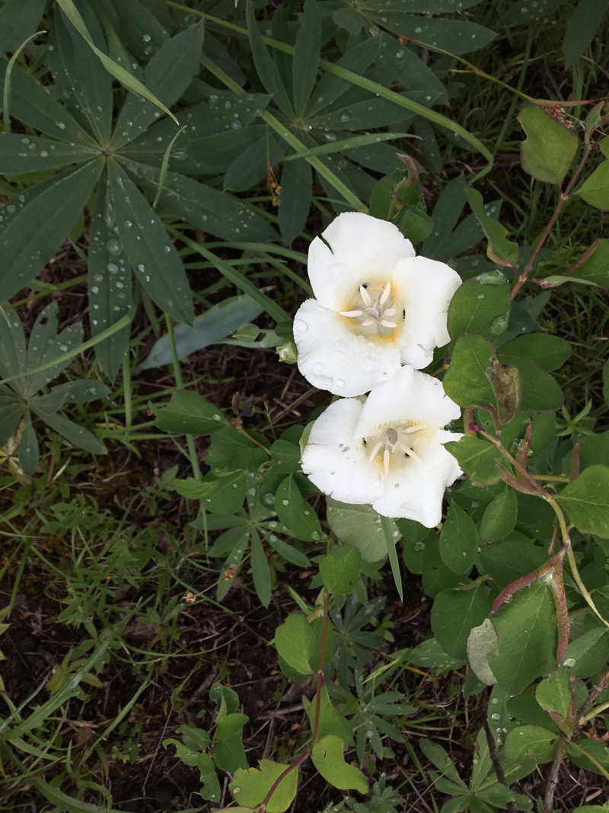
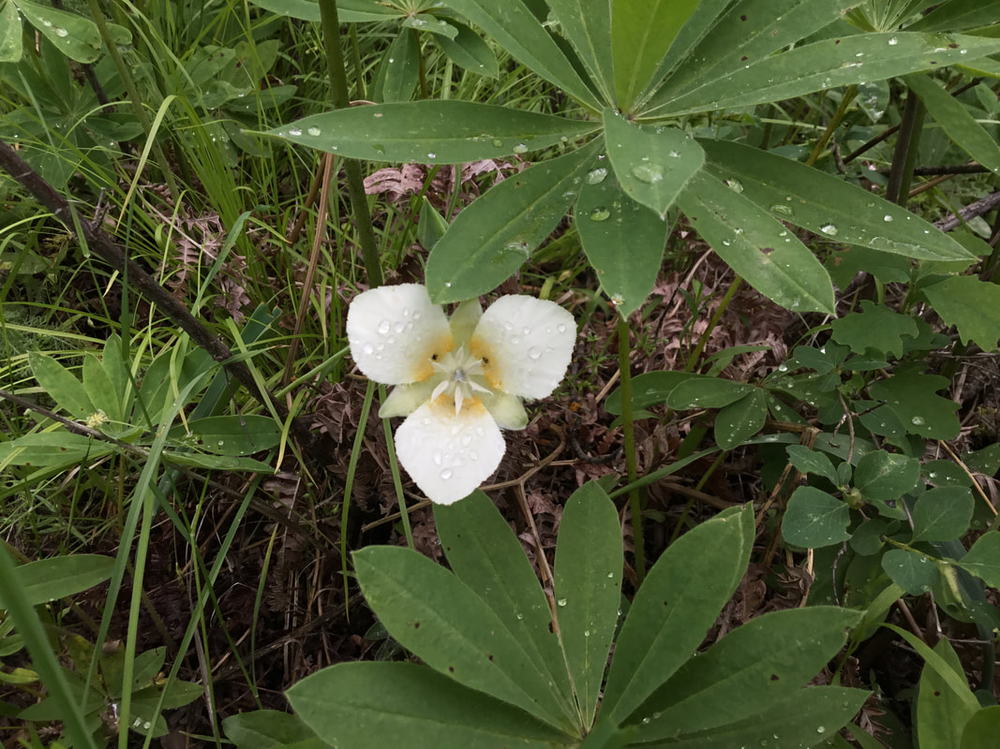

---
tags:
- Flora & Plants
stats:
- label: Genesis Name
  icon: book-open-variant
  value: Calochortus apiculatus
- label: Distribution
  icon: earth
  value: Occurring east of the Cascades crest in the northeast counties of Washington;
    southeastern British Columbia to northeastern Washington, east to southeastern
    Alberta, northern Idaho, and western Montana.
- label: Season
  icon: calendar
  value: Flowers June and July
- label: Poisonous
  icon: skull-crossbones
  value: 'no'
- label: Edibility
  icon: food-apple
  value: Calochortus spp. bulbs are edible raw, best when cooked.
- label: Leaves
  icon: leaf
  value: Baker Mariposa Lily - Calochortus apiculatus
- label: Fruits
  icon: fruit-cherries
  value: Fruit elliptic, acute, 3-winged, nodding.
notes:
- label: 'Medical use: An infusion of the plant has been taken internally to treat
    rheumatic swellings and to ease the delivery of the placenta.'
  url: '#'
- label: 'Basal Leaf: Flat, broader and usually more than half as long as the stem
    leaves.'
  url: '#'
- label: 'Anthers: Lanceolate (wider from base to below middle and tapering to the
    tip) and apiculate (short, sharp tip).'
  url: '#'
- label: 'Sepals: 15-25 mm long.'
- label: 'Petals: Outside is white, drying yellowish, and serrulate on the margins.
    Inside the petals are hairy (or strongly bearded), white, and at the base it is
    yellow with a small (1.5 mm), circular, dark, central gland.'
  url: '#'
---

# Baker's Mariposa Lily

## Description

Stem 10–35 cm. Leaf blade 5–18 mm wide. Bracts 2 or more, 1–5 cm long. Flowers 1 to 3; sepals 15–25 mm long;
petals white, drying yellowish with serrulate margins; inner surface often yellow basally, hairy with a
small, dark circular gland near the base; anthers lanceolate, apiculate. Capsule nodding, ovoid 1–3 mm long.

## Photo Gallery

_Baker's Mariposa Lily_

_Long narrow leaves are lupine, not mariposa leaves_
