---
tags:
- Trails & Scrambles
- Easy to Moderate
- Day Hiking
stats:
- label: Event Type
  icon: hiking
  value: Day hiking, interpretive trail thru the Cedars.
- label: Distance
  icon: map-marker-distance
  value: Less then a mile within the botanical area.
- label: Elevation Gain
  icon: elevation-rise
  value: "about 2400\u2019 to Bloom Peak."
- label: Difficulty
  icon: speedometer
  value: easy to moderate
- label: Maps
  icon: map
  value: Idaho Panhandle N.F., Burke topo
- label: GPS
  icon: crosshairs-gps
  value: "Trailhead 47\xB042\u201934\" N -115\xB049\u201936\" W"
- label: Ranger District
  icon: pine-tree
  value: CDA River R.D. 208.769.3000
- label: Shoshone County Sheriff
  icon: shield-account
  value: CALL 911 FIRST or 208.556.1114
notes:
- label: About 12 miles RT to Bloom Peak.
  url: '#'
- label: Idaho panhandle national forest/alerts
  url: '#'
---

---

# Settlers Grove Of Ancient Cedars

!!! warning "Before you go"
    Settlers grove of ancient cedars

## Forest road 805 to settlers grove of ancient cedars is closed due to being washed out

## Description

We have added the areas sheriff’s emergency phone numbers for each trip write up under the ranger district
info. if an emergency ocurrs, evaluate your circumstances and call only if needed. Settlers Grove was
established as a botanical area in 1970, and is the only old growth cedar botanical area in the CDA River
Ranger District. The Cedars measure up to 7 feet in diameter, and have been estimated at 600 + years old.
The West Fork Eagle Creek runs thru the grove, and crosses the trail on foot bridges several times. Meander
up thru the Cedars for about a mile before the formal grove ends.

## Option #1

Trail #162 continues past the cedar grove for about another 4+ miles to the Idaho Montana Boarder. The trail
is overgrown at the top of the grove, but clears at about 1.5 miles. Soon the boarder is in sight high
above. Continue NE and then north to Bloom Peak 5863’. From Bloom Peak the boarder heads north over a mile
to Lost Peak 6350". The Cabinet Mountain Wilderness stands tall just 20 miles north east.

## Directions

Head east on I-90 to exit 43 in Kingston. Head north up F.H. #9 for 26 miles to Eagle, Idaho. Turn left
(north) up F.R. #152 for 1.3 miles to a junction with F.R. 805, and bear left for 5.6 miles to the
trailhead.

## Hazards

None within the grove. The trail above the grove is over grown in about a mile.

## Cool things close by

Crystal Lake, Graham Mountain, Silver Mountain Resort, Chain Lakes, Stevens Peak & Lakes, U. & L. Glidden
Lakes, Revette Lake, and Blossom Lakes.

## R & P

## Pizza Factory, 1313 Club, Brooks Hotel & Restaurant, City Limits Brew Pub, Fainting Goat, Smoke House BBQ & Saloon, Wallace Brewing Co., Muchacho’s Tacos in Wallace. Radio Brewing in Kellogg. The Snake Pit north of Kingston. And Moon Time in CDA

## Settlers Grove Of Ancient Cedars (2)

## Images from along the trail

## Photo gallery

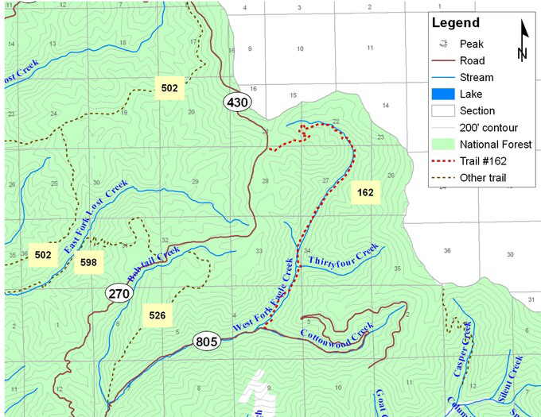

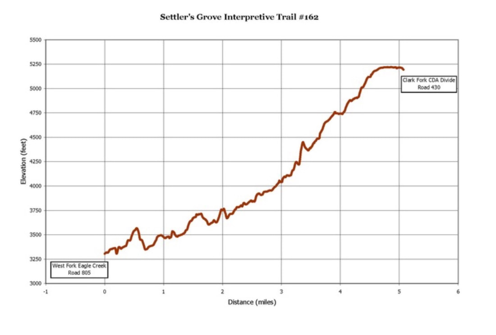

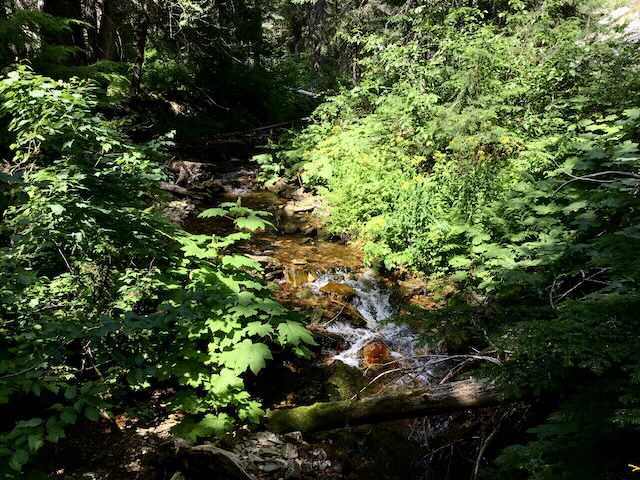

## West fork eagle creek

---

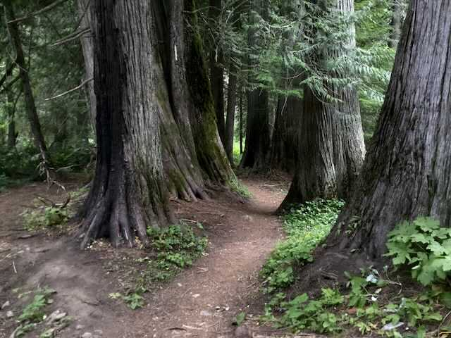

## Along the trail thru the cedars

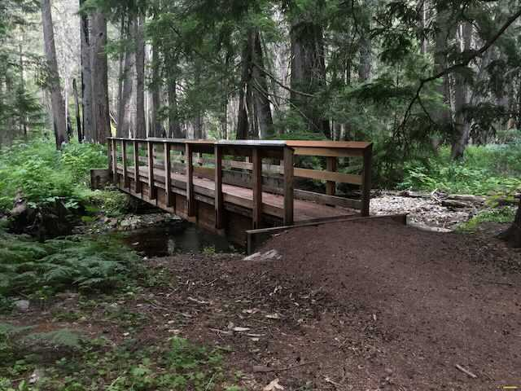

## Foot bridge over eagle creek

### Picture (Image missing)

## The benches are well placed for a rest or lunch

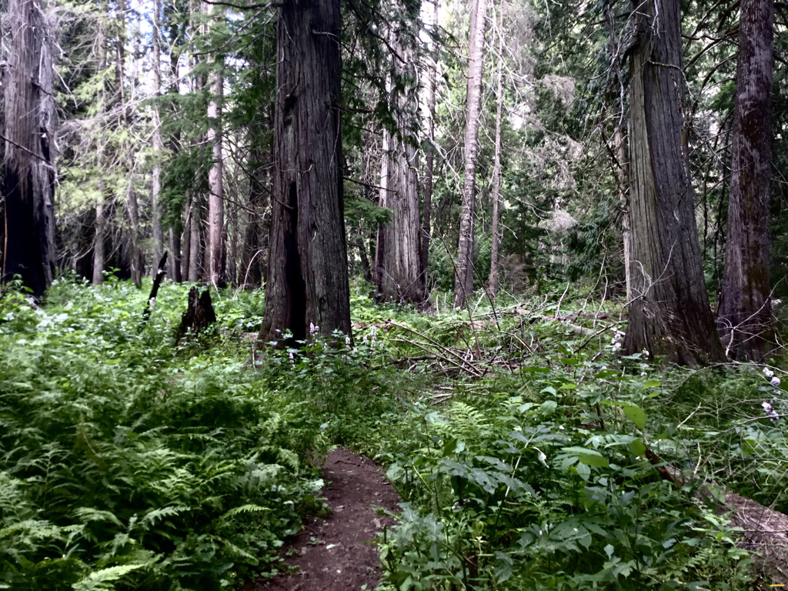

## Trail deep within the ancient cedar canopy

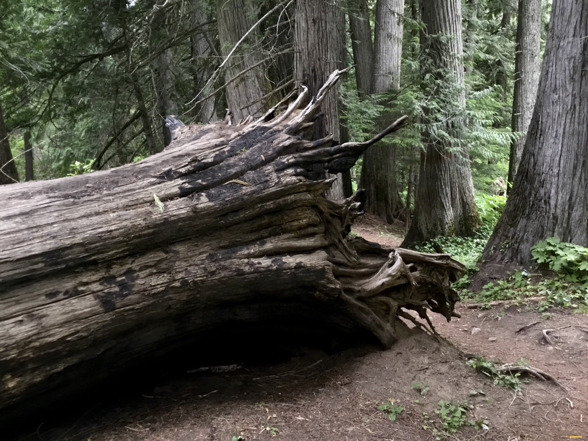

## This cedar, laying down is taller then me

## The below images are from all along the trail

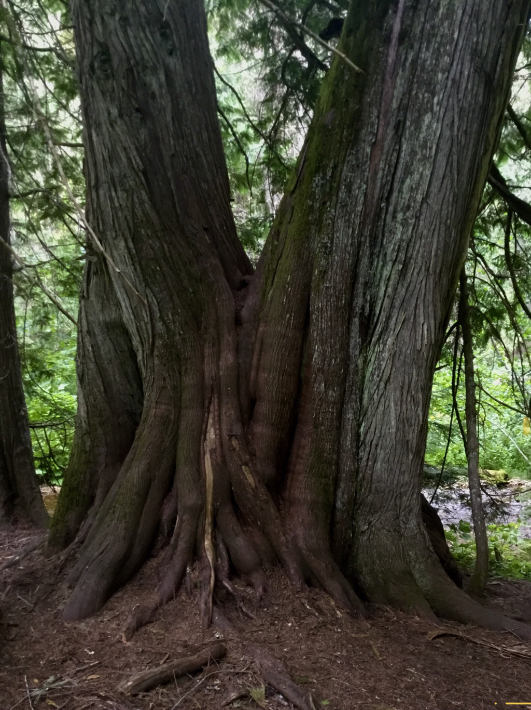

## Giant western red cedars  (having fun)

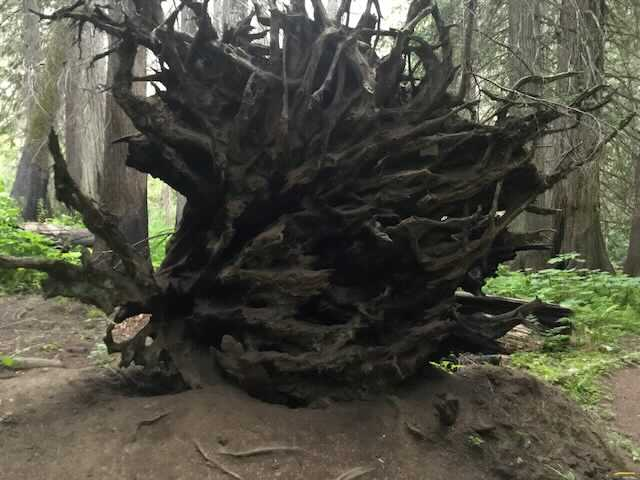

## This rootball is 8-9 feet tall

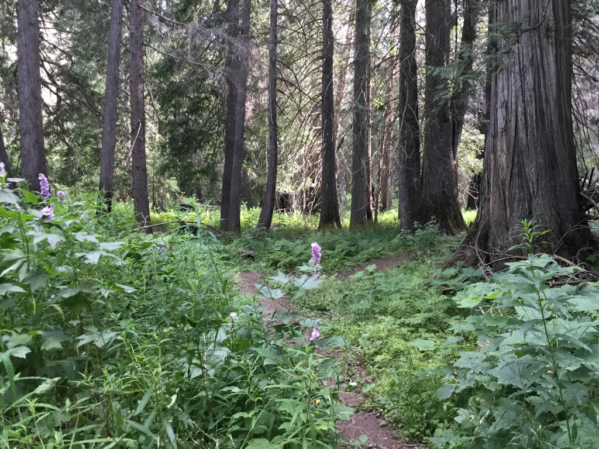

## Mountain globemallow

### Picture (Image missing) Details

## A remnant of the great 1910 fire

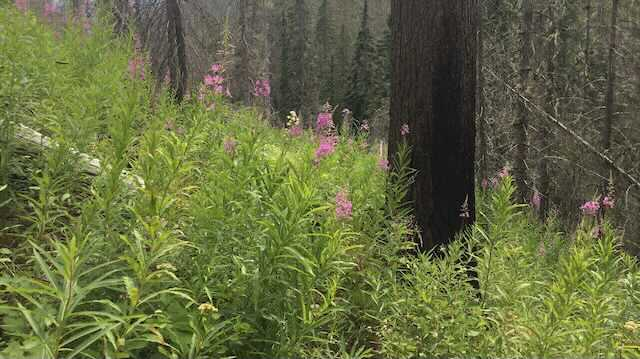

## In tragedy, beauty is not far behind

---

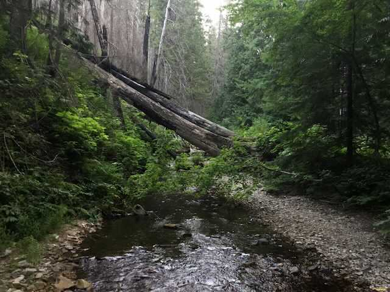

## Eagle creek

I walked amongst giants today. Some were growing along streams. Some were so old they turned white decades
ago, among the high ridges. These giant trees, no matter their age, are monarchs. chic. 9.14.11
