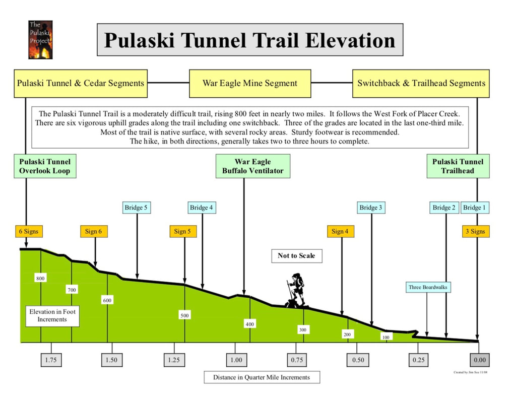
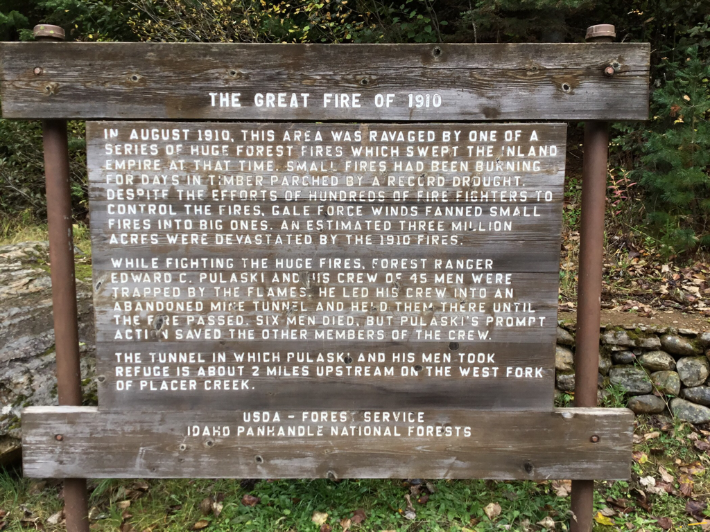
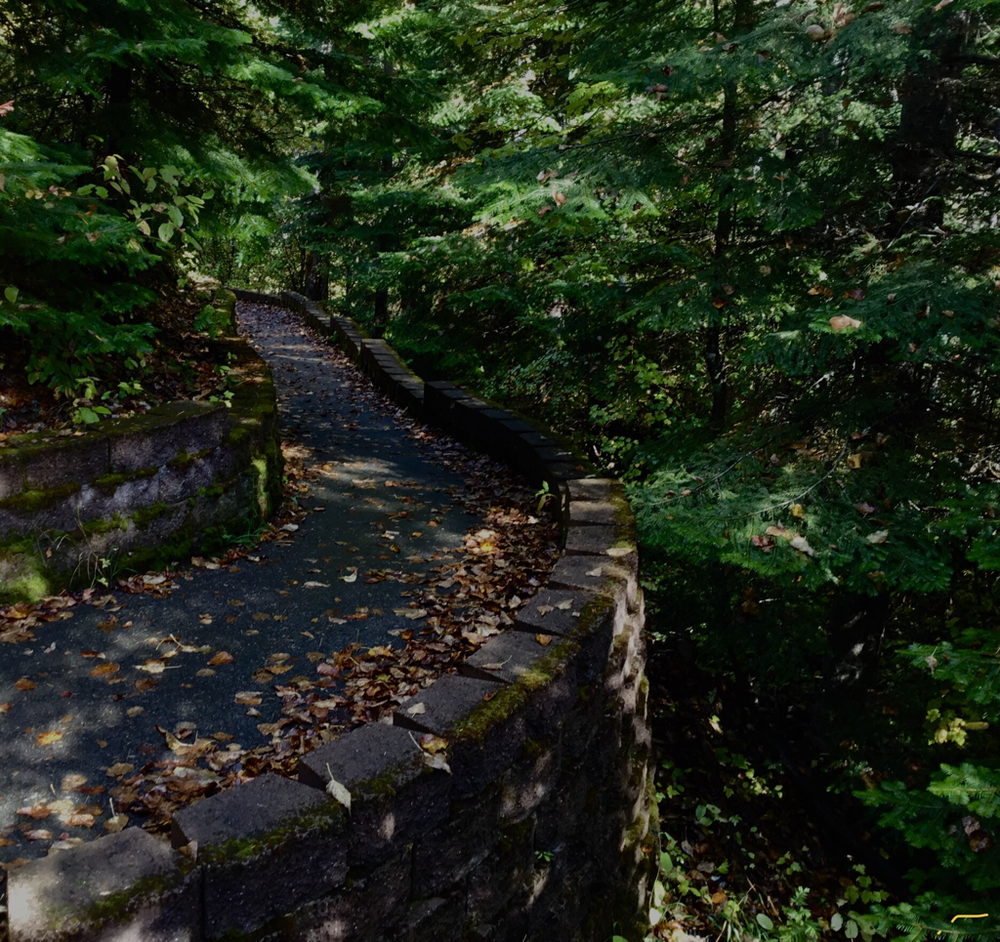
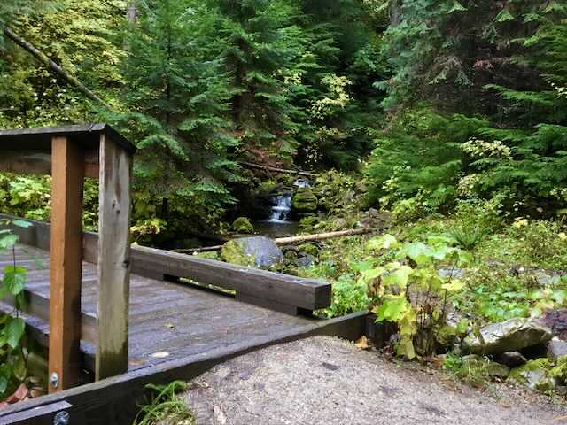
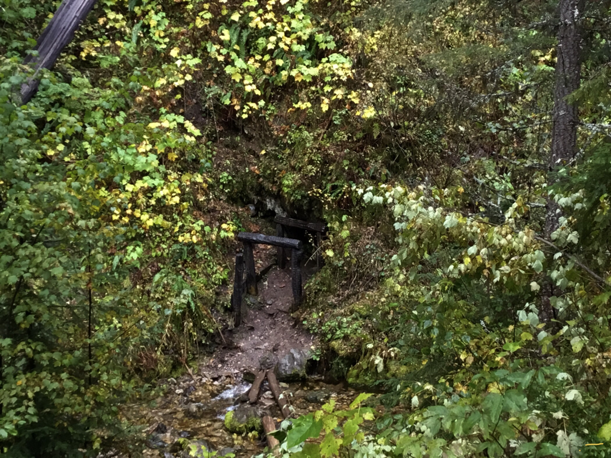
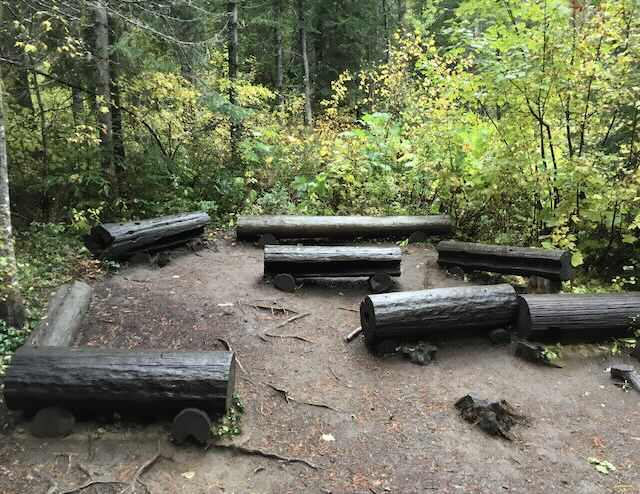

---
tags:
- Winter & Skiing
- Easy
- Day Hiking
- History
stats:
- label: Event Type
  icon: ski
  value: Day hiking, history
- label: Distance
  icon: map-marker-distance
  value: 4 miles RT
- label: Elevation
  icon: terrain
  value: 800’
- label: Difficulty
  icon: speedometer
  value: easy
- label: Maps
  icon: map
  value: IPNF, Pulaski Tunnel Trail Brochure, Wallace topo
- label: GPS
  icon: crosshairs-gps
  value: 47°45’87" n 115°93’57" w
- label: Ranger District
  icon: pine-tree
  value: CDA River R.D. 208.769.3000
- label: Shoshone County Sheriff
  icon: shield-account
  value: CALL 911 FIRST or 208.556.1114
notes:
- Idaho panhandle national forest/alerts
- <https://www.fs.usda.gov/alerts/ipnf/alerts-notices>
---

# Pulaski Tunnel Trail

## Description

We have added the areas sheriff’s emergency phone numbers for each trip write up under the ranger district info. if an emergency ocurrs, evaluate your circumstances and call only if needed.
description:
The Pulaski Tunnel Trail (five minutes from downtown Wallace, ID) traces part of the route that Edward Pulaski and his crew followed during their escape from the 1910 fires. The trails two-mile course brings hikers to an overlook across the creek from the Nicholson mine adit - better known as the Pulaski Tunnel - where "Big Ed" Pulaski saved all but six of his 45-man firefighting crew in August of 1910.

The site's harsh history is now buffered by a thick green cloak of spruce and fir; the West Fork of Placer Creek cascades down the ravine. Interpretive signs along the trail tell of the calamitous summer of fire and the people who suffered it’s scars.
Allow two to four hours for the four-mile round trip to the Pulaski Tunnel overlook.
One of the cool things about the lower 725 feet of the trail is that it is paved, for ADA accessibility. The remainder of the trail is not doable for wheelchairs.
The trail skirts  the West Fork of Placer Creek all the way to the overview area. Along the way, are interpretative signs explaining how Edward Pulaski saved so many lives, and how hard it was to survive the fires.

## Directions

From I-90, take exit 61. At off-ramp stop sign, turn right (south). At Front Street turn left (east)on I-90 Business Route. Turn right onto 2nd Street. Continue to follow 2nd Street. Turn right onto Bank Street. Bank Street turns left and becomes King Street. King Street turns slightly left and becomes National Forest Road 456/Moon Pass Road. Continue on FS Road 456 for about one mile, along Placer Creek, until you see the well-marked parking area on your left. The trail is south up the road, and crosses F.R.#456. Look for the trail near a water tank.

## Hazards: Some roots can be slippery

---

Cool things close by: Stevens Lakes & Peak, Lone Lake, St. Regis Lakes, National Recreation Trail #16 on the St Joe/CDA River Divide, U. & L. Glidden Lakes, Silver Mt., The Trail of the Coeur d’Alenes, Route of the Hiawatha, and the CDA River

## R & P

Pizza Factory, 1313 Club, Brooks Hotel & Restaurant, City Limits Brew Pub, Fainting Goat, Smoke House BBQ & Saloon, Wallace Brewing Co., and Muchacho’sTacos in Wallace. Radio Brewing In Kellogg. The Snake Pit north of Kingston. And the Moon Time in CDA

For more detailed info, on the great fire of 1910, click the url below <https://www.fs.usda.gov/Internet/FSE_DOCUMENTS/stelprdb5343877.pdf>

*Picture (Image missing)*

## Photo gallery

## The great fire of 1910

## The beginning of the pulaski tunnel trail

*Picture (Image missing)*

## All along this wonderful trail are these informative signs

## A scenic creek crossing

*Picture (Image missing)*

## West fork placer creek and trail

---

*Picture (Image missing)*

## The pulaski tool is used world wide, and by our trail crews in smi & wta

---

## The pulaski tunnel

## The amphitheater near the tunnel’s viewpoint
