---
tags:

- Lakes

- Easy to Moderate

- Hike

- Backpack

- Mountain Bike

stats:

- label: Event Type
  icon: hiking
  value: Hike, Backpack and Mountain Bike

- label: Distance
  icon: map-marker-distance
  value: Pyramid Lake 2.8 jmiles RT, Ball Lakes 5 miles RT. (P. Pass 2.7 m & 1300')

- label: Elevation
  icon: terrain
  value: Trail Head 5920', 798' gain to Ball Lakes

- label: Difficulty
  icon: speedometer
  value: Easy to Moderate

- label: Maps
  icon: map
  value: IPNF-Kaniksu N. F., WSGS-Pyramid Lake

- label: Acreage
  icon: information-outline
  value: Pyramid Lake 6.5. Ball Lake 6.4

- label: GPS
  icon: crosshairs-gps
  value: '[48° 48’ 19.7"n 116° 35’ 57.7"w](https://goo.gl/maps/h1E7q3BbFNA2WiKeA)'

- label: Ranger District
  icon: pine-tree
  value: Bonners Ferry R.D. 208.267.5561

- label: Bonners Ferry County Sheriff
  icon: shield-account
  value: 911 or 208.267.3151
notes:

- Idaho panhandle national forest/alerts

- <https://www.fs.usda.gov/alerts/ipnf/alerts-notices>
---

# Pyramid And Ball Lakes Trail 43

*Pyramid lake 6100' and ball lakes 6610' trials #13 & 43*

## Description

The cool thing about these lakes are how easy and family friendly they are. From the trailhead (5920v) take Trail #13 for .5 miles and turn left (SW) onto trail #43 for 1 mile. As you approach the lake the views of the surrounding walls are very picturesque. Pyramid Lake is shaped kinda like an hour glass. Spend some time and skirt the shore line on the right to get great views of the upper portion of the lake and the great walls. I think, but am not sure, that the lake may have been named after a pyramid rock in the lake along its north shore.

Return to the base of the lake and continue around it's NE end to the trail that scales the great wall. Once above the wall (1.2 m), you can go due west up to an unnamed peak where people have built a wind shelter for sleeping. Return to the trail and head right (south) for about .5 miles to the Upper Ball Lake.. Retrace your steps to get back to your cars. On the descent of the wall at the second switchback, carefully walk to the edge and look down the face of the great wall. Because the wall is so steep the trees that grow out of the wall, grow very close to the wall for their entire length. Once at the lake, spend some time enjoying the views before you head down the main trail to the cars.

## Option #1

Along the trail to Ball Lakes, you will be hiking the beautiful SW wall above Pyramid Lake. Enjoy the views here. As you summit the wall trail 1.2miles,  Ball Lakes are further SW.
Once over the top, turn right (west), and hike to the summit above the NW corner of Pyramid Lake. Here you will find a stacked rock shelter, and incredible views across the Pack River, and the Seven Sisters.
From here, you can walk the high ridge south to above Ball Lakes, or retrace your steps down to the main trail to Ball Lakes.

## Option #2

Once at the Ball Lakes, head to the lower lake, and notice the ridge line on the SE end of the lake. Scramble up to this ridge WNW above the lower lake to the unnamed summit. From here head north until you are above the Upper Ball Lake. In less then .5 miles you will be at another lesser summit on this ridge. Head east down the ridge line for about 700 feet before it turns left for another 700+ feet to the unnamed summit above the SW end of Pyramid Lake.

From here head ESE to the main trail back to Pyramid Lake.
Be aware, this route can be hazardous, as there is no trail.

## Option #3

From Ball Lake, you can head west along the Pacific Northwest Trail for about 2 miles to an area to view Lion Head Mountain to the north?
From the lower lake, walk around the south face and scramble up to a deep notch in the ridge. Once here, traverse across the south face to the ridge
running SW until you get the view you want for lunch.
Log onto.
<https://www.pnt.org/wp-content/uploads/2019/06/2019-PNT-Overview-Maps-FWV.pdf>

## Directions

From the Kootenai National Wildlife Refuge, drive north 10 miles to the Trout Creek Road #634. Turn left (west) and drive 9 miles to the trailhead.

## Hazards

This is a pretty gentle hike to Pyramid Lake. Take your kids.
The route to Upper & Lower Ball Lakes is up the SE wall. From Pyramid Lake, it looks daunting. But it’s actually a nice protected walk. Don’t miss it. But if you have children along, be aware of the cliffs. PROTECT YOUR CHILDREN WHILE ON THE ASCENT OF THE GREAT WALL.

## Cool things close by

Pyramid Peak, Pyramid Pass, Long Canyon, Long Mountain P. & L., Parker Peak, Fisher Peak, and Trout Lake,

## R & P

Jalapeños, Mr. Sub, Burger Express, Eichardt’s in Sandpoint

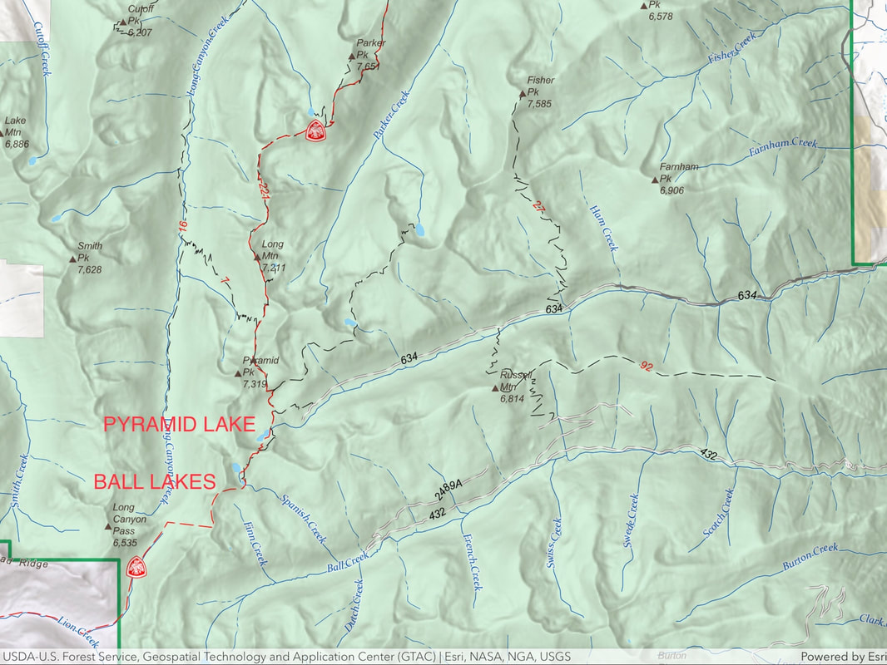

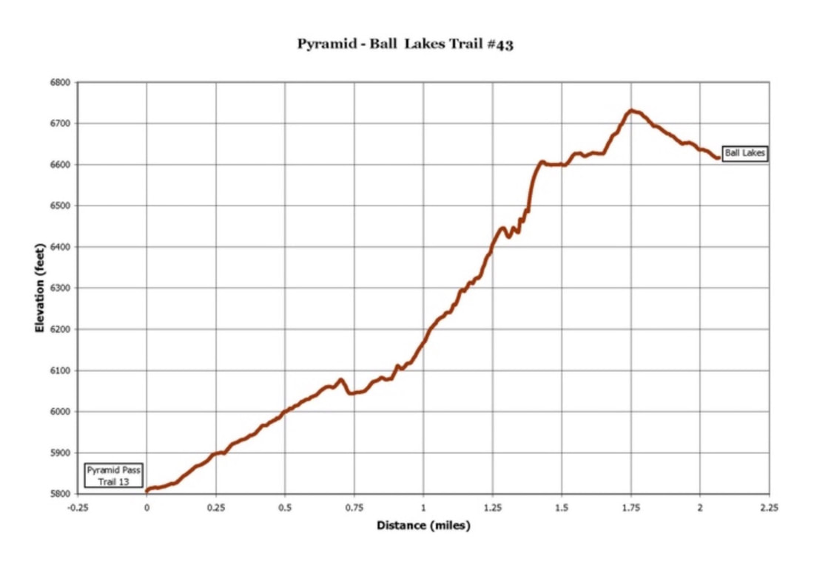

## Photo gallery

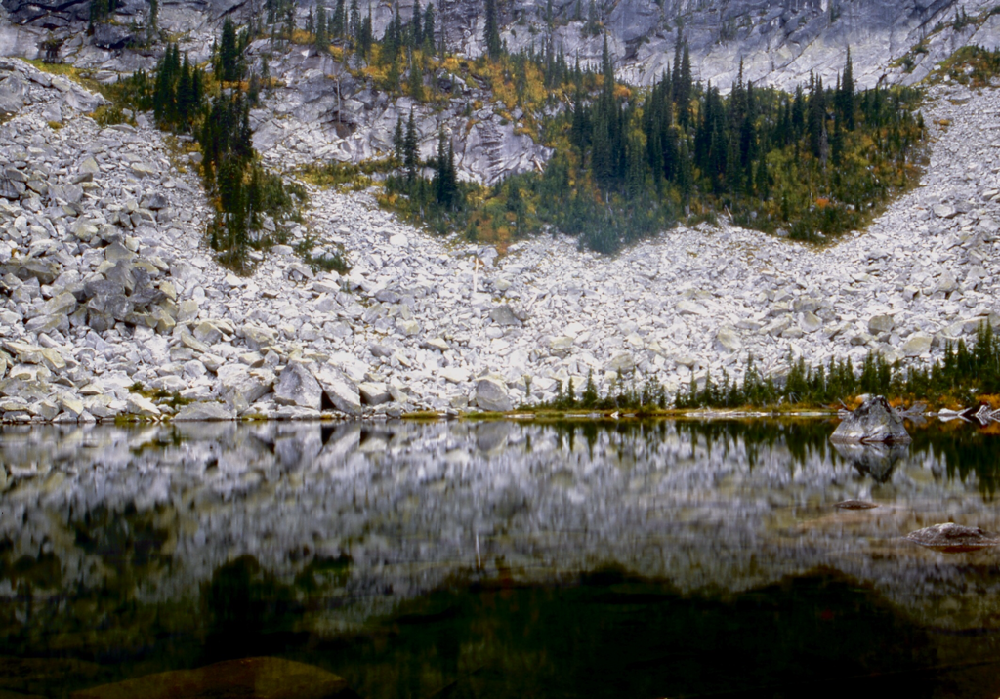

## North end of pyramid lake

---

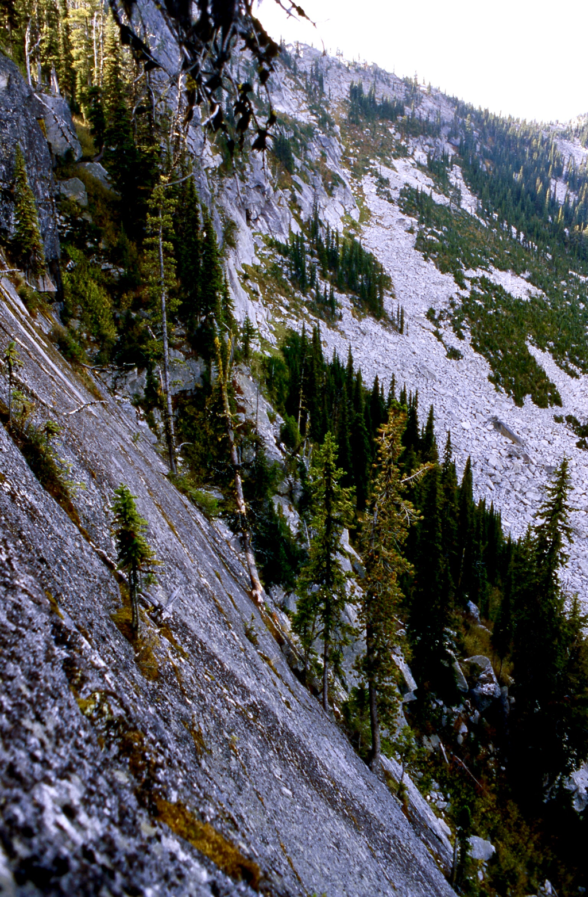

## From a view point above pyramid lake, on the great wall to ball lakes

---

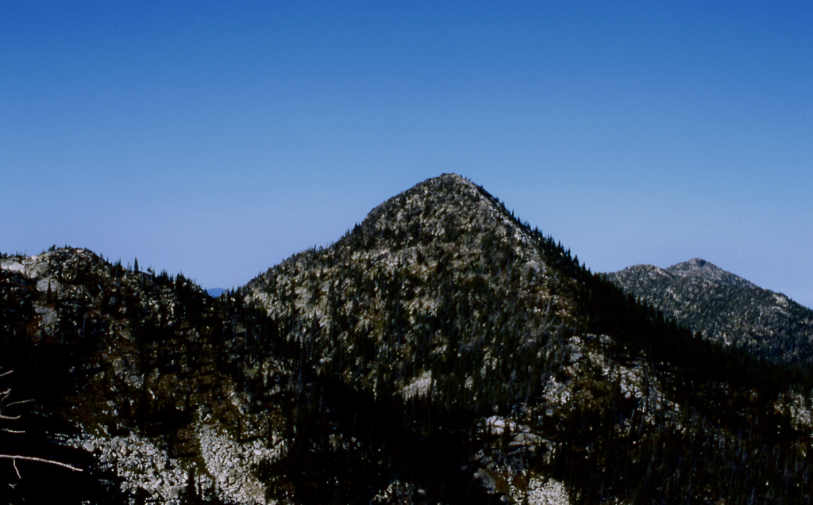

## Pyramid peak 7355’ from long mountain trail

---

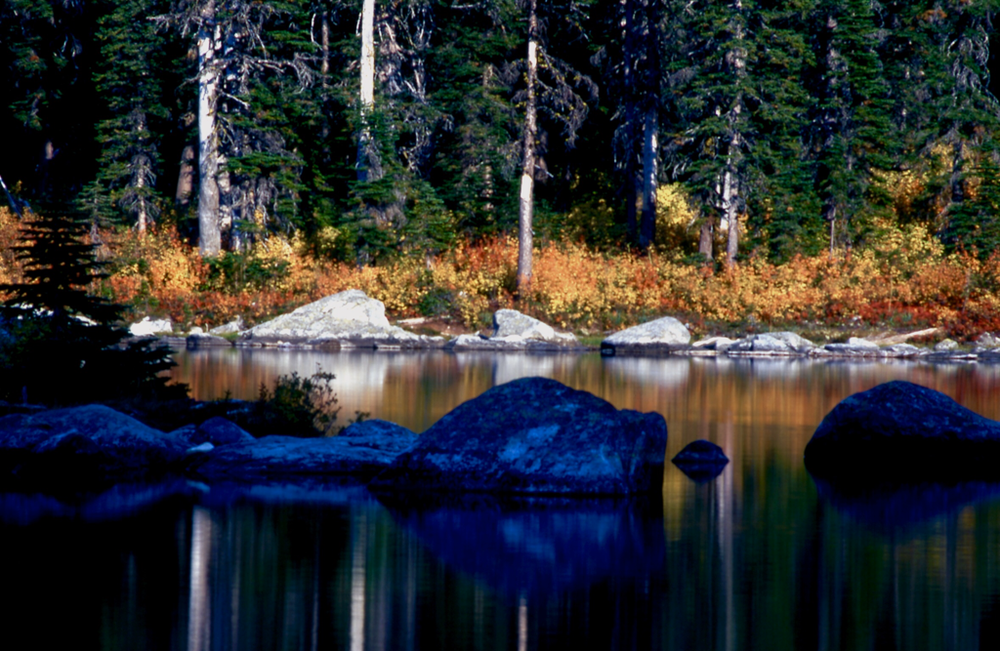

One day, after summiting pyramid peak, we raced down to pyramid lake to capture the fleeting sunset on the lake

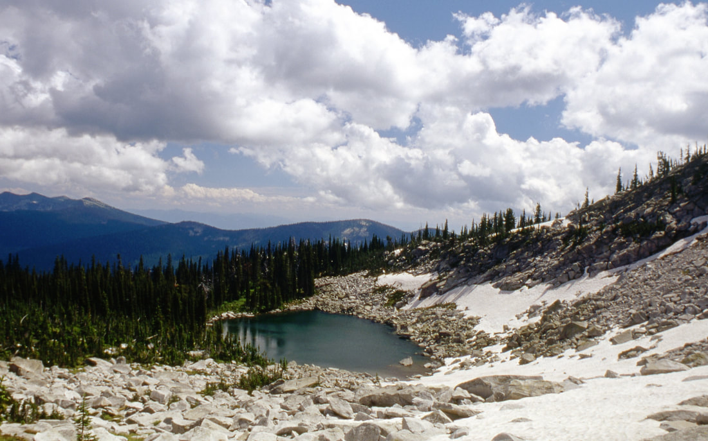

## Upper ball lake

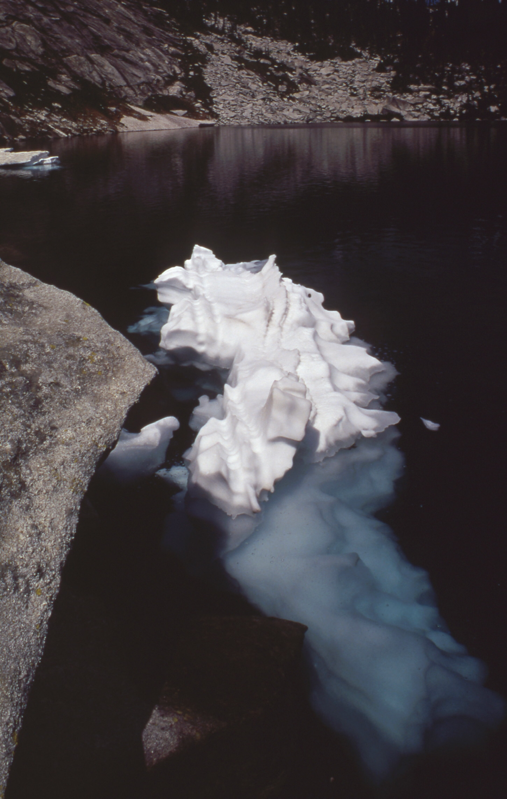

## Ice berg on lower ball lake

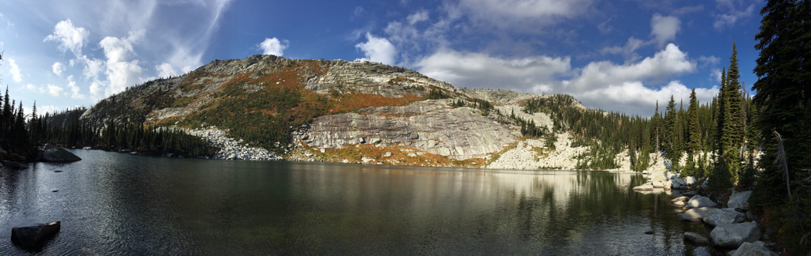

## A pano of the lower ball lake on our return hike

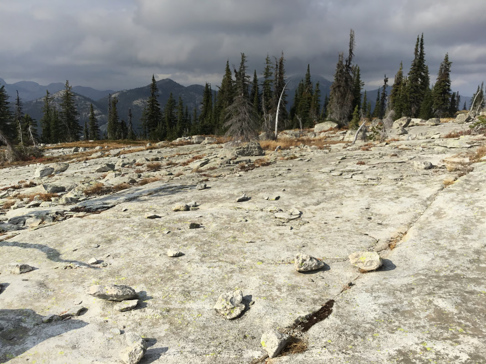

## The lunar landscape south of ball lakes along the ne fork of the selkirk crest

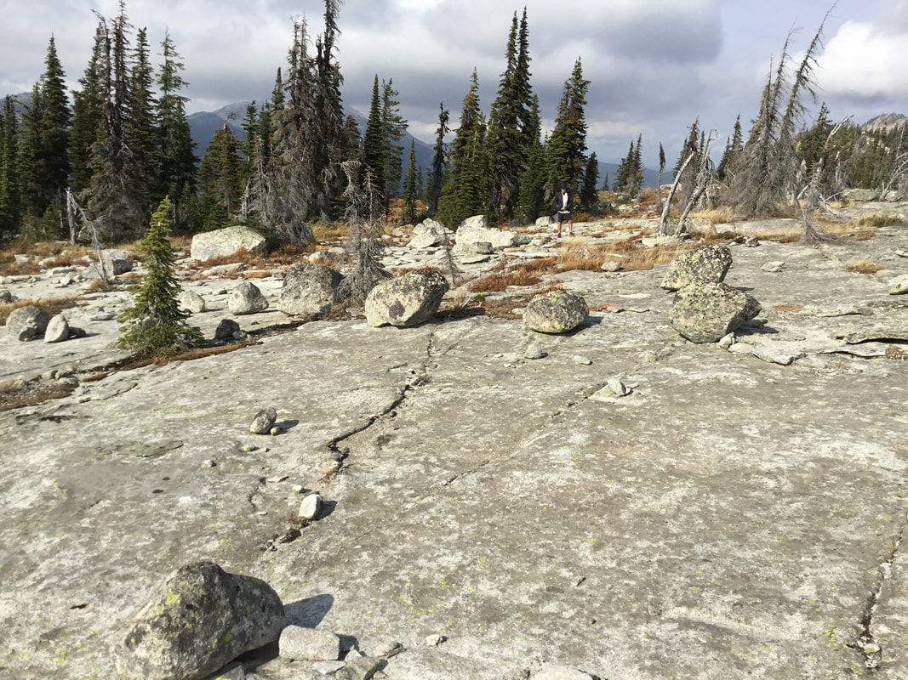

## Chris examining a new lunar landscape

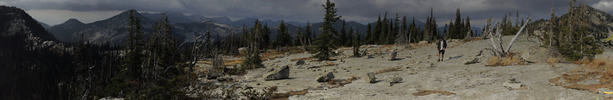

## Chris walking on what he calls "lunar landscape" on the ridge south of pyramid lakes

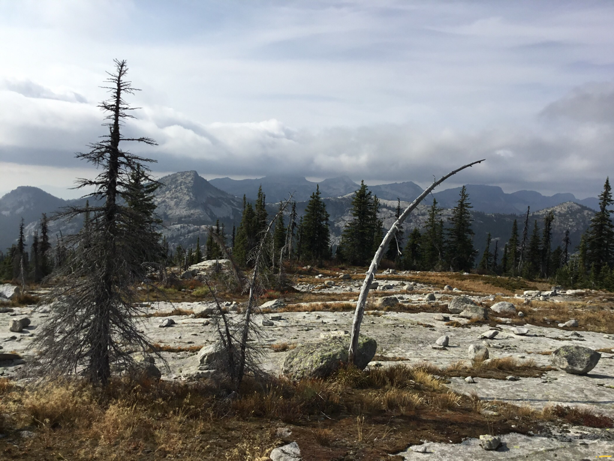

Sw of ball lakes is this very scenic ridge line hike. in the background is lions head peak 7288’ in the clouds

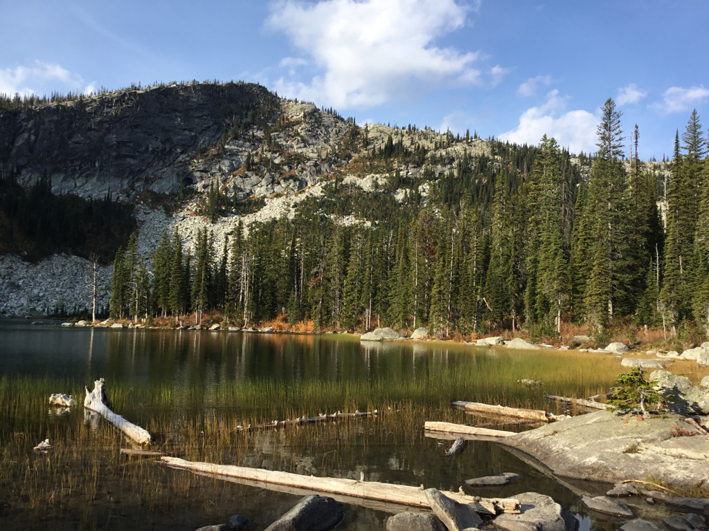

## The last view of pyramid lake along the trail out

Good route finding comes from experience. Experience comes from bad route finding.     chic     2012
