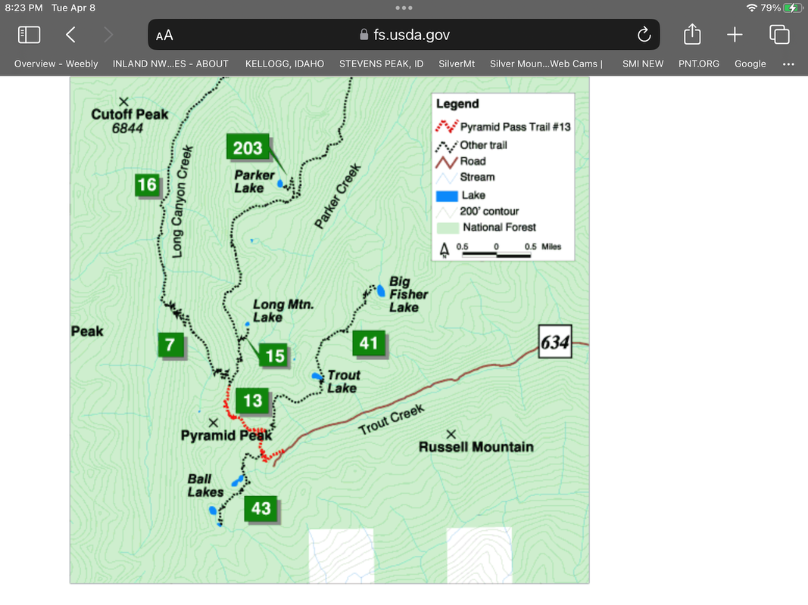
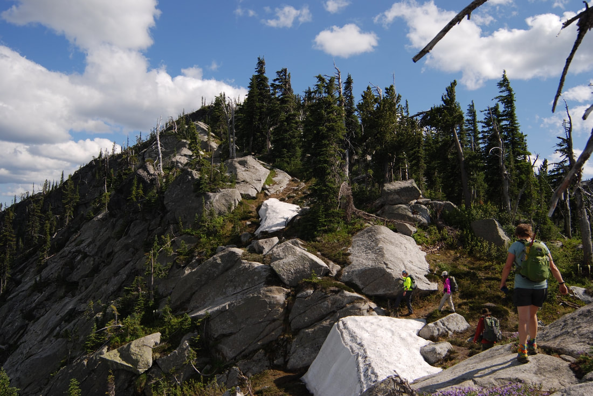
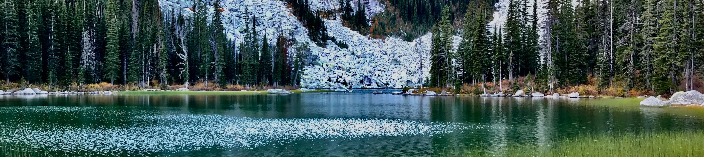
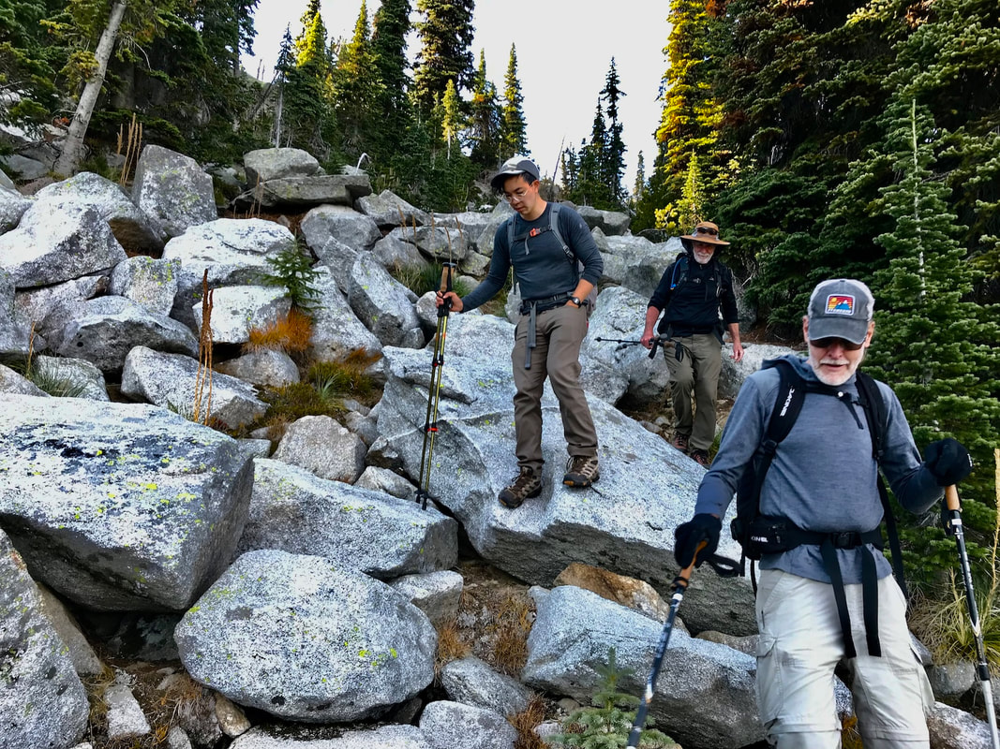

---
tags:
- Peaks & Mountains
- Moderate Hike, Difficult Ascent.
- Hiking
- Scrambling
stats:
- label: Event Type
  icon: hiking
  value: Hiking & scrambling
- label: Distance
  icon: map-marker-distance
  value: About 6 Miles RT. (P. Pass 2.7 & 1300')
- label: Elevation Gain
  icon: elevation-rise
  value: 2005' gain. 643’ from Pass to Summit.
- label: Acres
  icon: vector-square
  value: '6.5'
- label: Difficulty
  icon: speedometer
  value: Moderate hike, Difficult ascent.
- label: Maps
  icon: map
  value: IPNF-Kaniksu N. F., USG-Pyramid Peak
- label: GPS
  icon: crosshairs-gps
  value: 48° 48’ 19.7"n 116° 35’ 57.7"w
- label: Ranger District
  icon: pine-tree
  value: Bonners Ferry R.D. 208.267.5561
- label: Boundary County Sheriff
  icon: shield-account
  value: CALL 911 FIRST or 208.267.3151
notes:
- Idaho panhandle national forest/alerts
- '[https://www.fs.usda.gov/alerts/ipnf/alerts-notices](https://www.fs.usda.gov/alerts/ipnf/alerts-notices)'
---

# Pyramid Peak 7355 Trail 13

## Description

We have added the areas sheriff’s emergency phone numbers for each trip write up under the ranger district
info. if an
emergency ocurrs, evaluate your circumstances and call only if needed.
Pyramid Peak towered over Pyramid Pass, Long Canyon, and Pyramid Lake.
From a distance it look like it's namesake, a steep sided pyramid.
Once at Pyramid Pass, turn left (south) and look for a primitive trail leading to the lower flanks of the
peak.
Immediately the route (no trail), climbs steeply for about .3 of a mile.
You have to pick your way up the steep terrain over and around boulders, often times scrambling. But when you
see the
summit just above you, and summit it, you will be amazed and astonished that you made it, and of the
incredible views.
From the summit, the views all around are spectacular, especially looking down Long Canyon. Nowhere else do
you get such
a great view of the canyon.
And thats not all, the 360° views so worth the scramble.
please read "hazards"below

## Option #1

This option is, to very carefully make your way down the way you ascended.
Please take this descent seriously.
In some cases, I turn around facing up hill, and use what ever you can to safely descend.

## Option #2

To extend you hike/scramble, head SSE down a gentle ridge that connects with the ridge to Ball Lakes.
Along the ridge, there is a small unnamed peak that you should skirt around. Once on the other side, continue
to above
Pyramid Lake. It’s a long rock hop down to the lake. There is a trail around the north side of the lake.
It is not safe to ascend the ridge up the next prominence.
From Pyramid Lake, hike the trail that ascends the south wall. This walk up to Ball Lakes is magical.
As you gain the top of the wall, you can walk up hill to your right, to the prominence that’s too difficult to
ascend.
There people have built wind breaks for sleeping.
Head down the ridge to above Upper Ball Lake and around the NE shore line.
From the above prominence you can walk SE and pick up Trail #43, right to Ball Lakes or left to Pyramid Lake.

## Directions

From the Kootenai National Wildlife Refuge, head north on the West Side Road for 10 miles to the Trout Creek
Road #634.
Turn left (west) and drive 9 miles to the trailhead.

## Hazards

This hike is not forthe inexperienced.

Because about half of the route is off trail, you must take extra care on this entire route.
Be sure to carry your 13 essentials, a water filter, and dress for all weather conditions.
And please take my word, you need to wear long legged pants, to descend thru the thick brush.

## Cool things close by

Long Canyon, Long Mountain Lake & Peak, Russell Mt & Ridge, and Trout Lake & Big Fisher Lakes

## R & P

Jalapeños, Burger Express,  Eichardt's, and Mr. Sub in Sandpoint

*Picture (Image missing)*

## Photo gallery

*Picture (Image missing)*

##

*Picture (Image missing)*

## A glimps of pyramid peak from the trail to pyramid pass

*Picture (Image missing)*

## Pyramid pass The route up pyramid peak is to the left from my pack

*Picture (Image missing)*

## A scrambler near the top of pyramid's summit

## Scramblers nearing the summit of pyramid peak

*Picture (Image missing)*

## Tyler and shuwen celebrating on the summit of pyramid peak

*Picture (Image missing)*

## Pyramid peak from the parker peak hike, near long mountain lake

---

*Picture (Image missing)*

## The lion head group above long canyon image by colin xu

Pyramid lake

Rock hopping from the peak to the lake

Is half the fun

There is a high, a high that comes from being in the mountains. If you have never been there, you are missing
out. Go to
the mountains. Experience Nature’s high.  chic    8.12.2014
