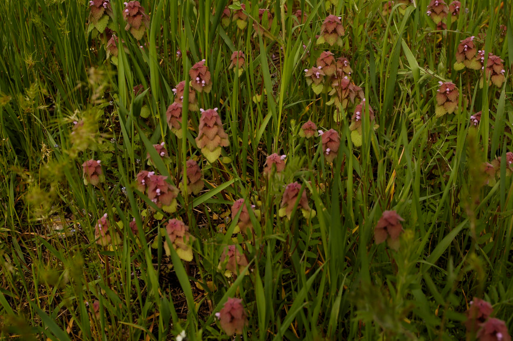
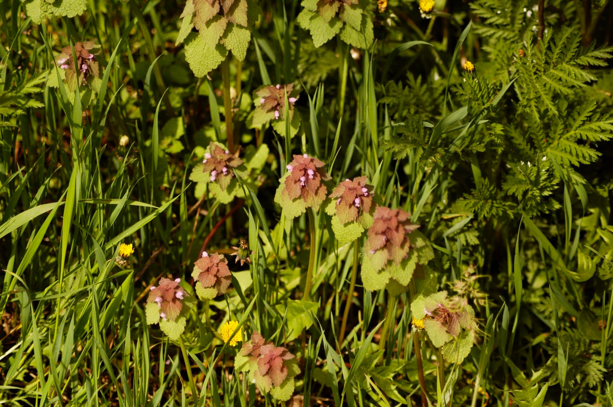
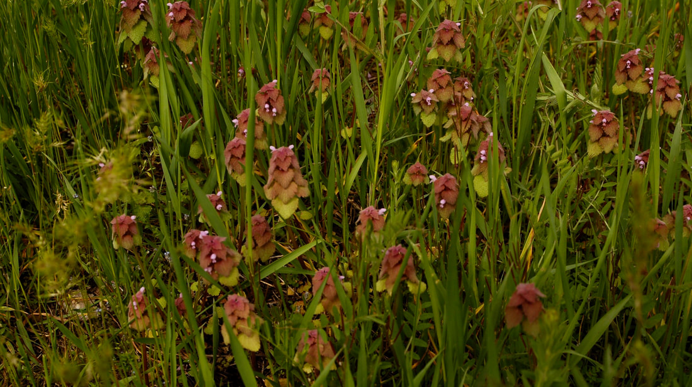

# Red Dead Nettle

---
tags:

- Trails & Scrambles stats:
- label: Genesis Name icon: book-open-variant value: Lamium purpureum
- label: Distribution icon: earth value: They originated in Europe and Asia, but are found throughout the
  U.S.
- label: Season icon: calendar value: These plants can bloom in all seasons.
- label: Medical Use icon: medical-bag value: The whole plant is astringent, diaphoretic, diuretic,
  purgative and styptic. In terms of traditional medicinal uses, dried leaves have been used as a poultice
  to stem hemorrhaging whilst fresh bruised leaves have been applied to external wounds and cuts. The
  leaves are also made into a tea and drunk to promote perspiration and discharge from the kidneys in
  treating chills.
- label: Poisonous icon: skull-crossbones value: 'No'
- label: Edibility icon: food-apple value: '**Red Dead-Nettle is edible** (as are the similar species
  mentioned above). You can use Red Dead-Nettle as per White Dead-Nettle, Lamium album and the leaves and
  flowering tops are great in salads. Unlike White Dead-nettle, there doesn''t seem to be the tendency for
  the leaves to become bitter with age.'
- label: Features icon: information-outline value: The stems are square, with a smooth texture. Purplish
  flowers have a top hooded petal with 2 lower lip petals. May be produced throughout the year. Sessile in
  whorls in the leave axils. They can self pollinate, and the flowers are hermaphrodite. Purple
  Dead-nettle is usually considered a weed and originates from Europe and Asia. It is low growing and
  blooms occur throughout the year including warmer weather in winter. It can be found in lawns, along
  roads, gardens and meadows. It is often confused with Henbit and they can grow together. Henbit has
  stemless leaves. Prefers full sun to light shade and moist fertile soil. The foliage is little bothered
  by disease and insect pests. This plant develops quickly during the cool weather of spring. This plant
  is a winter or summer annual (usually the former) that is unbranched and ½–2½' tall. The central stem is
  strongly 4-angled and largely glabrous. The lower third of the stem in a mature plant is often devoid of
  leaves. The opposite leaves are up to 2" long and across. They are densely crowded together along the
  stem, each pair of leaves rotating 90° from the pair of leaves immediately below or above. Young leaves
  at the apex of the stem are tinted purple, but they become dull green with maturity. The leaves are
  broadly cordate or deltoid, crenate along their margins, and finely pubescent. Their petioles are short.
  The upper surface of each leaf has a reticulated network of indented veins, creating a wrinkly
  appearance. Sessile whorls of flowers occur above the leaf axils, and a terminal whorl of flowers occurs
  at the apex of the stem. Each tubular flower is about ½" long and has well-defined upper and lower lips.
  The lower lip is divided into 2 rounded lobes, and there are insignificant side lobes that are reduced
  in size to small teeth. The corolla is purplish pink, pink, or white – the upper lobe is usually a
  darker color than the lower lobe, which is often white with purple spots. The tubular calyx is green or
  purplish green, and has 5 slender teeth that spread outward slightly. The blooming period usually occurs
  during mid- to late spring and lasts about 1½ months, although plants that are summer annuals may bloom
  during the fall. Each flower is replaced by 4 nutlets. The root system consists of a taproot. This plant
  occasionally forms dense colonies by reseeding itself.
- label: Leaves icon: leaf value: Crowded heart-shaped leaves tend to overlap; upper leaves are often
  purplish with greenish undersides and hairy. Short petioles. Wavy to serrated margins.
- label: Fruits icon: fruit-cherries value: '**Like many in the dead nettle family, this plant produces four
  tiny nutlets**.'
- label: Parts Used icon: information-outline

## value: Leaves, flowering tops and flowers

## Red Dead Nettle (2)

## Photo gallery

### Picture (Image missing)

### Picture (Image missing) Details

### Picture (Image missing) Details (2)

### Picture (Image missing) Details (3)
