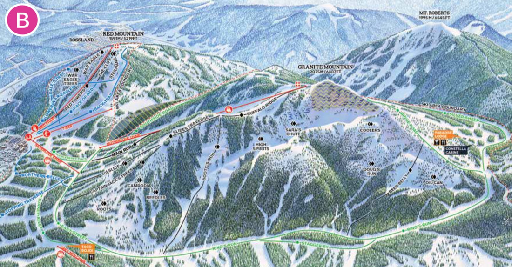

---
tags:
- Peaks & Mountains
stats:
- label: Acres
  icon: vector-square
  value: '3850'
- label: Summit Elevation
  icon: terrain
  value: 6807'
- label: Base Elevation
  icon: terrain
  value: 3887'
- label: Verts
  icon: arrow-expand-vertical
  value: 2920'
- label: Runs
  icon: ski
  value: '119'
- label: Lifts
  icon: gondola
  value: '8'
- label: Distance from Spokane
  icon: map-marker-distance
  value: 124 miles
- label: Amenities
  icon: star-outline
  value: xc, ns, cat s,
notes:
- Redresort.com
- 800.663.0105
---

# Red Mountain Resort

!!! warning "Before you go"

    

## Description

Red mountain is actually one of four peaks. of which red mt is the smallest. red mt is located just 2.5
miles from rossland, b.c.

The Red Mountain Ski Area is one of the oldest ski operations in North America. The mountains now included
in the resort have been skied since the late 1890s. In 1947, the volunteer Red Mountain Ski Club was formed
by the amalgamation of two local ski clubs. Its members built the Red Mountain Lodge (originally the Black
Bear Compressor Building, moved and refitted) and the Red Chair Lift - the first chairlift in Western
Canada. The ski hill was operated by a

non-profit

society for 40 years and is now one of the region’s most recognized recreational resource. Red Mountain
itself is Rossland’s most significant landmark; its historic significance being the primary site of the gold
mining that developed the City of Rossland.

Red Mountain Ski Area is known worldwide, and has successfully hosted regional, national, and international
races. It is very attractive to visitors in the winter and is a recreational anchor to much of the seasonal
and permanent residency in Rossland.

---

Click for Current NOAA Weather Conditions

## Photo gallery

## To contribute images, contact chic via this website

---

The Red Mountain Ski Area is located in the Rossland range in southeastern BC. It encompasses 1700 hectares
of

land in

the northwestern portion of the City of Rossland and is anchored by Red Mountain, Granite Mountain, Grey
Mountain and the Red Mountain

lodge. The entrance to the Red Mountain Ski Area is off Highway 3B approximately three kilometers from
Rossland’s historic downtown. Heritage Value: The Red Mountain Ski Area has played a major role in
Rossland’s identify for over 75 years. It is the oldest ski operation in Western Canada, created in 1947
with the amalgamation of local Ski Clubs and the erection of the Red Chair lift and the construction of the
Red

Mountain lodge. The Ski Hill is a testament to the vision and initiative of local outdoor enthusiasts who
provided all the skills and labour needed to establish the ski operation. It also reflects the considerable
assistance of CM&S Company, a mining company still in operation today (Teck Trail Operations) in
contributing to the development of the region’s most recognized recreational resource. A non-profit society
operated the Ski Hill for 40 years and this has contributed to a strong feeling of ownership within the
community to this day. Red Mountain is the most significant landmark in Rossland. Its striking conical shape
is visible from all parts of Rossland and the developed north side of the mountain, including the very
challenging War Eagle and Cliff ski runs, forms a natural amphitheatre for the base lodge. Spectacular
vistas of the City and surrounding areas are seen from the top of both Red, Granite and Grey Mountains and
their ski runs and lift lines, cut in the naturally forested slopes are seen from many miles away. The
historic significance of Red Mountain itself, predates the creation of the Ski Area. It was the primary site
of extensive gold mining operations that spawned the City of Rossland and there is evidence of this
industrial past in the abandoned mining sites and the ore dumps in the Ski Area today. The original Black
Bear compressor building, moved and refitted to its present site in 1947 became the Red Mountain lodge and
the names of many ski runs reflect the area’s mining history. The Ski Area’s reputation of excellence is
well established in the ski world today and is a source of pride for locals. Red is known for its
challenging terrain, very successful ski racing programs and its ability to successfully host regional,
national and international races. It is a major attraction in the winter months and is the reason why some
visitors have decided to take up seasonal and permanent residency in Rossland. The Red Mountain Ski Area is
emblematic of the "mountain culture" that exists in Rossland today. Many individuals and families value and
pursue an active lifestyle, enjoying the variety of outdoor activities available in the immediate area of
our small, alpine city.

---

---

---

---

---

---
