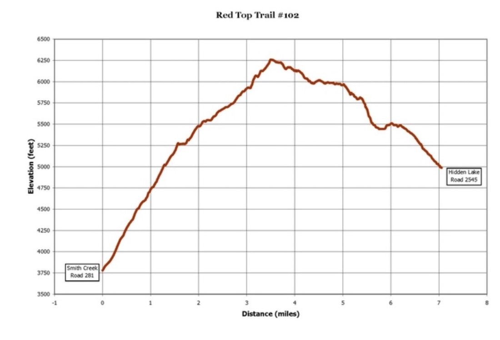
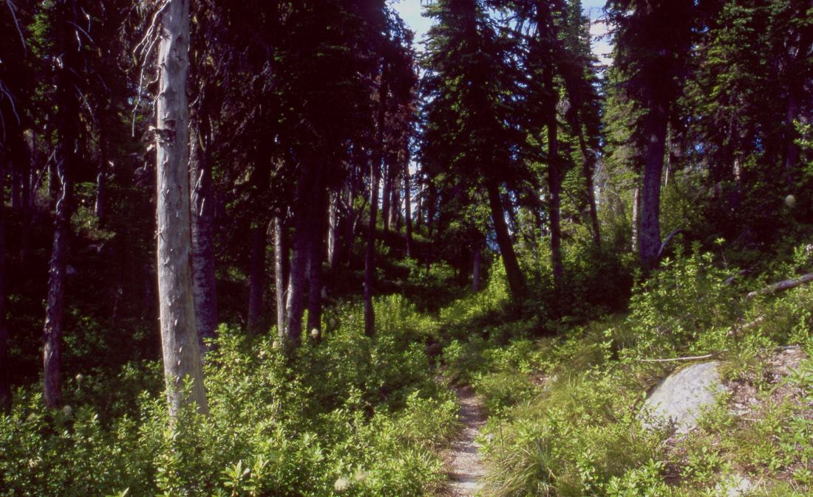
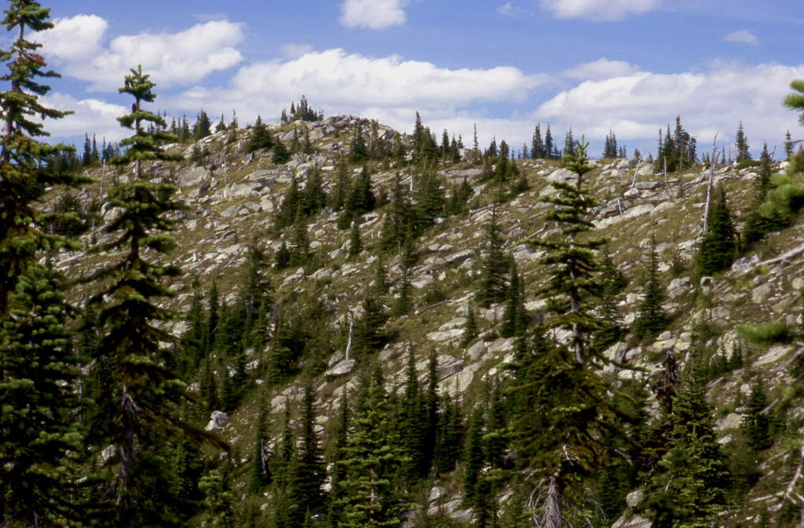
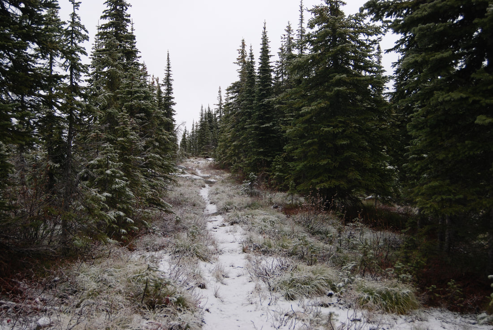
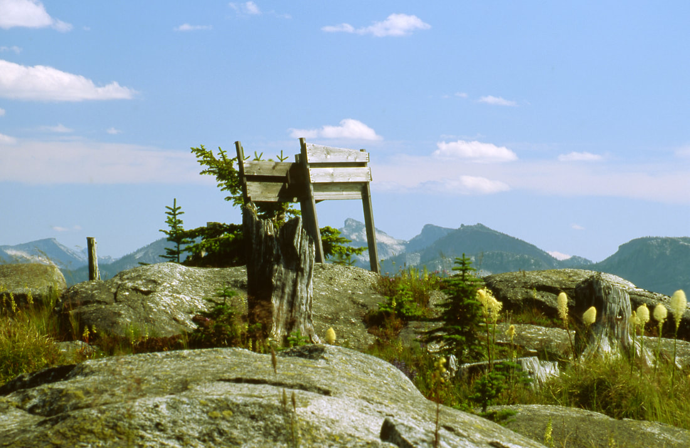
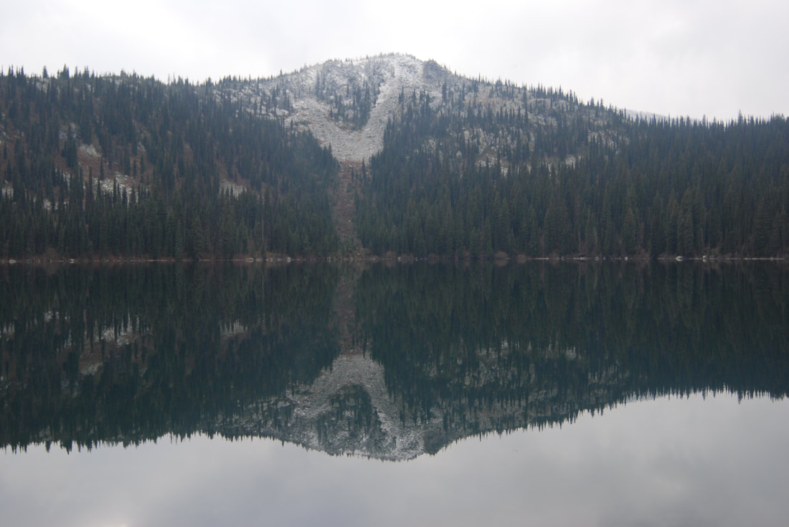
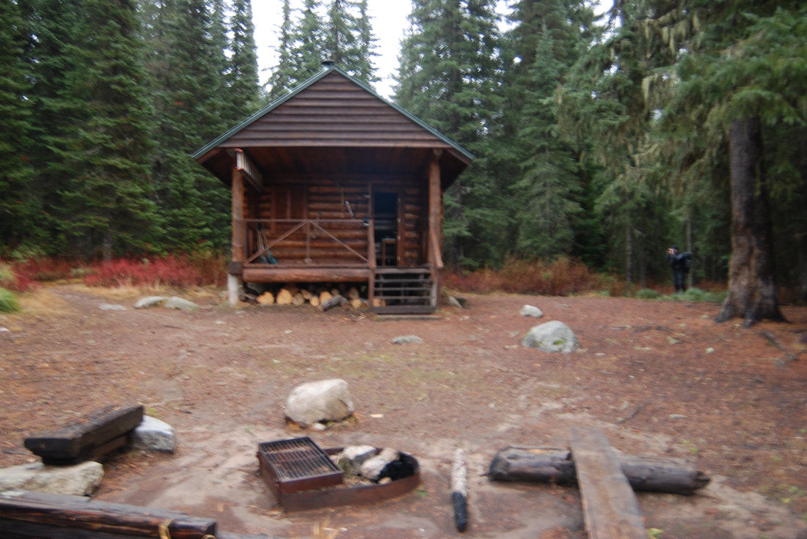

---
tags:
- Peaks & Mountains
- Day Hiking
- Backpacking
stats:
- label: Event Type
  icon: hiking
  value: Hiking and Backpacking
- label: Distance
  icon: map-marker-distance
  value: 1 mile to Hidden Lake one way and 7.5 miles RT to Red Top
- label: Elevation Gain
  icon: elevation-rise
  value: 1275'
- label: Difficulty
  icon: speedometer
  value: Easy to the lake and moderate to the peak
- label: Maps
  icon: map
  value: IPNF - Kaniksu N.F., USGS - Grass Mt. and Shorty Peak
- label: GPS
  icon: crosshairs-gps
  value: 48° 54’ 49.0"n 116° 41’ 06.6"w
- label: Ranger District
  icon: pine-tree
  value: Bonners Ferry R.D. 208.267.5561
- label: Boundary County Sheriff
  icon: shield-account
  value: CALL 911 FIRST or 208.67.3151
notes:
- label: Idaho panhandle national forest/alerts
  url: '#'
- url: https://www.fs.usda.gov/alerts/ipnf/alerts-notices
---

# Red Top Mountain 6266 Trail 102

## Description

We have added the areas sheriff’s emergency phone numbers for each trip write up under the ranger district
info. if an emergency ocurrs, evaluate your circumstances and call only if needed. The trail to Hidden Lake
is easy, and moderate to the peak. Most people don't venture past the lake, where there is good fishing and
swimming, so the peak trail is seldom used. On the trail above Hidden Lake the views across the lake are of
Joe Peak 6748'. Red Top offers views of the northern section of the American Selkirks.

## Options 1

From the top, the trail begins a 4 mile descent to Road #281. It leaves the ridge and drops back into
forested habitat with lots of huckleberries, while in season.

## Directions

From Bonners Ferry drive north on 95 for 15 miles to SH #1. Turn left (west) and drive thru Copeland and
over the Kootenai River on FR #281 to the West Side Road #417. Turn left (south) onto FR #281, to FR #2545
to the trailhead.

## Cool things close by

Shorty Peak, Lone Tree Peak, and West Fork Lake & Mountian. There is a waterfall on Smith Creek close to SH

## 1

## Hazards

None of note.

## R & P

Jalapeños, Eichardt’s, Burger Express, Mr. Sub in Sandpoint

### Picture (Image missing)

## Photo gallery

## Part of the trail to red top 6266’

---

## The summit of red top from the trails in

### Picture (Image missing) Details

## In the shoulder months, this hike is excellent

### Picture (Image missing) Details (2)

## This trail offers many unique photo opportunities

The higher you get on the trail towards joe peak & lake the more snow you will encounter in roctober

### Picture (Image missing) Details (3)

## Chris nearing the top of joe peak

## The summit of joe peak

## Joe peak from the south end of hidden lake

### Picture (Image missing) Details (4)

## Along the south shore, this rock has made a friend

## West fork cabin

## Life is short….play often.   chic.   2013
