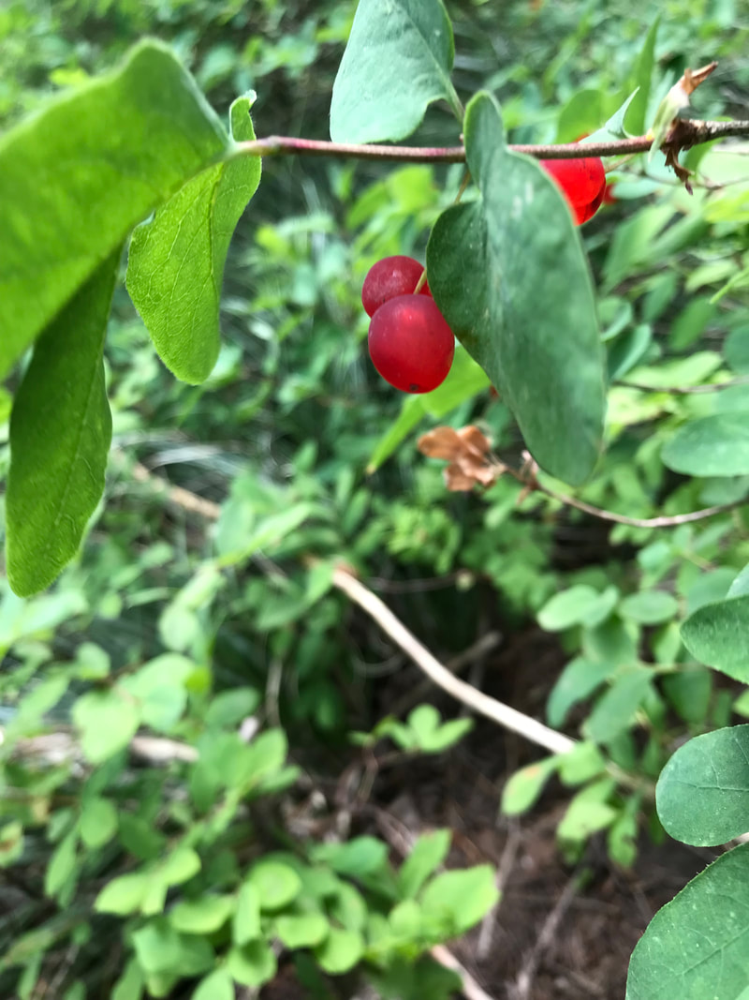

---
tags:
- Trails & Scrambles
stats:
- label: Genesis Name
  icon: book-open-variant
  value: Lonicera involcrata. (Lonicera utahensis)
- label: Distribution
  icon: earth
  value: Western half U.S & Great Lakes
- label: Season
  icon: calendar
  value: 'April thru JuneMedical use: Twinberry was employed medicinally by a number
    of native North American Indian tribes who used it to **treat a range of complaints**.
    It is little, if at all, used in modern herbalism. The bark is disinfectant, galactogogue,
    ophthalmic and pectoral. A decoction is used in the treatment of coughs and as
    an eyewash.'
- label: Poisonous
  icon: skull-crossbones
  value: The **berries were mostly considered poisonous**, but were sometimes eaten
    for food. The fruit or leaves were used to induce vomiting for purification or
    after poisoning. ... Bears also eat the berries. Black Twinberry provides cover
    for small animals.
- label: Edibility
  icon: food-apple
  value: '**The berries are edible but not particularly tasty**. Some birds and bears
    are known to eat the fruit, but these plants are not common enough to be important
    to wildlife. Twinberry is widespread, however, and the yellow flowers and paired
    fruits often attract attention.'
- label: Features
  icon: information-outline
  value: Twinberry honeysuckle is a long-lived deciduous shrub which grows up to 10
    feet in height. Leaves are bright green, elliptical, and paired opposite each
    other on the stem. Flowering occurs in June-July. Small, tubular yellow flowers
    grow in pairs surrounded by two leafy bracts. The bracts turn from green to a
    striking dark red in late summer as fruits ripen. The name *involucrata* refers
    to these bracts, which are collectively called an "involucre". The paired black
    berries are about one-third inch in diameter and are unpleasantly bitter tasting.
    Berries reportedly had limited food use, but were used by Native Americans as
    a dye for hair and other materials. The fruits, stems and leaves were also used
    for a variety of medicinal purposes.Twinberry honeysuckle is found throughout
    the western United States from Alaska to Mexico. The species also occurs east
    of the Great Plains in Michigan and Wisconsin, where it is rare and listed as
    threatened and endangered. Habitats are generally moist forest openings, swamps,
    streamsides, and meadow edges, ranging in elevation from sea level along the Pacific
    Coast to subalpine sites in the mountains.
notes:
- Reports on the fruit **vary from poisonous**, to mildly toxic, to bitter and unpalatable,
  to edible and useful as food, depending on tribe, region or publication. The berry
  was used as a source of dye. Medicinal uses were many and varied among tribes.
- Like many honeysuckles, twinberry is an attractive ornamental which can be grown
  in the garden. Its flowers attract hummingbirds and birds feed on the fruits. Twinberry
  prefers moist, well-drained soil in full sun or partial shade, and is tolerant of
  cold climates. Plants are propagated either from seed or cuttings, and are available
  from many nurseries.
---

# Red Twinberry

## Red Twinberry, AKA Utah Honeysuckle

## Description

Add Desc

---

## Photo gallery

