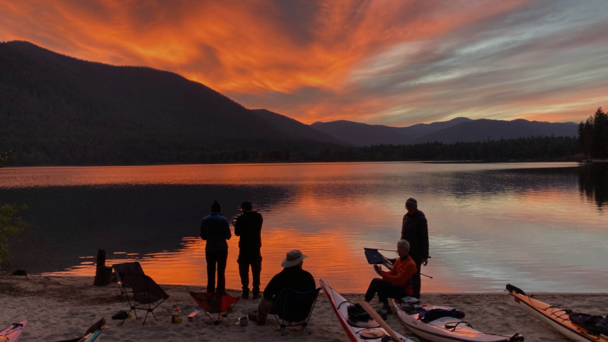

---
tags:
  - Resources
  - Conservation & Organizations
  - Paddling & Water Sports
stats:
  - label: Organization Name
    value: "Spokane Canoe & Kayak Club (SCKC)"
  - label: Organization Type
    value: "501(c)(3) Non-Profit Paddle Sports Club"
  - label: Supported Craft
    value: "Canoes, Kayaks (Recreational, Sea, Whitewater), SUPs, Rafts"
  - label: Region & Scope
    value: "Inland Northwest Rivers, Lakes & Whitewater Streams"
  - label: Official Website
    value: "sckc.club"
    url: "https://www.sckc.club"
notes:
  - label: Spokane Canoe & Kayak Club (SCKC Official Site)
    url: https://www.sckc.club
  - label: SCKC Paddling Calendar & Club Trips
    url: https://www.sckc.club/calendar
---

# Spokane Canoe and Kayak Club

_Spokane Canoe And Kayak Club._

Rushing whitewater, quiet mountain lakes, and meandering rivers—the Inland Northwest offers extraordinary water
recreation, and the Spokane Canoe and Kayak Club (SCKC) is the region's premier community for non-motorized paddlers.

---

## Mission & Paddle Sports Community

Dedicated to promoting safe, enjoyable, and environmental paddling of all kinds, SCKC welcomes paddlers of all
experience levels across North Idaho, Eastern Washington, and Western Montana.

Operating as a volunteer-driven non-profit, SCKC fosters a warm, supportive community where members share river
knowledge, coordinate trip logistics, practice safety techniques, and organize group paddles throughout the season.

---

## Watercraft & Paddling Disciplines

SCKC embraces all forms of non-motorized watercraft:

- **Canoeing:** Tandem and solo open canoeing on quiet lakes, scenic rivers, and moderate whitewater.
- **Kayaking:** Recreational flatwater kayaking, sea touring on large lakes (CDA, Pend Oreille), and whitewater kayaking.
- **Stand-Up Paddleboarding (SUP) & Rafting:** SUP touring and inflatable rafting on regional river stretches.

---

## Trips, Safety & Educational Opportunities

SCKC sponsors a wide variety of activities designed to enhance paddling skills and water safety:

- **Club Paddling Trips:** Volunteer-led day trips and multi-day camping excursions on flatwater lakes and rivers.
- **Safety & Rescue Training:** Member clinics covering self-rescue, T-rescues, rolling, swiftwater safety, and river
  reading.
- **Conservation & River Stewardship:** Participating in river cleanup work parties, public access advocacy, and
  protecting local waterways.

To view upcoming trips, join the club, or access local river logs, visit the
[Spokane Canoe & Kayak Club Website](https://www.sckc.club).
