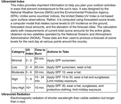

_First Aid and Medical Preparedness Kit._

Knowledge is the single most vital piece of equipment you carry into the backcountry. This guide summarizes essential wilderness medical protocols, environmental hazard management, accident response strategies, and field safety practices.

!!! quote "Core Safety Maxim"

    "Don't ever let your biggest harm be yourself."
    — **Chic Burge** *(2012)*

---

## Medical Emergency Card

Every hiker and outdoor adventurer should carry a completed **Medical Information Card** in their backpack. In an emergency, first responders and trail companions need immediate access to your medical history, allergies, emergency contacts, and vital information.

!!! info "Emergency Card Contents"

    - **Personal Identifiers:** Full name, age, home address, and emergency contact phone numbers.
    - **Medical Details:** Pre-existing conditions, active medications, severe allergies, blood type, and insurance details.
    - **Backpack Storage:** Store the card in a waterproof pouch in an easily accessible top pocket of your pack.

---

## Wilderness First Aid & Training

Knowing CPR and Wilderness First Aid is essential for every outdoor participant.

- **Wilderness First Aid & CPR Courses:** The Spokane Mountaineers offer annual Wilderness First Aid (WFA), CPR Certification, and Level 1 Avalanche courses.
- **Local Resources:** Fire departments, hospitals, the YMCA/YWCA, and online platforms like [CPR & First Aid](https://www.cprandfirstaid.net) offer self-study and certification options.

---

## Hydration & Water Purification

Proper hydration sustains physical performance and keeps blood viscosity normal during strenuous elevation gains.

### Hydration Guidelines & Calculations

- **Thirst Rule:** Drink water continuously to prevent feeling thirsty. Feeling thirsty indicates dehydration has already begun.
- **Daily Fluid Calculation:** Divide your body weight (lbs) by two to calculate the baseline target in ounces of water per day.
- **Urine Color Monitoring:** Monitor urine clarity. Dark yellow urine signals dehydration; aim for a clear stream.
- **Body Composition:** The human body is 50–60% water (brains are 73% water). Food provides roughly 20% of daily fluid intake.

### Lightweight Water Filtration

Carrying gallons of water is heavy. Always carry a compact water filter (such as the *Sawyer Squeeze* or *Sawyer Mini*) weighing ~2–5 oz to purify water directly from alpine streams. Keep a water bottle accessible on your pack shoulder strap rather than buried inside.

---

## Cold-Weather Emergencies

!!! warning "Hypothermia & Frostbite Hazard"

    Cold conditions can turn fatal rapidly. Monitor trail partners closely for signs of shivering, slurred speech, apathy, or confusion.

### Frostbite Recognition & Care

- **Symptoms:** Loss of sensation; skin appears waxy, cold to touch, and pale white, yellow, or bluish.
- **Rewarming Protocol:**
  - Handle affected areas with extreme care. Never rub frozen tissue.
  - Submerge affected limbs in warm water between **100°F and 105°F** *(test water temperature on your inner wrist; never use scalding water)*.
  - Ensure limbs do not touch the sides or bottom of the container.
  - After rewarming, place sterile gauze or cotton between fingers/toes and wrap loosely.
  - **Do NOT pop blisters.**

### Hypothermia Prevention & Evacuation

- **Early Indicators:** Slurred speech, impaired judgment, glassy stare, numbness, or unzipping jackets in freezing weather.
- **Severe Indicators:** Shivering stops, pulse slows, breathing becomes shallow, and apathy sets in.
- **Field Treatment:**
  - Replace wet clothing with dry layers immediately.
  - Wrap the victim in thermal blankets and apply chemical heat packs to extremities.
  - Provide warm liquids if the victim is conscious and able to swallow.
  - Assist the victim down the trail and transport them to a hospital immediately.

---

## Heat-Related Illnesses

### Heat Cramps & The Mustard Packet Remedy

- **Symptoms:** Painful muscle spasms and heavy sweating during intense exercise.
- **Stretching Relief:** Sit comfortably, extend legs, and gently flex toes back and forth until cramps subside.
- **Field Remedy:** Carry **restaurant mustard packets**. Consuming a packet of yellow mustard followed by water quickly alleviates muscle cramps due to the sodium and vinegar content.

### Heat Exhaustion

- **Symptoms:** Heavy sweating, cold/pale/clammy skin, fast weak pulse, nausea, dizziness, headaches, and weakness.
- **Treatment:** Move the victim to the shade, loosen tight clothing, apply cold damp towels to the neck, armpits, and groin, and encourage slow sips of cool water.

### Heatstroke (Medical Emergency)

- **Symptoms:** High body temperature (103°F+), altered mental state, confusion, hot/red skin, rapid breathing, and racing heart rate.
- **Emergency Action:** Move to shade immediately. Immerse or douse clothes in cold stream water. Apply cold packs to major blood vessels (neck, armpits, groin). **Do NOT administer fluids until body temperature drops and consciousness is fully restored.** Transport to a hospital immediately.

---

## Emergency Accident Response & Search and Rescue

### Accident Logging & Route Marking

In the event of a severe accident, keep detailed notes in a pocket notebook:

1. **Record Vitals:** Log the victim's name, age, injury details, vital signs, and medical history.
2. **Mark the Evacuation Route:** Use 15" strips of bright surveyor's tape to mark the trail when hiking out for help so Search & Rescue (SAR) teams can locate the scene rapidly.
3. **Safety First for Messengers:** Ensure anyone sent for help travels carefully to prevent secondary accidents.

### Helicopter Landing Zone Preparation

If a rescue helicopter is dispatched (such as *Two Bear Air*):

- **Select LZ:** Find a clear, flat open space free of overhead wires or tall trees.
- **Clear Debris:** Remove all loose branches, trash, gear, and items that could be blown into helicopter rotors.
- **Mark the Spot:** Securely anchor a bright marker or stand at the edge of the LZ facing into the wind.

---

## Field Management for Sprained Ankles

!!! tip "Chic's Selkirks Solo Survival Lesson"

    While solo hiking 5 miles up the trail under the North Twin in the American Selkirks, Chic sustained a severe ankle sprain. Following this ground-drop protocol allowed him to walk out under his own power.

### The Immediate Ground-Drop Protocol

1. **Drop Immediately:** If you twist your ankle, drop directly to the ground. **Do not attempt to stand or walk.**
2. **Elevate Above Heart:** Immediately prop the injured foot up on a rock, pack, or tree trunk so it rests higher than your heart.
3. **Hold for 30–45 Minutes:** Keep the leg elevated continuously for 30 to 45 minutes to prevent severe swelling and joint pooling.
4. **Apply Ice/Cold Water:** Fill ziplock bags with stream water or snow and apply to the joint while maintaining elevation.
5. **Lower Slowly:** Lower the leg gradually. If it begins to throb or ache, elevate it back up and repeat until tolerable.

---

## Sun Exposure, UV Index & Sunscreen Guide

_EPA and NWS Sun Protection UV Index Scale._

### Sunscreen Guidelines

Sunscreen reduces UV damage, premature skin aging, and skin cancer risk (squamous cell carcinoma and melanoma).

| Question | Sunscreen Protocol |
| :--- | :--- |
| **Who** | Everyone (adults and children over 6 months) |
| **What** | Broad-spectrum SPF 30+ water-resistant sunscreen |
| **When** | Apply 30 minutes before exposure; reapply every 2 hours (or after swimming/sweating) |
| **Where** | All exposed skin (ears, neck line, tops of feet, hands, scalp line) |
| **How Much** | 1 ounce (a full shot glass) per full body application |

- **Physical (Mineral) Sunscreens:** Zinc oxide and titanium dioxide block and reflect UV rays.
- **Chemical Sunscreens:** Avobenzone and octisalate absorb UV rays before skin damage occurs.

---

## Air Quality & Particulate Matter (PM2.5 & PM10)

Wildfire smoke and particulate matter present serious respiratory hazards during summer and autumn hiking in the Inland Northwest.

### Particle Categories & Health Impacts

- **PM10:** Inhalable dust and smoke particles ≤ 10 micrometers.
- **PM2.5:** Fine inhalable particles ≤ 2.5 micrometers (30x smaller than a human hair). Fine particles penetrate deep into lung tissue and the bloodstream.
- **Health Risks:** Shortness of breath, eye/throat irritation, coughing, reduced lung function, and aggravation of asthma or cardiac conditions.
- **Monitoring:** Check [AirNow.gov](https://www.airnow.gov) for daily Air Quality Index (AQI) forecasts before heading into the mountains. Limit strenuous outdoor activities when AQI reaches unhealthy levels.
