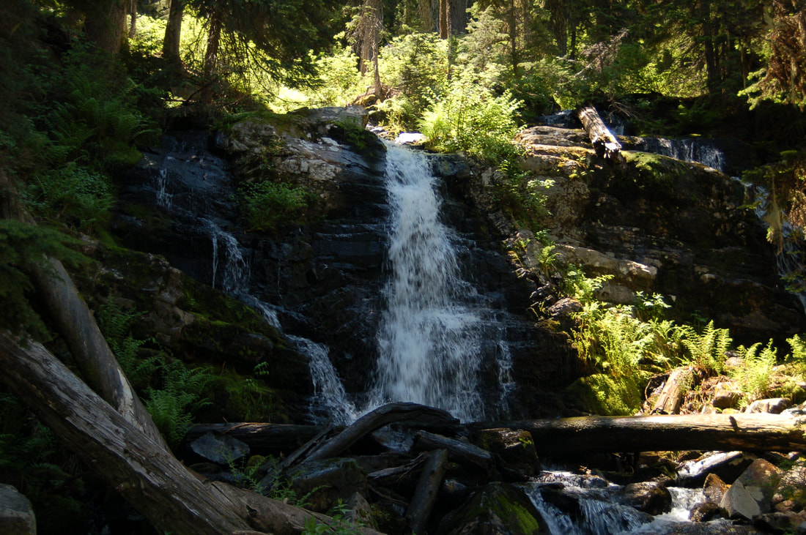
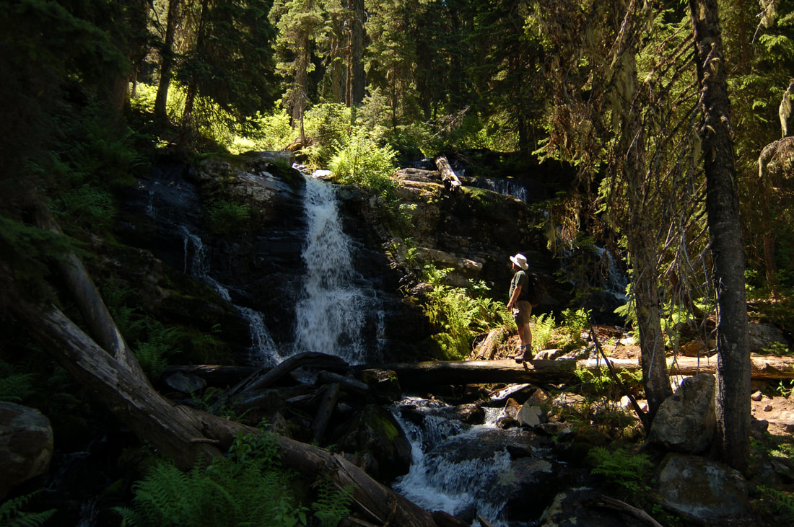
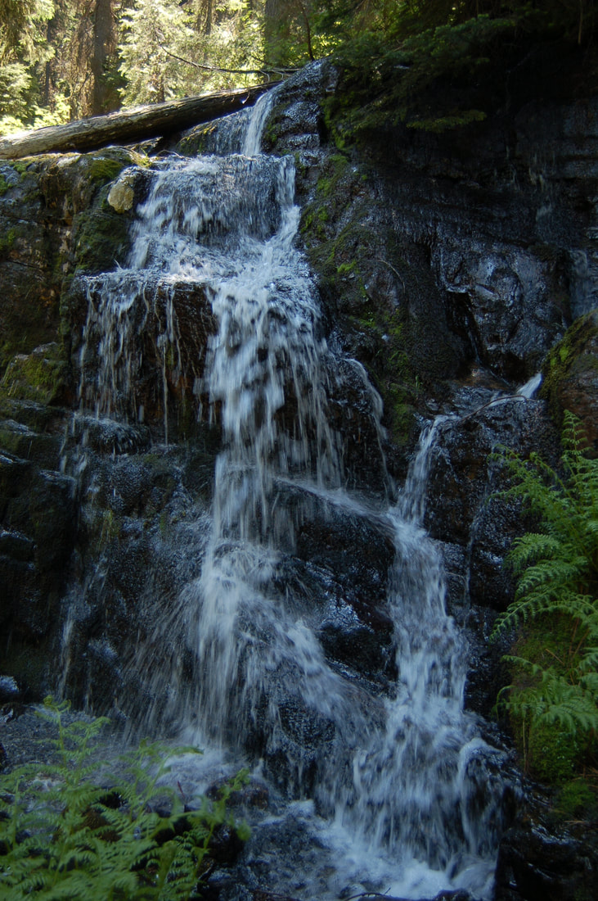

---
tags:
- Waterfalls
stats:
- label: Waterfall
  icon: waterfall
  value: revett falls
- label: Drop
  icon: arrow-collapse-down
  value: 20'
- label: Waterfall Type
  icon: waterfall
  value: Tiered
- label: Distance Car to Falls
  icon: map-marker-distance
  value: .8 miles
- label: Maps
  icon: map
  value: I.P.N.F., Burke & Thompson Pass topos
- label: GPS
  icon: crosshairs-gps
  value: 47°56’09" N 115°??75’?10" W. Wallace Ranger District 208.752.1221
---

# Revett Falls

## Description

The Revett waterfall(s) should be visited in the spring and early summer, due to lack of water.
The hike starts at Thompson Pass on Idaho Hwy #9. At this pass is also the trailhead to L. & U. Blossom Lakes,
on the
Montana side.

Revett Lake trailhead starts about .4 miles up F.R. 266 to the west of the pass. You can park at the pass and
walk the
extra .8 miles if you wish.
The Revett Lake trail is easy and the falls aren't too far from the trailhead.
After visiting the falls, the lake is only 1.2 miles further. From the falls, the trail is easy all the way to
the lake.
Above the lake on the west side is Granite Peak, 1144 vertical feet above the lake. To access the peak, see
Revett Lake
in the HIKE section.
If you visit the falls in late March or early April, there is actually 4 waterfalls, because of the run off.

---

## Directions

Drive I-90 east to the Kingston exit # 43, and turn left (north) over the freeway and up FR #9, also known as

the Coeur

d'Alene River Road. Drive north for about 21 miles and bear right (east) at Pritchard, continue for about 16
miles to
Thompson Pass at the Idaho Montana boarder. Off to the right at the summit of the road, you will see a parking
area. The
trailhead is up a short road near the south corner of the parking area.

---

## Cool things close by

Settler's Grove of  ancient Cedars, historic Murray, L. & U. Blossom Lakes, Pear Lake, the CDA River, and Cube
Iron
Mountain.

## Hazards

None to the Lake, unless you who in the snow.

## R & P

Pizza Factory, 1313 Club, Brooks Hotel & Restaurant, City Limits Brew Pub, Fainting Goat, Smoke House BBQ &
Saloon,
Wallace Brewing Co., Muchacho’s Tacos in Wallace. Radio Brewing in Kellogg. , the Snake Pit, Moon Time, and
the Mexican
Food Factory

---

## Photo gallery

*Picture (Image missing)*

## Trail # 9 before you enter the forest

