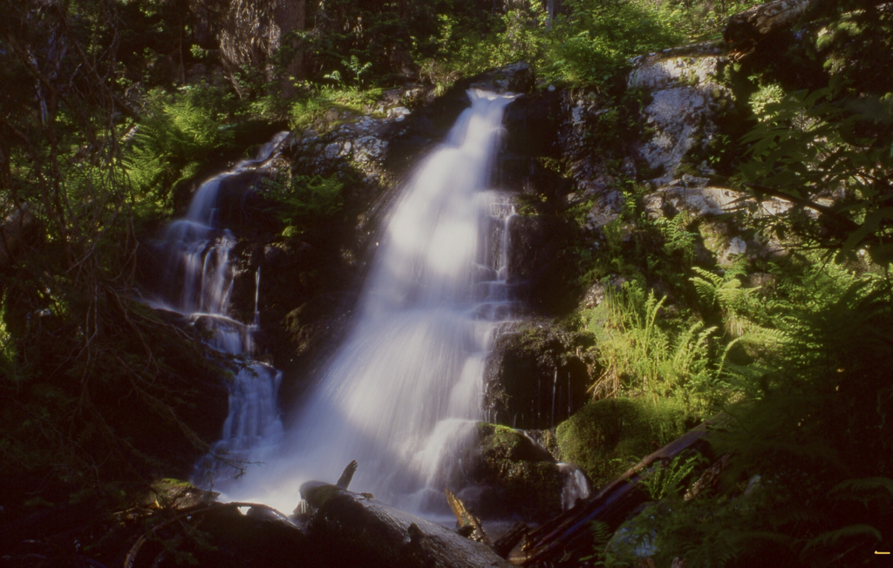
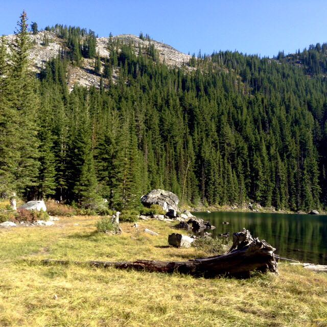
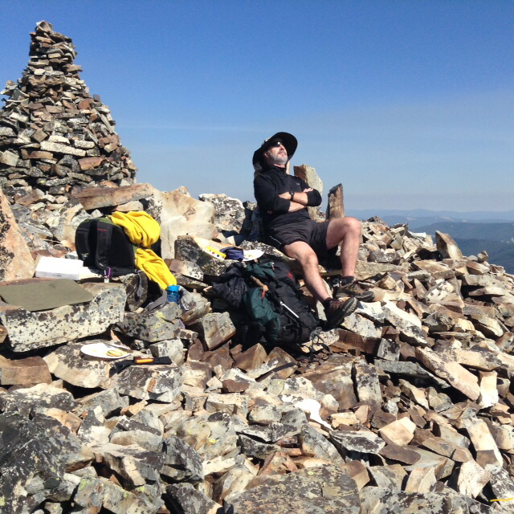
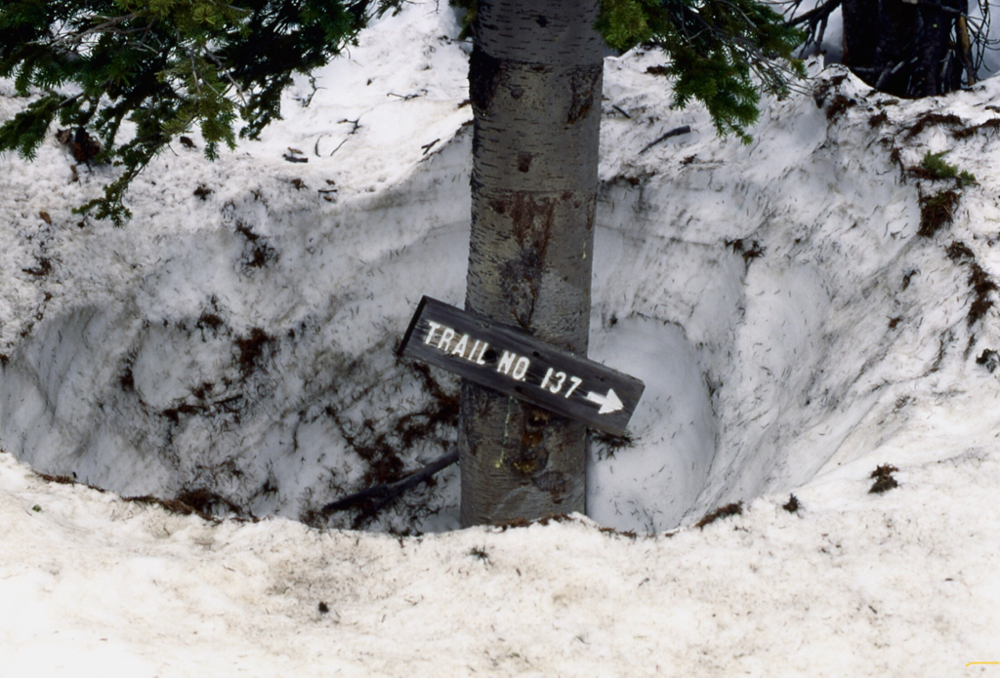
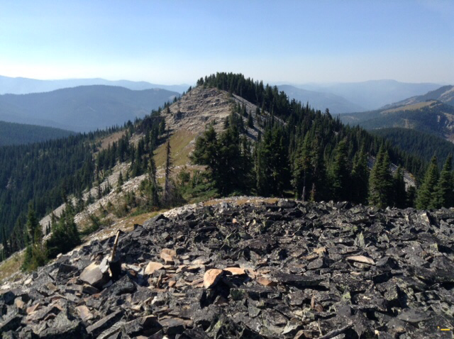
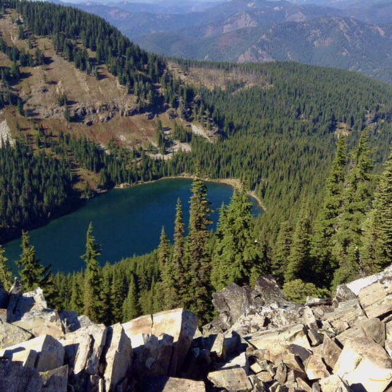

---
tags:
- Lakes
- Easy
- Day Hiking
- Backpacking
- Scrambling
stats:
- label: Event Type
  icon: hiking
  value: Day hiking, backpacking, scrambling
- label: Distance
  icon: map-marker-distance
  value: 4 miles RT
- label: Elevation Gain
  icon: elevation-rise
  value: 500 verts
- label: Difficulty
  icon: speedometer
  value: Easy
- label: Maps
  icon: map
  value: IPNF, LOLO N.F., Burke, Thompson Pass topos
- label: GPS
  icon: crosshairs-gps
  value: 47 °56’09’ n 115°75’10"
- label: CdA River Ranger District
  icon: pine-tree
  value: 208.752.1221
- label: Shoshone County Sheriff
  icon: shield-account
  value: CALL 911 FIRST or 208. 556. 1114
notes:
- Idaho panhandle national forest/alerts<https://www.fs.usda.gov/alerts/ipnf/alerts-notices>
---

# Revett Lake

*Revett lake, id-mt boarder trail #9*

## Description

We have added the areas sheriff’s emergency phone numbers for each trip write up under the ranger district
info. if an
emergency ocurrs, evaluate your circumstances and call only if needed.
This short hike is great for families.
From the trailhead, hike a mellow trail SW to a where the trail crosses Cascade Creek. Look for up to 4  12'
waterfall
early in the year, on your left (SW). The trail above does a single switchback before descending 30' to the
lake. You
can walk the shore line all the way around the lake for views. From the SE shore, there is a good view of
Granite Peak
6814' to the west towering above the lake. There are a few campsites off to the NE shore.

## Option #1

Granite Peak. (See Granite Peak write up)
Be aware, this is steep and exposed
There are three main routes to the summit.
The first is a serious scramble up from the NE corner of the lake. The terrain looks like stepped rock
shelves. Above
the scramble the terrain is grassy and not as steep. In about 200' you will access a ridge and turn left to
the top. The
summit is about 20' wide and 50' long. The first thing you see as you approach the top, are two very tall rock
cairns.
One is about 14' tall. To the SE of the larger cairn, there are slabs of rock made into lounge chairs. Have a
seat and
relax during lunch. Off the SE in the distance the view of Upper & Lower Stevens Lakes is head on. To the
north is the
massive mountains of the Cabinet Mountain Wilderness and the Proposed Scotchman Peak’s Wilderness. The easiest
and
safest descent is down the scree slope on the SW end of the lake. There is an 8 foot cliff band about 1/3 the
way down
to navigate.

## Option #2

Barton Creek Trail #140 starts up Granite  Gulch about .1 miles along Forest Road #9 about 3.4 miles past the
east end
of Murray, Idaho.

It intersects with Trail #137 at the summit of Granite Peak.

Its a rarely used trail, but if solitude is your goal, this trail is for you. However, during hunting season,
you might
encounter hunters.
The trail is 4.25 miles with about 3540 verts.

## Option #3

As described in the Blossom Lakes write up, you can climb the saddle between the Revett & Blossom Lakes and
descend to
the trailhead. It makes a good loop hike.

## Option #4

There's a cool loop hike you can do to get great views of the whole area.
After climbing Granite Peak from Revett Lake, head SW to a low ridge that leads you over to the Idaho/Montana
boarder.
Turn right(S) down the boarder, and you find yourself above Pear Lake, walk about .3 of a mile to the Idaho
Centennial
Trail, and drop down to Pear Lake.
Once at Pear Lake you can take one of two trails/routes to Blossom Lakes
If you follow the Idaho Centennial Trail, you will get to Lower Blossom Lake.
But if you do a bit of Chicwackin' you can get to Upper Blossom Lake.

## Option #5

Starting at Revett Lake, scramble up to Granite Peak, and follow the route in OPTION #4, until you get to the
Boarder,
and turn left NE to the ridge between Revett and Blossom Lakes.

Stay up on the ridge until you get even with the NE end of Revett Lake.
Here, drop down the scree slopes to Trail #9 (Revett Lake Trail), and out to the parking area.

## Directions

Drive I-90 east to the Kingston exit # 43, and turn left (north) over the freeway and up FR #9, also known as

the Coeur

d'Alene River Road. Drive north for about 21 miles and bear right (east) at Pritchard, continue for about 16
miles to
Thompson Pass at the Idaho Montana boarder. Off to the right at the summit of the road, you will see a parking
area. The
trailhead is up a short road near the south corner of the parking area.

## Hazards

None to the lake.
 be extra cautious on all route to granite peak, and high options.

## Cool things close by

U & L Blossom Lakes, Pear Lake, the CDA River, and The Snake Pit.

## R & P

Pizza Factory, 1313 Club, Brooks Hotel & Restaurant, City Limits Brew Pub, Fainting Goat, Smoke House BBQ &
Saloon,
Muchacho’s Tacos, Wallace Brewing Co., Radio Brewing, the Snake Pit, and Moon Time.

## Photo gallery

*Picture (Image missing)*

## One of four revett creek falls

---

## Revett lake east shore line

---

## Chris napping on granite peak

---

## Granite peak trail in snow

---

## The high trail #7 towards burke canyon

---

## Revett lake from ridge between revett & blossom lakes

---

On top of Granite Peak amungst the massive rubble of scree, the trail has been defined  by the separation of

stones.

Next to the two rock cairns, are large slabs stacked as back rests. As you sit comfortably on rock, the views
of three
states, two countries, are all around you. The songs of birds as they soar in the wind,
brings
peace.                                                               chic.  9.14.11

---
