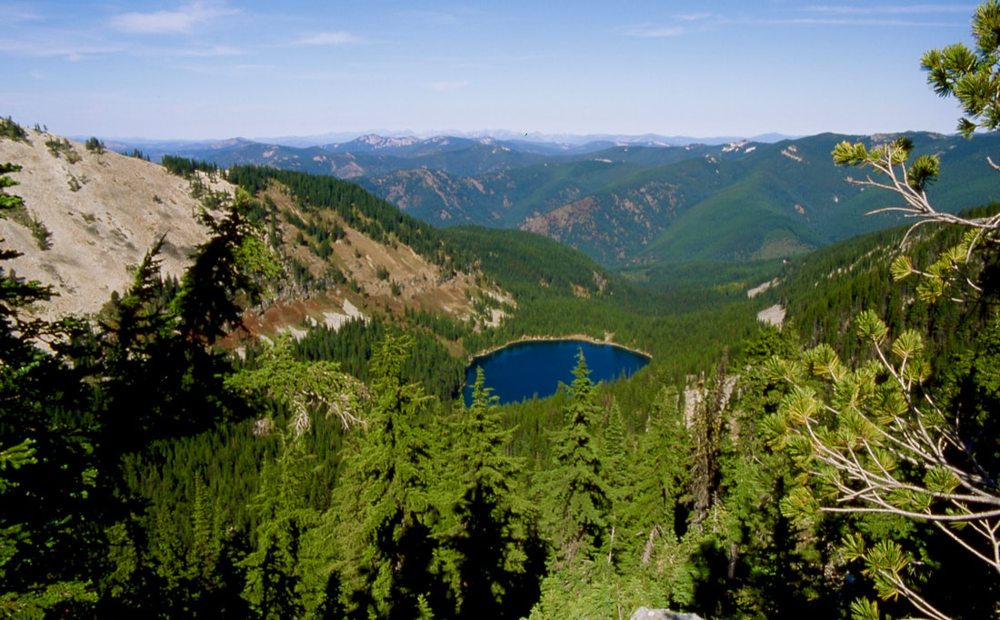

---
tags:
  - Lakes
  - Easy
  - Day Hiking
  - Backpacking
  - Scrambling
stats:
  - label: Event Type
    icon: hiking
    value: Day hiking, backpacking, scrambling
  - label: Distance
    icon: map-marker-distance
    value: 4.0 miles RT (Granite Peak Scramble ~5.5 miles RT)
  - label: Elevation Gain
    icon: elevation-rise
    value: 500' gain to lake (1,800' gain to Granite Peak)
  - label: Acres
    icon: vector-square
    value: "20.2"
  - label: Difficulty
    icon: speedometer
    value: Easy to lake, strenuous off-trail scramble to Granite Peak
  - label: Maps
    icon: map
    value: IPNF, Lolo N.F., Burke, Thompson Pass USGS topos
  - label: GPS
    icon: crosshairs-gps
    value: Revett Lake 47°33'39"N 115°45'06"W (Granite Peak 47°33'12"N 115°45'48"W)
  - label: Ranger District
    icon: pine-tree
    value: Coeur d'Alene River R.D. (208.769.3000)
  - label: Shoshone County Sheriff
    icon: shield-account
    value: CALL 911 FIRST, or 208.556.1114
notes:
  - label: Idaho Panhandle National Forests Alerts
    url: https://www.fs.usda.gov/alerts/ipnf/alerts-notices
---

# Revett Lake & Granite Peak (Trail #9)

_Revett Lake._

## Description

Revett Lake is a pristine 20-acre subalpine lake nestled in a steep glacial cirque right along the Idaho-Montana border near Thompson Pass. The easy 2.0-mile trail to the lake makes it a popular destination for families, day hikers, and beginner backpackers.

From the Thompson Pass Trailhead, Trail #9 gently traverses southwest through dense cedar and pine timber. Early in the summer season, hikers pass Cascade Creek, which tumbles down a series of four cascading waterfalls. After a single switchback and a brief 30-foot descent, the trail reaches the crystal-clear outlet of Revett Lake. Primitive shoreline campsites are scattered along the northeast shore, framed by the towering granite cliffs of Granite Peak (6,814') to the west.

## Route Options & Scrambles

### Option 1: Granite Peak Scramble (6,814')

Granite Peak towers directly above the western shore of Revett Lake. This off-trail scramble gains 1,300' over steep, exposed rock shelves and scree slopes.

- **Ascent Route:** From the northwest corner of the lake, climb the stepped rock ledges. Above the scramble band, the slope transitions to steep grassy meadows. Gain the ridgeline and turn left (south) to reach the 20'x50' summit plateau.
- **Summit Views:** The summit features two massive stone cairns (one standing 14' tall) and hand-built rock slab lounge chairs. Sweeping vistas encompass Stevens Peak, Lone Lake, the Cabinet Mountains Wilderness, and the Proposed Scotchman Peaks.
- **Descent Route:** The safest descent follows the scree slope down to the southwest end of the lake, carefully navigating an 8-foot cliff band one-third of the way down.

### Option 2: Barton Creek Trail #140

For solitude, Barton Creek Trail #140 ascends Granite Gulch from Forest Road #9 (3.4 miles east of Murray, ID) and climbs 3,540' over 4.25 miles to intersect Trail #137 near the summit of Granite Peak.

### Option 3: Revett Lake to Blossom Lakes Loop

From the northeast end of Revett Lake, climb the saddle separating Revett and Blossom Lakes. From the pass, descend past Upper and Lower Blossom Lakes to return to the Thompson Pass Trailhead for a scenic loop hike.

### Option 4: High Divide & Pear Lake Traverse

From Granite Peak, traverse southwest along the low ridgeline to the Idaho-Montana border. Follow the border south above Pear Lake for 0.3 miles to intersect the Idaho Centennial Trail. Descend to Pear Lake and connect to Lower or Upper Blossom Lakes.

## Directions

Take I-90 east to Exit #43 (Kingston). Turn left (north) onto Forest Road #9 (Coeur d'Alene River Road). Drive 21 miles north to Prichard, then bear right (east) for 16 miles up Thompson Pass Road to the Idaho-Montana border. Park at the Thompson Pass summit lot; Trailhead #9 begins near the south corner of the parking area.

## Hazards & Safety Tips

The main trail to Revett Lake is safe and easy. However, the scramble to Granite Peak involves steep exposure, loose scree, and class 3 rock ledges. Helmets and off-trail scrambling experience are recommended.

## Nearby Attractions

Upper & Lower Blossom Lakes, Pear Lake, Coeur d'Alene River, Shadow Falls, Fern Falls, and Cube Iron Mountain.

## Refreshments & Dining (R & P)

Pizza Factory, 1313 Club, Brooks Hotel & Restaurant, City Limits Brew Pub, Fainting Goat, Smoke House BBQ & Saloon, and Wallace Brewing Co. in Wallace; Radio Brewing in Kellogg; The Snake Pit in Enaville; Moon Time in Coeur d'Alene.

## Photo Gallery

_Easy and scenic trail approach to Revett Lake._

_One of four cascading drops along Cascade Creek._

_Revett Creek Falls tumbling over rock ledges._

_Spectacular rock wall along the trail before the lake._

_Revett Lake eastern shoreline._

_Tranquil waters along the east shore of Revett Lake._

_Hiker resting on the summit of Granite Peak near the stone cairns._

_Granite Peak trail covered in early season snow._

_Trail #7 ridgeline path heading toward Burke Canyon._

_Revett Lake viewed from the high ridge between Revett and Blossom Lakes._

_Looking down at Revett Lake from the Granite Peak ascent route._

_Relaxing along the lake shore with a dog and a book._

_Cascade Creek 4-tier waterfall in full summer flow._

_Rare large cluster of Mariposa Lilies along the trail._

!!! quote "Summit Peace on Granite Peak"

    On top of Granite Peak amongst the massive rubble of scree, the trail has been defined by the separation of stones. Next to the two rock cairns are large slabs stacked as backrests. As you sit comfortably on rock, the views of three states and two countries surround you. The songs of birds as they soar in the wind bring peace.

    — Chic Burge (September 14, 2011)
