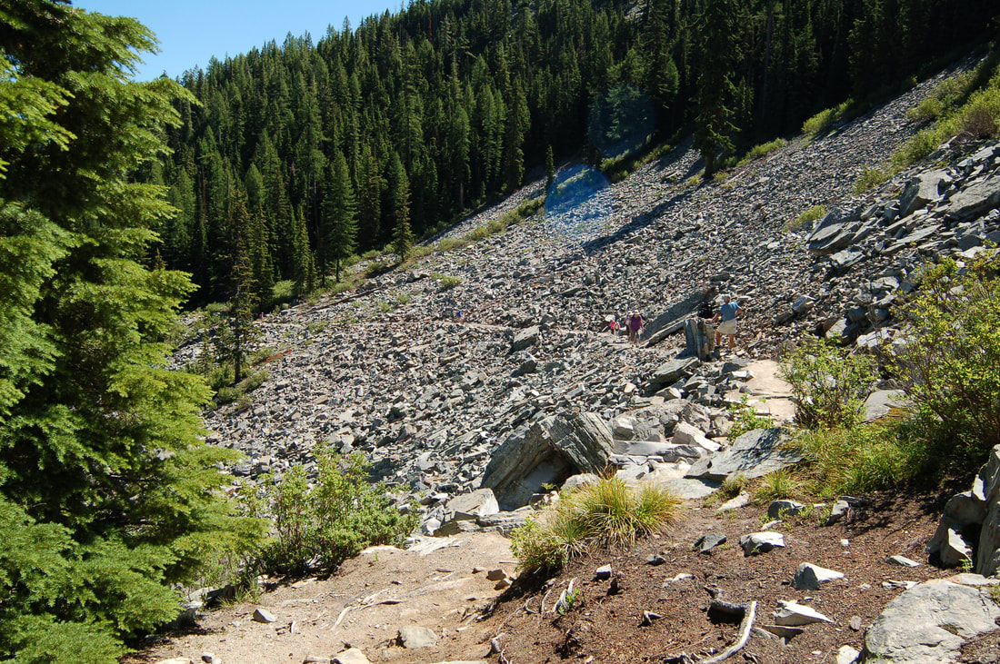
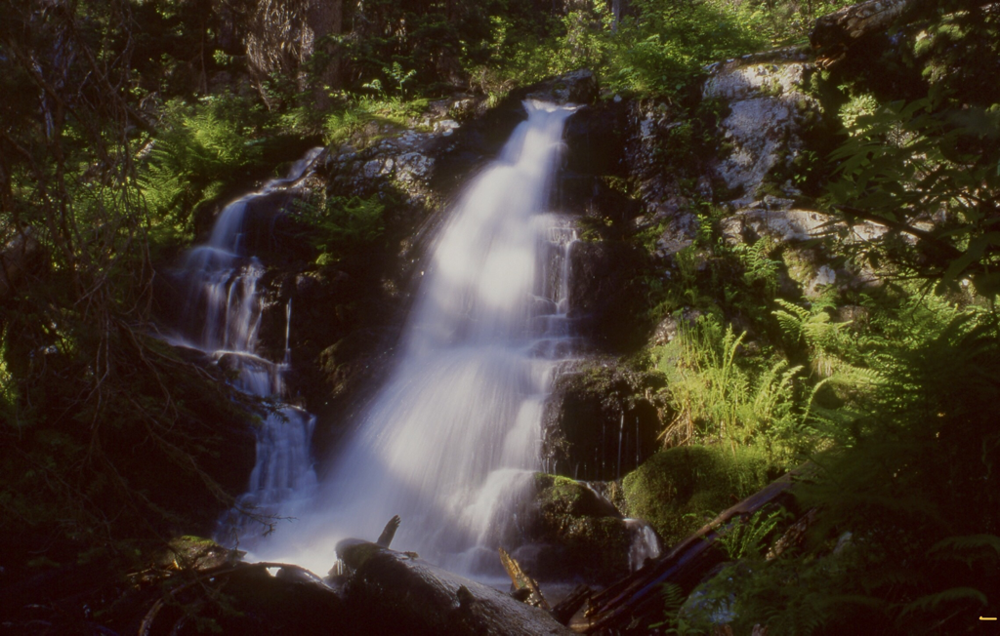
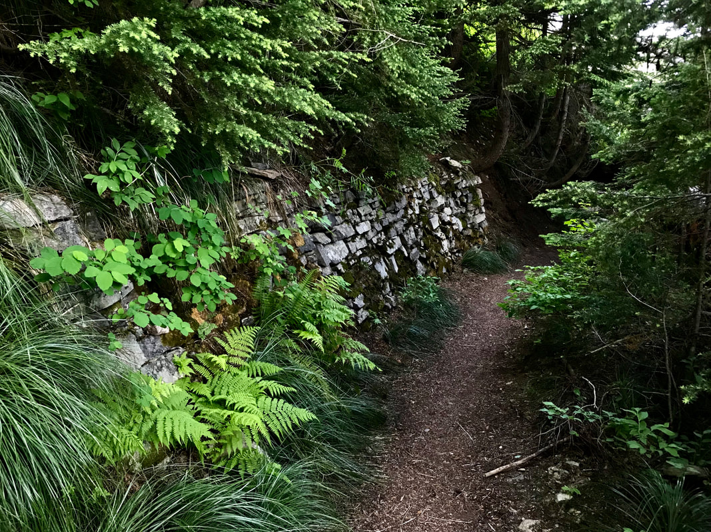
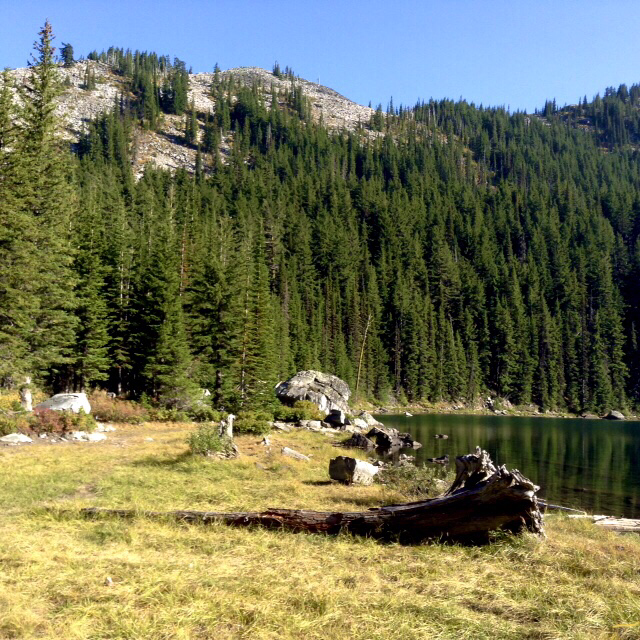
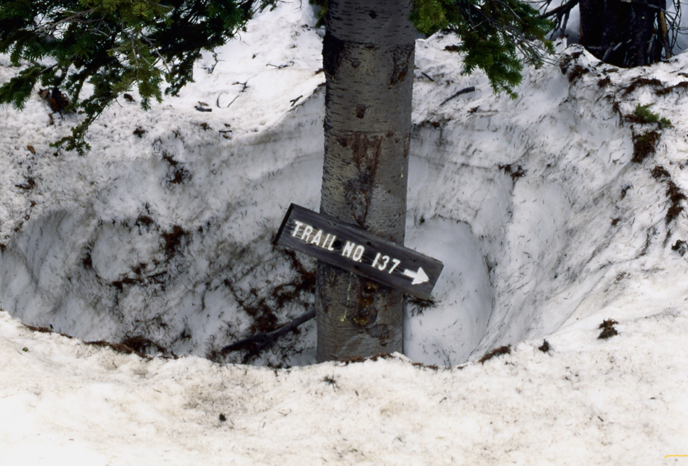
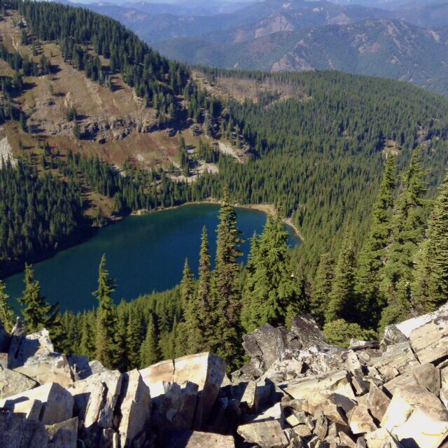
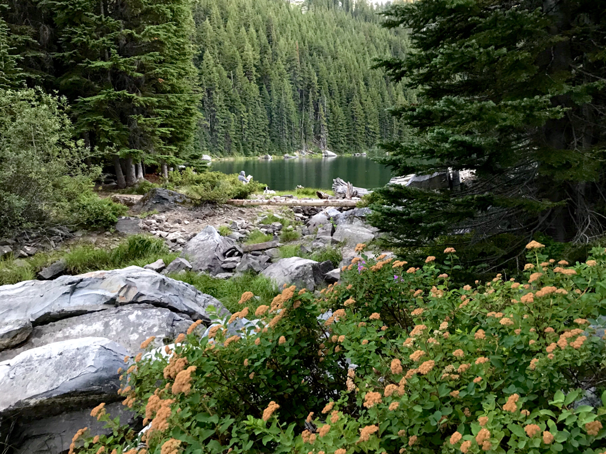
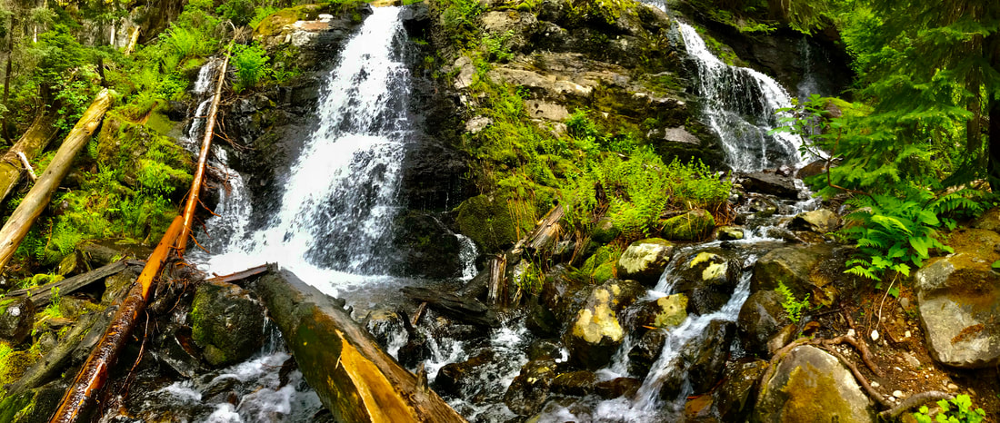
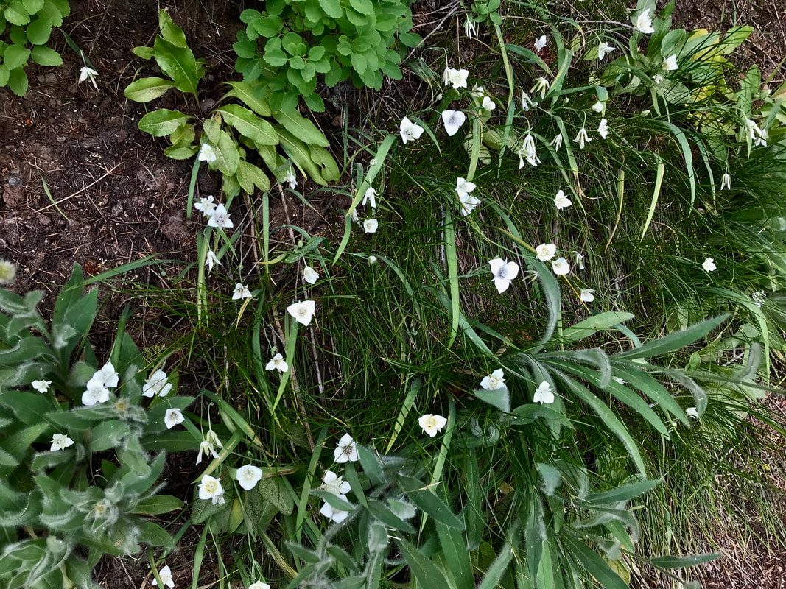

---
tags:
- Lakes
- Easy
- Day Hiking
- Backpacking
- Scrambling
stats:
- label: Event Type
  icon: hiking
  value: Day hiking, backpacking, scrambling
- label: Distance
  icon: map-marker-distance
  value: 4 miles RT
- label: Elevation
  icon: terrain
  value: 500 verts
- label: Acres
  icon: vector-square
  value: '20.2'
- label: Difficulty
  icon: speedometer
  value: Easy
- label: Maps
  icon: map
  value: IPNF, LOLO N.F., Burke, Thompson Pass topos
- label: GPS
  icon: crosshairs-gps
  value: 47 °56’09’ n 115°75’10" w
- label: Ranger District
  icon: pine-tree
  value: CDA River R.D. 208.769.3000
- label: Shoshone County Sheriff
  icon: shield-account
  value: CALL 911 FIRST or 208.556.1114
notes:
- Idaho panhandle national forest/alerts
- <https://www.fs.usda.gov/alerts/ipnf/alerts-notices>
---

# Revett Lake1

*Revett lake, id-mt boarder*

## Description

We have added the areas sheriff’s emergency phone numbers for each trip write up under the ranger district info. if an emergency ocurrs, evaluate your circumstances and call only if needed.
​This short hike is great for families.
From the trailhead, hike a mellow trail SW to a where the trail crosses Cascade Creek. Look for a 12' waterfall early in the year, on your left (SW). The trail above does a single switchback before descending 30' to the lake. You can walk the shore line all the way around the lake for views. From the SE shore, there is a good view of Granite Peak 6814' to the west towering above the lake. There are a few campsites off to the NE shore.

## Option #1

Granite Peak.
Be aware, this is steep and exposed route, and should not be attempted by anyone how hasn't had proper training and experience.

The route is a serious scramble up from the NW corner of the lake. The terrain looks like stepped rock shelves. Above the scramble, the terrain is grassy and not as steep. In about 200' you will access a ridge and turn left to the top. The summit is about 20' wide and 50' long. The first thing you see as you approach the top, are two very tall rock cairns. One is about 14' tall. To the SE of the larger cairn, there are slabs of rock made into lounge chairs. Have a seat and relax during lunch. Off the SE, in the distance, is the view of Lone Lake & Upper Sanctuary, and Stevens Peak  head on. To the north is the massive mountains of the Cabinet Mountain Wilderness. The easiest and safest descent is down the scree slope on the SW end of the lake. There is an 8 foot cliff band about 1/3 the way down to navigate.

## Option #2

As described in the Blossom Lakes write up, you can climb the saddle between the Revett & Blossom Lakes and descend to the trailhead. It makes a good loop hike.

## Directions

Drive I-90 east to the Kingston exit # 43, and turn left (north) over the freeway and up FR #9, also known as the Coeur d'Alene River Road. Drive north for about 21 miles and bear right (east) at Pritchard, continue for about 16 miles to Thompson Pass at the Idaho Montana boarder. Off to the right at the summit of the road, you will see a parking area. The trailhead is up a short road near the south corner of the parking area.

## Hazards

None to the lake.
​ be extra cautious on all routes to granite peak.

## Cool things close by

U & L Blossom Lakes, Pear Lake, the CDA River, Shadow & Fern Falls, Cube Iron Mountain.

## R & p

Pizza Factory, 1313 Club, Brooks Hotel & Restaurant, City Limits Brew Pub, Fainting Goat, Smoke House BBQ & Saloon, Wallace Brewing Co., Muchacho’s Tacos in Wallace. Radio Brewing in Kellogg. , the Snake Pit, Moon Time, and the Mexican Food Factory

*Picture (Image missing)*

*Picture (Image missing)*

## Photo gallery

## The trail to revett lake is easy and scenic

## Revett creek falls

---

## Cool rock wall before the lake

## Revett lake east shore line

---

*Picture (Image missing)*

## Some spokane mountaineers enjoy the views at revett lake

*Picture (Image missing)*

## The view from the sw end of revett, looking ne to the trails end

*Picture (Image missing)*

## The north shore of revett lake The image below is of granite peak, far left

*Picture (Image missing)*

## Chris napping on granite peak

---

## Granite peak trail in snow

---

*Picture (Image missing)*

## The high trail #7 towards burke canyon

---

Revett lake from the ridge between revett & lower blossom lakes ​the steep slope top left of center is the route to granite peak

---

## A day spent next to a high country lake with your dog and a book, is best

## Revett falls actually have 4 drops, but only in the summer

## Mariposa lilies along the trail. rarely do you see such a large clump
